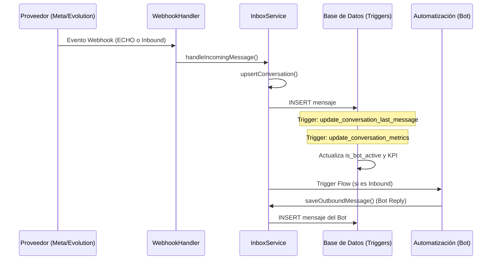

# Manual Técnico: Integración de Mensajería y Automatización (Pixy)

Este documento describe la arquitectura, la lógica de persistencia del estado del bot y el sistema de métricas de respuesta para el CRM de Pixy.

## 1. Arquitectura de Flujo de Mensajes

El sistema utiliza un flujo híbrido entre el código (Next.js/Node.js) y la base de datos (Supabase/PostgreSQL) para garantizar que el estado de la conversación sea siempre preciso.



## 2. Lógica de Persistencia del Icono del Bot (🤖)

El icono del bot aparece basándose en el campo `is_bot_active` de la tabla `conversations`. Para evitar que este estado se "resetee" erróneamente, implementamos una protección de doble capa.

### Capa 1: Identificación en Código (`inbox-service.ts`)
En el método `upsertConversation`, identificamos si un mensaje proveniente de un webhook es un "eco" (una copia de lo que el bot envió) mediante la propiedad `msg.origin === 'outbound'`.

- **Acción**: Si es un eco, forzamos:
  - `sender`: `'System'`
  - `metadata.sender_type`: `'bot'`
  - `direction`: `'outbound'`

### Capa 2: Fail-Safe en Base de Datos (Trigger SQL)
Si por alguna razón el código no envía la metadata correcta, el trigger `update_conversation_last_message` realiza una validación por nombre de remitente:

```sql
sender_type_val := COALESCE(
    NEW.metadata->>'sender_type', 
    CASE WHEN NEW.sender IN ('System', 'Automation Bot') THEN 'bot' ELSE 'human' END
);
```

Esto garantiza que el estado `is_bot_active` se mantenga en `true` siempre que el último mensaje registrado pertenezca a la automatización.

## 3. Sistema de Métricas (SLAs y Respuesta)

El sistema mide el desempeño de los agentes humanos calculando el tiempo transcurrido desde que un cliente escribe hasta que un humano responde.

### Conceptos Clave
- **`waiting_since`**: Marca de tiempo de cuándo el cliente empezó a esperar. Solo se activa si el mensaje es `inbound` y el bot **no** está activo.
- **`average_response_time_seconds`**: Promedio móvil del tiempo de respuesta del agente.

### Funcionamiento del Trigger (`update_conversation_metrics`)
1. **Mensaje Inbound**: Si el bot está apagado, se marca `waiting_since = NOW()`.
2. **Respuesta Humana (Outbound)**: 
   - Se calcula la diferencia: `NOW() - waiting_since`.
   - Se actualiza el promedio: `(PromedioAnterior + NuevoTiempo) / 2`.
   - Se limpia `waiting_since`.
3. **Respuesta de Bot**: No limpia la espera humana. El cronómetro del agente sigue corriendo si el bot no resuelve la duda.

## 4. Visualización de Mensajes y Previsualización

Para evitar que el inbox muestre objetos JSON crudos (`{"type": "text", ...}`), el trigger utiliza la función `get_content_text(content jsonb)`.

Esta función extrae inteligentemente el texto de:
- Mensajes de texto simples.
- Botones interactivos (`body`).
- Listas de opciones (`text`).
- Captions de imágenes/documentos.

## 5. Mantenimiento y Extensión

### Añadir un nuevo "Nombre de Bot"
Si integras un nuevo proveedor que usa un nombre de remitente diferente, actualiza la lista en el trigger SQL:
```sql
WHEN NEW.sender IN ('System', 'Automation Bot', 'NUEVO_SENDER') THEN 'bot'
```

### Consultar Métricas Globales
Para obtener el tiempo de respuesta promedio de toda la organización (usado en la página de Reportes):
```sql
SELECT AVG(average_response_time_seconds) 
FROM conversations 
WHERE organization_id = 'tu-id';
```

---
**Nota**: Este documento debe actualizarse cada vez que se modifique la lógica de los triggers en `/supabase/migrations` o el flujo de entrada en `inbox-service.ts`.
