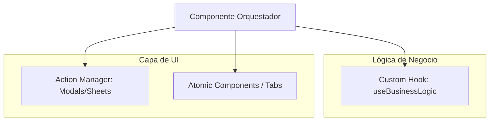

# Mapa de Módulos de UI (Next.js)

Este documento describe la estructura de la interfaz de usuario en el frontend, mapeando las áreas del dashboard a los dominios funcionales y detallando los componentes principales.

---

## 1. Organización de Vistas (App Router)

Las rutas del dashboard se encuentran en `src/app/(dashboard)/` y se dividen por dominios:

| Ruta | Dominio | Componente Principal / Propósito |
|---|---|---|
| `/inbox` | **Mensajería** | Omni-Inbox: Bandeja de entrada multicanal. |
| `/crm` | **CRM** | Pipeline Kanban: Visualización del proceso de ventas. |
| `/automations` | **Automatización** | Workflow Builder: Editor visual de flujos. |
| `/invoices` | **Billing** | Listado y visor de facturas generadas. |
| `/quotes` | **Billing** | Editor y visor de propuestas comerciales. |
| `/settings` | **SaaS Core** | Panel de configuración organizacional y personal. |
| `/resto-tables` | **Resto** | Mapa interactivo de gestión de mesas. |
| `/platform` | **SaaS Admin** | Panel de administración de niveles de sistema (Whitelabel). |

---

## 2. Patrones de UI Modular (Anti-God Components)

Para escalar el sistema, hemos implementado una **Arquitectura de 3 Capas** en los componentes más complejos (`Inbox` y `CRM`), eliminando los archivos monolíticos de más de 1000 líneas.

### Estructura de 3 Capas:

1.  **Orquestador**: (ej. `ChatArea.tsx` o `ClientManagementSheet.tsx`) Ahora son archivos de <180 líneas que solo coordinan el estado y distribuyen props.
2.  **Custom Hooks**: Encapsulan la sincronización (Realtime), fetching de API y mutaciones de datos.
3.  **Atomic Tabs / Components**: Carpetas dedicadas con las piezas visuales aisladas (ej. `ProfileTab`, `MessageList`).

### God Components Restantes:
1. **`workflow-builder.tsx`**: Orquestador visual para la creación de automatizaciones (Pendiente de refactorización).

---

## 3. Estrategia de Carga de Datos

El sistema utiliza varios métodos para la obtención y actualización de datos:

- **Server Actions**: Se usan para mutaciones (crear/actualizar) y para alimentar los datos iniciales de las páginas.
- **Supabase Realtime**: Implementado en la Omni-Inbox para recibir mensajes entrantes y actualizaciones de estado sin refrescar.
- **SWR / TanStack Query**: Utilizado para el cacheo de datos en el cliente y la revalidación automática (especialmente en el CRM y Dashboard).
- **Zustand**: Gestión de estado global simplificada para preferencias de UI y contextos multivertical.

---

## 4. Riesgos en la Capa UI

- **Lógica de Negocio Filtrada**: Existe una tendencia a manejar filtros y transformaciones de datos complejas directamente en los componentes de React, en lugar de delegar al Service layer.
- **Acoplamiento Directo al Esquema**: Muchos componentes consumen directamente las tipos generados por Supabase (`Lead`, `Quote`), lo que hace que cualquier cambio en la base de datos impacte de inmediato en la UI si no se usa un adaptador.
- **Rendimiento de Componentes Gigantes**: La alta concentración de lógica en `chat-area.tsx` y `client-card-v2.tsx` puede degradar el tiempo de interactividad (TTI) si no se optimiza con `memo` o `virtualization`.
