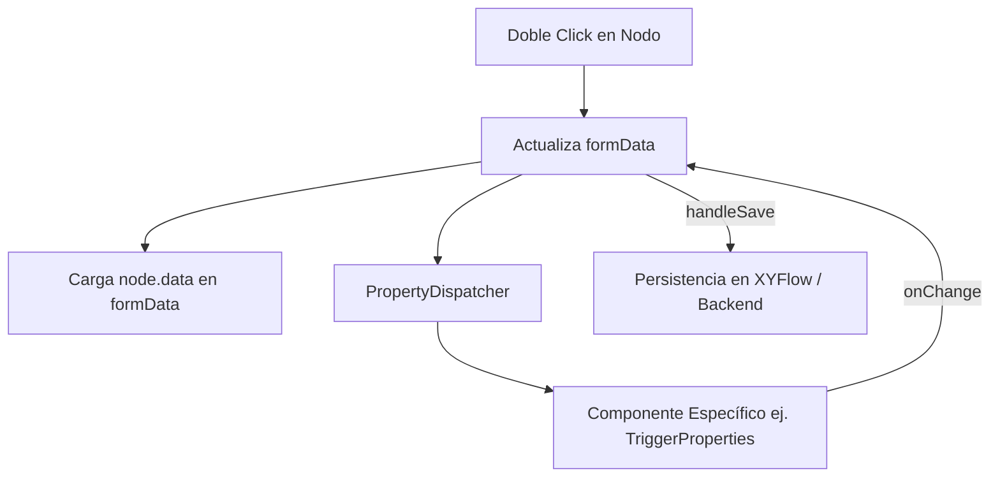

# Arquitectura: Descomposición del UI de Automatización (God Object Refactor)

> **Última actualización:** 2026-04-04  
> **Estado:** Refactorización Completa  
> **Principales Componentes:**  
> - `src/modules/features/automation/components/properties-sheet.tsx` (Shell)
> - `src/modules/features/automation/components/properties/PropertyDispatcher.tsx` (Router)
> - `src/modules/features/automation/components/properties/` (Colección Atómica)

## Contexto de la Refactorización

Anteriormente, el archivo `properties-sheet.tsx` era un "God Object" de más de **2,800 líneas** que contenía la lógica de renderizado condicional de todos los tipos de nodos del motor de automatización. Esto generaba:
- Alto acoplamiento técnico.
- Tiempos de compilación lentos en desarrollo.
- Riesgo elevado de efectos secundarios en ediciones menores.
- Incapacidad para escalar a nuevos casos de uso industriales (Resto, Attendance, etc.).

## Nueva Estructura: "UI Atoms"

La nueva arquitectura separa la orquestación de la visualización:

### 1. El Shell Orchestrator (`properties-sheet.tsx`)
Mantiene el estado global del formulario (`formData`), las validaciones básicas y la integración con el contexto de `xyflow`. Su responsabilidad es pura configuración y persistencia.

### 2. El Property Dispatcher
Un componente funcional ligero que actúa como un enrutador de UI. Selecciona el componente de propiedades adecuado según el tipo de nodo (`node.type`), delegando toda la complejidad visual a archivos especializados.

### 3. Componentes de Dominio Atómico
Cada grupo de acciones tiene su propio archivo:
- `MessagingProperties`: WhatsApp y Media.
- `CRMProperties`: Leads, Pipelines y Tags.
- `LogicProperties`: Condiciones lógicas y Split Testing.
- `IntegrationProperties`: HTTP y AI Agent.
- `InteractionProperties`: Entrada dinámica del usuario.

## Diagrama de Flujo de Datos

## Beneficios para el Desarrollador
1. **Aislamiento**: Editar la UI de un mensaje de WhatsApp no afecta la lógica de un bloque de CRM.
2. **Reusabilidad**: Los componentes pueden usarse en simuladores o vistas previas fuera del editor principal.
3. **Mantenibilidad**: Archivos pequeños (<150 líneas) facilitan el debugging y las pruebas unitarias.

---

Este refactor sienta las bases para la integración de módulos industriales (Features) en el motor de automatización sin contaminar el código base del Core SaaS.
