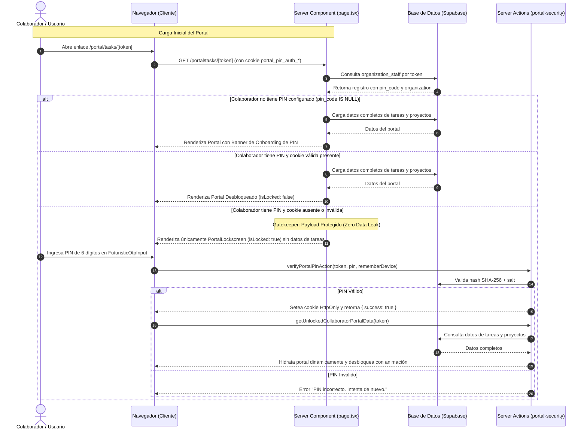

# Arquitectura del Sistema de Seguridad y Protección por PIN para Portales (`portal-security`)

Este documento detalla la arquitectura técnica, modelo criptográfico, control de sesión mediante cookies seguras, protocolo gatekeeper SSR (Zero-Data-Leak), componentes visuales adaptativos (Modo Claro / Modo Oscuro) y flujos de administración del subsistema **Portal Security (`@/modules/features/portal-security`)** en el ecosistema PIXY Agency Manager.

---

## 1. Visión General y Necesidad de Negocio

Los portales públicos de PIXY (como el Portal de Tareas para colaboradores `/portal/tasks/[token]`) permiten el acceso ágil mediante enlaces basados en tokens únicos (`access_token`). Si bien esto minimiza la fricción inicial al prescindir de credenciales tradicionales complejas (usuario y contraseña), presenta el riesgo de que terceros que obtengan el enlace accedan sin autorización a información sensible de proyectos, clientes y tareas de la organización.

Para solventar esta vulnerabilidad sin convertir el portal en un login pesado:
1. Se implementó una **capa de seguridad modular y opcional** basada en un **código PIN de 6 dígitos**.
2. **Cero Fuga en SSR (Gatekeeper)**: El servidor no entrega datos confidenciales de tareas ni proyectos en la carga inicial si la sesión del portal está bloqueada.
3. **Persistencia Transparente**: Soporte de sesión mediante cookies cifradas `HttpOnly`, permitiendo "Recordar este dispositivo por 30 días".
4. **Diseño Modular y Reutilizable**: Aislado como feature independiente (`@/modules/features/portal-security`) para ser incorporado en cualquier portal actual o futuro de PIXY.
5. **Experiencia UI/UX de Vanguardia**: Componente OTP cibernético, pantalla de bloqueo con desenfoque de fondo (*backdrop blur*), microinteracciones fluidas con Framer Motion y compatibilidad total tanto con **Modo Claro** como **Modo Oscuro** y el color corporativo (`brandColor`) del tenant padre.

---

## 2. Diagrama de Flujo y Arquitectura

---

## 3. Modelo Criptográfico y Seguridad de Datos

### A. Almacenamiento Seguro del PIN (`pin-crypto.ts`)
Los PINs nunca se almacenan en texto plano en la base de datos:
- **Algoritmo**: SHA-256 con Salt criptográfico de 16 bytes (32 caracteres hexadecimales).
- **Formato en BD**: `salt:hashHex` en la columna `organization_staff.pin_code` (tipo `character varying`).
- **Función de Hash**:
  $$\text{hash} = \text{SHA256}(\text{salt} + \text{pin})$$
- **Verificación**: Para cada intento de validación, se extrae el salt del registro, se hashea el PIN ingresado con dicho salt y se compara en tiempo constante (`timingSafeEqual`) para prevenir ataques de temporización (*timing attacks*).
- **Retrocompatibilidad**: Si se detecta un hash legacy de 64 caracteres sin salt, se valida y se migra automáticamente al formato `salt:hash`.

### B. Gestión de Sesión y Cookies Seguras (`session-cookie.ts`)
- **Nombre de Cookie**: `portal_pin_auth_<staffId>` (con prefijo del ID del colaborador para evitar colisiones multisesión en el mismo navegador).
- **Firma del Token**: HMAC-SHA256 con secreto de aplicación (`APP_SECRET` o fallback derivado del entorno).
- **Atributos de Cookie**:
  - `httpOnly: true`: Inaccesible desde JavaScript del lado del cliente, protegiendo contra ataques XSS.
  - `secure: process.env.NODE_ENV === "production"`: Exclusiva sobre HTTPS en producción.
  - `sameSite: "lax"`: Mitiga ataques CSRF.
  - `path: "/"`: Disponible en todo el alcance del portal.
  - `maxAge`: 30 días (2,592,000 segundos) si el usuario selecciona "Recordar este dispositivo"; de lo contrario, expira al cerrar la sesión del navegador.

---

## 4. Componentes de la Capa de Presentación (UI/UX)

Todos los componentes residen en `src/modules/features/portal-security/components/`:

| Componente | Responsabilidad | Adaptabilidad de Tema |
|---|---|---|
| `PortalLockscreen` | Pantalla de bloqueo modal con backdrop blur, orbes ambientales de color de marca, candado interactivo, soporte para recordar dispositivo y enlace para PIN olvidado. | Fondo perlado y textos oscuros en Modo Claro; vidrio oscuro `zinc-950/90` en Modo Oscuro. Selección automática de `logo_light_url` o `logo_dark_url`. |
| `FuturisticOtpInput` | Celdas numéricas cibernéticas de 6 dígitos, soporte para pegar desde portapapeles, teclado táctil virtual desplegable con física *spring* (3x4), y botón para ocultar/mostrar dígitos. | Celdas `zinc-100` con bordes `zinc-200` en Claro; `black/60` con bordes sutiles en Oscuro. Resaltes fluorescentes automáticos con el `brandColor` del tenant. |
| `PortalSecurityModal` | Modal de gestión integral con 3 modos: **Configurar PIN inicial** (2 pasos), **Cambiar PIN** (3 pasos con validación de PIN actual) y **Desactivar PIN** (con confirmación de seguridad). | Contraste optimizado para botones secundarios ("Atrás", "Cancelar"), mensajes de error y badges informativos tanto en Claro como en Oscuro. |
| `PortalAvatarSecurityMenu` | Desplegable integrado en el avatar del colaborador en el header del portal. Permite "Bloquear portal ahora", "Cambiar PIN" o "Desactivar PIN". | Tokens semánticos `text-foreground`, `text-muted-foreground` y `bg-card`. |
| `PortalSecurityBanner` | Banner de incorporación persistente (con memoria en `sessionStorage` tras descartar) que invita a activar el PIN si el colaborador aún no lo ha establecido. | Gradiente dinámico con el color corporativo del tenant y advertencia contextual. |

---

## 5. Acciones del Servidor (`portal-security-actions.ts`)

Todas las Server Actions ejecutan validaciones estrictas, sanitización de entrada (exactamente 6 dígitos numéricos) y control de errores:

1. **`verifyPortalPinAction(token, pin, rememberDevice)`**:
   - Resuelve el colaborador por token.
   - Valida el hash del PIN.
   - Inyecta la cookie de sesión firmada `portal_pin_auth_<staffId>`.
2. **`setupPortalPinAction(token, pin)`**:
   - Valida que el colaborador no tenga ya un PIN activo (o permite inicializarlo).
   - Genera el hash `salt:hash` y actualiza `organization_staff.pin_code`.
   - Inyecta la cookie de sesión para que el usuario continúe sin bloqueo.
3. **`changePortalPinAction(token, currentPin, newPin)`**:
   - Exige la validación previa del `currentPin` antes de sobrescribir.
   - Almacena el nuevo hash con nuevo salt criptográfico.
4. **`removePortalPinAction(token, currentPin)`**:
   - Exige validación del PIN actual.
   - Establece `pin_code = NULL` y elimina la cookie de sesión activa.
5. **`lockPortalSessionAction(token)`**:
   - Destruye la cookie de sesión del colaborador de forma inmediata (`cookies().delete`).
6. **`adminResetStaffPinAction(staffId)`**:
   - Acción de soporte administrativo: permite a los Directores o Gestores de Proyecto restablecer el PIN de un colaborador a `NULL` desde el gestor de colaboradores (`task-collaborators-manager.tsx`), en caso de olvido.

---

## 6. Sincronización de ADN de Marca y Solución de Inconsistencia de Color

Durante las pruebas iniciales se detectó que los componentes de seguridad tomaban por momentos el color corporativo por defecto de Pixy en lugar del color del tenant padre del portal.

**Causa Raíz**:
En `branding-provider.tsx`, el proveedor global resolvía el branding corporativo del sistema administrativo en rutas fuera de `(dashboard)`. Al recargar o ingresar por primera vez a `/portal/...`, se inyectaban los colores por defecto antes de leer el tenant.

**Solución Implementada**:
- En `src/components/providers/branding-provider.tsx`, se aisló el alcance del proveedor para que en rutas de portales (`/portal/*`) respete con prioridad absoluta el `organization.primary_color` pasado por los Server Components de la página.
- En `PortalLockscreen`, `PortalSecurityModal` y `FuturisticOtpInput`, se inyectan variables CSS directas (`--primary: ${brandColor}`, `--color-primary: ${brandColor}`) y estilos inline en las acciones principales para garantizar que el 100% de los botones, halos de selección y badges adopten el color del tenant desde el primer fotograma de renderizado.

---

## 7. Verificación y Pruebas Automatizadas

El subsistema incluye cobertura de pruebas unitarias y de integración en `src/modules/features/portal-security/portal-security.test.ts`:
- Generación de hashes y verificación con salt.
- Prevención de acceso con PIN incorrecto.
- Creación y verificación de tokens de sesión HMAC.
- Validación de que `isLocked: true` no emite datos de tareas en SSR.
