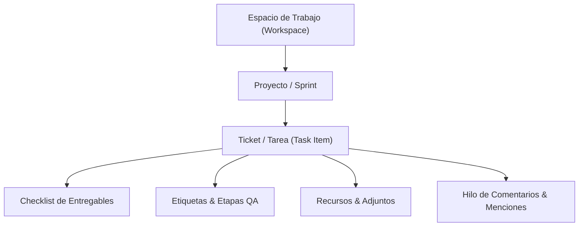
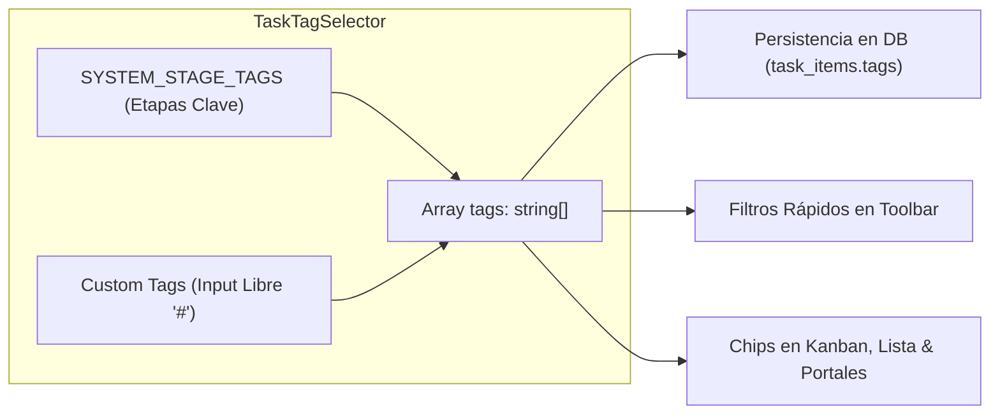

# Arquitectura Integral del Módulo de Gestión de Tareas (Task Management)

Este documento describe la estructura técnica, modelo de datos relacional, mecanismos de control de acceso (RBAC granular por espacios), flujos operativos, estándares de interfaz y optimizaciones de rendimiento del módulo de **Gestión de Tareas (`tasks`)** y sus **Portales de Colaboradores**, en el ecosistema de PIXY Agency Manager.

---

## 1. Visión General y Jerarquía de Trabajo

El módulo orquesta el ciclo de vida operativo de los requerimientos y sprints de la agencia a través de una jerarquía de tres niveles:



### Componentes Principales del Sistema
1. **Plataforma Central (`/operations/tasks`)**: Panel de control administrativo para dueños de agencia, administradores y personal interno con acceso a métricas globales, tableros Kanban interactivos, vistas de lista paginadas y gestión de espacios y proyectos.
2. **Portales Seguros por Token (`/portal/tasks/[token]`)**: Entornos web aislados accesibles mediante tokens criptográficos únicos por colaborador (`organization_staff.access_token`), sin requerir autenticación directa a la base de datos:
   - **Modo Colaborador (Ejecución)**: Enfocado en entregables propios, minimizando ruido visual (columna de responsable oculta, slider de progreso seguro y checklist interactivo).
   - **Modo Gestor de Proyecto (PM / Lead)**: Puesto de mando avanzado con telemetría de sprints, cinta interactiva de especialistas, reasignación de prioridades/estados y facultad de crear proyectos y tickets según sus espacios autorizados.

---

## 2. Modelo de Datos Relacional (Supabase / PostgreSQL)

El esquema se implementa en migraciones SQL con soporte multi-tenant estricto (`organization_id`):

### A. Tabla: `task_workspaces`
Define los espacios o unidades operativas macro (ej. *Desarrollo Web*, *App Móvil*, *Marketing*, *Diseño*).
| Campo | Tipo | Propósito |
|---|---|---|
| `id` | UUID (PK) | Identificador único del espacio. |
| `organization_id` | UUID (FK) | Tenant propietario. |
| `name` | Text | Nombre descriptivo del espacio de trabajo. |
| `color` | Text | Color hexadecimal para identificación visual. |
| `description` | Text | Descripción opcional del alcance del espacio. |
| `icon` | Text | Identificador de icono de Lucide. |
| `order_index` | Integer | Posicionamiento en menús y selectores. |
| `is_active` | Boolean | Estado de vigencia (default: `true`). |
| `created_at` | Timestamp | Fecha y hora de creación. |

### B. Tabla: `task_workspace_members`
Gobierna el control de acceso granular por espacio para colaboradores.
| Campo | Tipo | Propósito |
|---|---|---|
| `id` | UUID (PK) | Identificador del registro de membresía. |
| `organization_id` | UUID (FK) | Tenant propietario. |
| `workspace_id` | UUID (FK) | Espacio de trabajo concedido (`task_workspaces`). |
| `staff_id` | UUID (FK) | Miembro del personal autorizado (`organization_staff`). |
| `created_at` | Timestamp | Registro de asignación de acceso. |

### C. Tabla: `task_projects`
Proyectos o sprints específicos contenidos dentro de un espacio de trabajo.
| Campo | Tipo | Propósito |
|---|---|---|
| `id` | UUID (PK) | Identificador del proyecto. |
| `organization_id` | UUID (FK) | Tenant propietario. |
| `workspace_id` | UUID (FK, Opcional) | Espacio al que pertenece el proyecto. |
| `name` | Text | Nombre del proyecto o sprint. |
| `color` | Text | Color hexadecimal del proyecto. |
| `description` | Text | Descripción de alcance y objetivos. |
| `status` | Text | `planning`, `active`, `completed`, `on_hold`. |
| `start_date` | Timestamp | Fecha de inicio programada. |
| `end_date` | Timestamp | Fecha de cierre estimada. |
| `is_active` | Boolean | Indicador de proyecto activo. |
| `order_index` | Integer | Orden de presentación visual. |

### D. Tabla: `task_items`
Unidad atómica de requerimiento técnico, tarea o ticket.
| Campo | Tipo | Propósito |
|---|---|---|
| `id` | UUID (PK) | Identificador único del ticket. |
| `organization_id` | UUID (FK) | Tenant propietario. |
| `project_id` | UUID (FK) | Proyecto asociado (`task_projects`). |
| `ticket_code` | Text | Código autogenerado secuencial (ej: `TK-101`, `PRJ-102`). |
| `title` | Text | Título descriptivo y conciso de la tarea. |
| `description` | Text | Criterios de aceptación y especificaciones técnicas. |
| `status` | Text (`TaskStatus`) | `backlog`, `todo`, `in_progress`, `in_review`, `blocked`, `done`. |
| `priority` | Text (`TaskPriority`) | `low`, `medium`, `high`, `urgent`. |
| `type` | Text (`TaskType`) | `task`, `feature`, `bug`, `improvement`, `delivery`. |
| `assigned_staff_id` | UUID (FK, Nullable) | Especialista responsable asignado (`organization_staff`). |
| `created_by_staff_id` | UUID (FK, Nullable) | Creador de la tarea. |
| `qa_staff_id` | UUID (FK, Nullable) | Tester o revisor de calidad asignado. |
| `progress_percentage` | Integer | Avance registrado (0 - 100%). |
| `estimated_hours` | Numeric | Horas estimadas de ejecución. |
| `actual_hours` | Numeric | Horas reales reportadas. |
| `checklist` | JSONB | Entregables y subtareas (`TaskChecklistItem[]`). |
| `tags` | Text[] / JSONB | Etiquetas libres y etapas de flujo del sistema. |
| `attachments` | JSONB | Referencias a Figma, GitHub, imágenes y documentos. |
| `due_date` | Date / Timestamp | Fecha límite de entrega del entregable. |
| `order_index` | Integer | Orden dentro de columnas Kanban. |

### E. Tabla: `task_comments`
Canal de discusión contextual del ticket con soporte para menciones de equipo.
| Campo | Tipo | Propósito |
|---|---|---|
| `id` | UUID (PK) | Identificador del comentario. |
| `organization_id` | UUID (FK) | Tenant propietario. |
| `task_id` | UUID (FK) | Ticket al que pertenece el comentario. |
| `author_type` | Text | `owner`, `staff`, `system`. |
| `author_id` | UUID (FK) | Colaborador emisor. |
| `author_name` | Text | Nombre visible del autor. |
| `author_avatar` | Text | URL del avatar. |
| `content` | Text | Mensaje con soporte para `@Nombre`. |
| `mentions` | JSONB | Metadatos de colaboradores mencionados para notificaciones. |

---

## 3. Control de Acceso y Aislamiento por Espacios (RBAC Granular)

Para permitir que una agencia gestione múltiples unidades operativas (ej. *Espacio Web* y *Espacio App Móvil*) sin que colaboradores ajenos tengan visibilidad no autorizada:

1. **Acceso Global Implícito (Dueños y Administradores)**:
   - Usuarios con roles de administración o colaboradores sin restricciones en `task_workspace_members` tienen visibilidad total sobre todos los espacios, proyectos y tareas.
2. **Acceso Acotado a Espacios (`task_workspace_members`)**:
   - Si un colaborador tiene registros en `task_workspace_members`, sus consultas se limitan estrictamente a esos `workspace_id`.
   - Proyectos de espacios no autorizados quedan filtrados en el combobox, tableros y listados.
   - En el portal de colaboradores, un PM asignado a un solo espacio únicamente puede crear proyectos y tickets dentro de su espacio asignado.
3. **Mapeo de Consultas con `allowedWorkspaceIds` y `allowedProjectIds`**:
   - En [`collaborator-portal-actions.ts`](file:///G:/Pixy/agency-manager/src/modules/features/tasks/actions/collaborator-portal-actions.ts), se realiza la intersección de membresías al iniciar la sesión del portal:
     ```ts
     const { data: memberWorkspaces } = await supabaseAdmin
       .from("task_workspace_members")
       .select("workspace_id")
       .eq("staff_id", staff.id);
     ```
   - Si existen membresías, se extraen los IDs y solo se cargan proyectos hijos de esos espacios.

---

## 4. Patrones de Interfaz y Navegación

### A. Combobox Unificado en Árbol (Espacios y Proyectos)
En lugar de selectores separados que consumen espacio horizontal, se diseñó un combobox jerárquico integrado en [`task-manager-view.tsx`](file:///G:/Pixy/agency-manager/src/modules/features/tasks/components/task-manager-view.tsx) y [`task-collaborator-portal.tsx`](file:///G:/Pixy/agency-manager/src/modules/features/tasks/components/portal/task-collaborator-portal.tsx):
- **Jerarquía en Árbol**:
  - **Espacios de Trabajo**: Justificados completamente a la izquierda, en negrita, sin dot circular para distinguirlos con claridad.
  - **Proyectos**: Anidados hacia la derecha con indentación visual (`pl-6`), acompañados de su dot de color corporativo.
- **Edición Contextual Inmediata**:
  - Un botón de acción rápida con icono de lápiz (`Pencil`) permite editar el elemento seleccionado actualmente (si es un espacio abre [`WorkspaceFormModal`](file:///G:/Pixy/agency-manager/src/modules/features/tasks/components/modals/workspace-form-modal.tsx); si es un proyecto abre [`ProjectFormModal`](file:///G:/Pixy/agency-manager/src/modules/features/tasks/components/modals/project-form-modal.tsx)).
- **Aislamiento de Despliegue**: El popover de filtros despliega su contenido internamente sin empujar los elementos de la barra de herramientas fuera del frame contenedor.

### B. Botón de Creación Unificado (+ Nuevo)
El botón principal despliega un menú contextual según permisos:
- **+ Nuevo Ticket**: Invoca el modal de creación de requerimientos.
- **+ Nuevo Proyecto**: Invoca el modal de creación de proyectos/sprints, asociándolo al espacio contextual seleccionado.

---

## 5. Estándar de Diseño de Modales (Estilo Linear / Jira)

Para evitar contaminación visual y antipatrones de interfaz:

1. **Eliminación de Falsos Botones**:
   - Se erradicó el badge verde `+ NUEVO TICKET` en la cabecera que confundía a los usuarios al aparentar ser un botón interactivo.
2. **Supresión de Redundancias**:
   - Se eliminó el indicador duplicado de proyecto en la cabecera, ya que el selector interactivo es el primer campo del formulario.
   - Se retiraron los badges de rol innecesarios (`Gestor de Proyecto (Configuración Completa)`, `Modo Gestor PM`, `Modo Colaborador`).
3. **Cabecera Minimalista**:
   - **Izquierda**: Icono sobrio `<CheckSquare className="w-4 h-4 text-primary" />` acompañado del título semántico (`Nuevo Ticket de Sprint` o `TK-101` en edición).
   - **Derecha**: Botón de acción principal (`Crear Ticket` o `Guardar Cambios`), botón de `Eliminar` (si aplica) y botón de cierre `X`.
4. **Placeholder Profesional**:
   - Todos los inputs de título usan el placeholder estandarizado:
     ```tsx
     placeholder="Título de la tarea o requerimiento..."
     ```

---

## 6. Sistema Integral de Etiquetas (Tags & Etapas de Flujo)

### Componente Unificado: [`TaskTagSelector`](file:///G:/Pixy/agency-manager/src/modules/features/tasks/components/tags/task-tag-selector.tsx)
Centraliza la gestión visual y funcional de etiquetas:



#### A. Etapas Semánticas del Sistema (`SYSTEM_STAGE_TAGS`)
Pre-configuradas para conectar con los filtros analíticos de la agencia:
| Clave | Etiqueta Visible | Color / BadgeClass | Propósito Operativo |
|---|---|---|---|
| `qa-failed` | QA Erróneo | Rojo (`bg-red-500/10 text-red-600 border-red-500/30`) | Ticket rechazado en pruebas de calidad. |
| `uat` | UAT | Púrpura (`bg-purple-500/10 text-purple-600 border-purple-500/30`) | En validación por parte del cliente o usuario final. |
| `vendor-blocked` | Espera Proveedor | Ámbar (`bg-amber-500/10 text-amber-600 border-amber-500/30`) | Bloqueo externo por APIs, credenciales o terceros. |
| `ready-for-release` | Listo Release | Esmeralda (`bg-emerald-500/10 text-emerald-600 border-emerald-500/30`) | Aprobado técnicamente para pase a producción. |

#### B. Etiquetas Personalizadas Libres (Custom Tags)
- Input con prefijo visual `#`.
- Normalización automática al presionar `Enter` o click en `Añadir`:
  - Conversión a minúsculas (`toLowerCase`).
  - Reemplazo de espacios por guiones medios (`slugify`).
  - Eliminación de `#` o `@` iniciales duplicados.
  - Prevención de duplicados en el array de la tarea.

#### C. Visualización Transversal
- **Tablero Kanban ([`task-kanban-board.tsx`](file:///G:/Pixy/agency-manager/src/modules/features/tasks/components/kanban/task-kanban-board.tsx))**: Renderiza las etapas del sistema con su estilo semántico y las etiquetas personalizadas con chips sutiles `#{tag}`.
- **Vista de Lista ([`task-list-view.tsx`](file:///G:/Pixy/agency-manager/src/modules/features/tasks/components/list/task-list-view.tsx))**: Badges compactos junto al título del ticket.
- **Portal de Colaboradores ([`task-collaborator-portal.tsx`](file:///G:/Pixy/agency-manager/src/modules/features/tasks/components/portal/task-collaborator-portal.tsx))**: Visualización en tarjetas Kanban individuales, tarjetas del monitor de equipo y filas de la tabla de tareas.

---

## 7. Reglas de Negocio y Restricciones Operativas

1. **Regla del 95% en Entregables**:
   - Una tarea **no puede alcanzar el 100% de progreso ni cambiar al estado `done`** si tiene entregables sin completar en su checklist (`TaskChecklistItem[]`).
   - El sistema frena automáticamente el avance en **95%**, ajusta el estado a `in_review` y notifica al colaborador.
2. **Slider de Progreso Seguro**:
   - La manipulación continua del control deslizante actualiza el estado local en memoria (`onValueChange`), evitando ráfagas de escrituras a la base de datos.
   - El commit en base de datos únicamente se dispara al soltar el ratón (`onValueCommit`), optimizando la red y previniendo pérdidas de estado.
3. **Aseguramiento de Calidad (QA Flow)**:
   - El campo `qa_staff_id` permite designar a un tester responsable. Si el ticket es rechazado, se asigna el tag `qa-failed`, contabilizándose en las alertas del dashboard de telemetría del PM.
4. **Visibilidad Condicional de Asignaciones**:
   - En portales de colaboradores independientes, las columnas o controles de asignación a terceros se ocultan para mantener el foco en sus propias entregas y proteger la privacidad del equipo.

---

## 8. Optimización de Rendimiento y Escalabilidad

Se aplicó una reestructuración de ingeniería para garantizar fluidez con miles de tickets concurrentes:

### A. Índices Compuestos en Base de Datos (`20260916000003_optimize_task_indexes.sql`)
- `idx_task_items_org_proj_status`: Índice compuesto en `(organization_id, project_id, status)` para acelerar filtros de tableros Kanban.
- `idx_task_items_org_assigned`: En `(organization_id, assigned_staff_id)` para consultas de tareas asignadas al colaborador en portales.
- `idx_task_items_org_created`: En `(organization_id, created_at DESC)` para listados paginados cronológicos.
- `idx_task_workspace_members_org_staff`: En `(organization_id, staff_id)` para verificación instantánea de permisos en portales.

### B. Ejecución de Consultas Concurrentes y `React.cache()`
- En `collaborator-portal-actions.ts`, las consultas de membresías, proyectos, organización, staff y menciones se resuelven concurrentemente con `Promise.all()`.
- Se envuelven las funciones en `React.cache()` para deduplicar peticiones dentro del mismo ciclo de render de Next.js.

### C. Paginación Eficiente en Vistas de Lista
- [`task-list-view.tsx`](file:///G:/Pixy/agency-manager/src/modules/features/tasks/components/list/task-list-view.tsx) implementa paginación reactiva con selector de tamaño de página (10, 25, 50, 100 elementos) para mantener el árbol DOM ligero.

### D. Memoización en Tableros Kanban
- `TaskKanbanCard` está memoizado con `React.memo` y un comparador de propiedades personalizado (`arePropsEqual`).
- La clasificación de tareas por columnas en [`task-kanban-board.tsx`](file:///G:/Pixy/agency-manager/src/modules/features/tasks/components/kanban/task-kanban-board.tsx) se realiza en **una sola pasada $O(n)$** en lugar de filtros repetidos $O(k \cdot n)$.

### E. Aislamiento de Sliders y Carga Diferida (Lazy Loading)
- `PortalTaskSlider` opera como un componente aislado, evitando re-renders del tablero completo mientras se arrastra el slider.
- Animaciones pesadas de Lottie (celebración al 100% y modal de alertas) se cargan dinámicamente (`lazy load`) sólo cuando el modal correspondiente se activa.

---

## 9. Experiencia de Usuario y Estándares de Interfaz

### A. Sistema Dual de Menciones en Discusión (@ y #)
Implementado en [`task-detail-modal.tsx`](file:///G:/Pixy/agency-manager/src/modules/features/tasks/components/modals/task-detail-modal.tsx) y [`task-portal-detail-modal.tsx`](file:///G:/Pixy/agency-manager/src/modules/features/tasks/components/portal/task-portal-detail-modal.tsx):
1. **Menciones de Colaboradores (`@`)**:
   - Activa un popover flotante inteligente que filtra por nombre a los miembros de la organización.
   - Inserta `@Nombre` y notifica al usuario en su portal correspondiente.
2. **Menciones de Tickets (`#`)**:
   - Al tipear `#`, despliega un menú flotante con búsqueda instantánea por código de ticket (ej. `TK-101`) o palabras clave en el título.
   - En el historial de comentarios, cualquier mención `#TK-XXX` se renderiza como un chip interactivo estilizado (`FormattedCommentContent`).
   - **Navegación inter-ticket**: Al pulsar un chip `#TK-XXX`, el modal cambia directamente al ticket mencionado sin recargar la página.

### B. Confirmación de Cierre y Validación de Entregables
- En el portal de colaboradores, las acciones de completado ("Listo" en tabla o "Completar" en tarjetas) abren un `AlertDialog` con animación slide-in from bottom (`animate-alert-enter`).
- **Validación de checklist**:
  - Si existen entregables sin marcar como completados, se muestra una alerta ámbar detallando la cantidad pendiente y fijando el avance como máximo en **95%**.
  - Si todos los entregables están listos, confirma el cierre formal al **100%** con estado `done` y activa la celebración.

### C. Acciones Minimalistas y Tablas Fluidas
- **Columna Acciones**: En la tabla del portal, los botones de acción son exclusivamente de ícono (`CheckCircle2` y `Settings` de 28x28px) con tooltips nativos (`title`), optimizando el espacio horizontal.
- **Protección de Tablas en Pantallas Angostas**: Contenedores con `overflow-x-auto` y `min-w-[760px]` (en portal) o `min-w-[800px]` (en plataforma) para prevenir la compresión o solapamiento de columnas en dispositivos móviles o pantallas reducidas.
- **Ancho Completo Responsivo (100%)**: Se retiraron los límites de ancho fijos (`max-w-7xl mx-auto`) de los portales, utilizando `w-full px-4 sm:px-6 lg:px-8 xl:px-10` para aprovechar monitores ultra-wide, 2K y 4K.

### D. Scroll Horizontal Desktop en Monitor de Colaboradores
- En [`task-collaborator-ribbon.tsx`](file:///G:/Pixy/agency-manager/src/modules/features/tasks/components/portal/task-collaborator-ribbon.tsx), se captura el evento `wheel` del ratón para traducir el giro vertical (`deltaY`) en desplazamiento horizontal fluido sobre el monitor de especialistas, complementado por una barra de desplazamiento delgada (`scrollbar-thin`).

### E. Tonalización y Contraste del Riel de Slider
- En [`slider.tsx`](file:///G:/Pixy/agency-manager/src/components/ui/slider.tsx), el riel base se estiliza con `bg-zinc-200/90 dark:bg-zinc-800 border border-zinc-300/50 dark:border-white/10` y soporte para `trackClassName`, garantizando contraste visual nítido frente al fondo blanco o grafito de las tablas.

---

## 10. Estructura de Directorios del Módulo

```
src/modules/features/tasks/
├── actions/
│   ├── collaborator-portal-actions.ts       # Acciones autenticadas por token de portal
│   ├── task-actions.ts                      # Server Actions administrativas internas
│   └── task-management-actions.ts           # Consultas de métricas y workspaces
├── components/
│   ├── collaborators/
│   │   └── task-collaborators-manager.tsx   # Panel de miembros y asignación de accesos
│   ├── kanban/
│   │   └── task-kanban-board.tsx            # Tablero Kanban con agrupación O(n) y React.memo
│   ├── list/
│   │   └── task-list-view.tsx               # Vista de lista paginada de tickets
│   ├── modals/
│   │   ├── project-form-modal.tsx           # Creación y edición de proyectos/sprints
│   │   ├── task-detail-modal.tsx            # Detalle y edición completa de tickets en plataforma
│   │   ├── task-form-modal.tsx              # Modal de nuevo ticket con cabecera limpia
│   │   └── workspace-form-modal.tsx         # Creación y edición de espacios de trabajo
│   ├── portal/
│   │   ├── task-collaborator-portal.tsx     # Portal raíz con combobox en árbol y vistas
│   │   ├── task-collaborator-ribbon.tsx     # Monitor interactivo de especialistas (cinta)
│   │   ├── task-pm-operations-dashboard.tsx # Telemetría de sprint y gráficos de velocidad
│   │   └── task-portal-detail-modal.tsx     # Modal de tickets para portal (crear y editar)
│   ├── tags/
│   │   └── task-tag-selector.tsx            # Componente unificado de etapas QA y tags libres
│   └── task-manager-view.tsx                # Vista central de la plataforma (/operations/tasks)
├── types.ts                                 # Definición de tipos TypeScript (TaskItem, SYSTEM_STAGE_TAGS)
└── utils/
    └── avatar-presets.ts                    # Avatares 3D y helpers visuales
```
