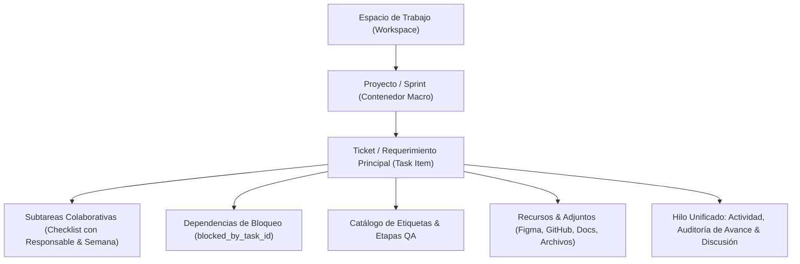
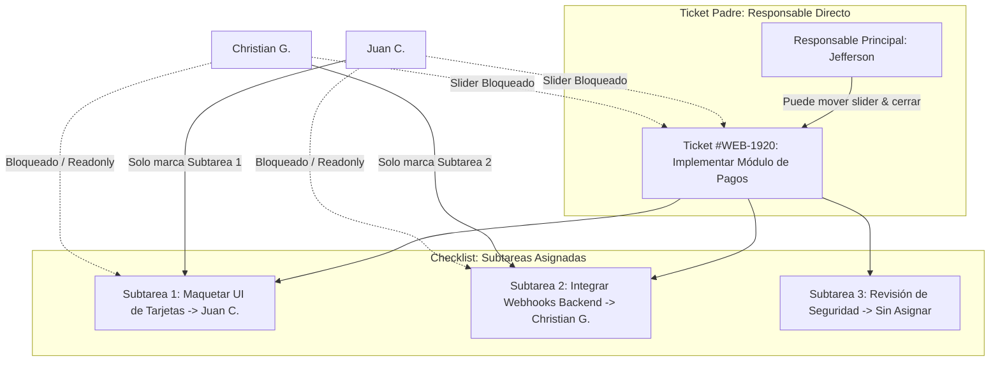
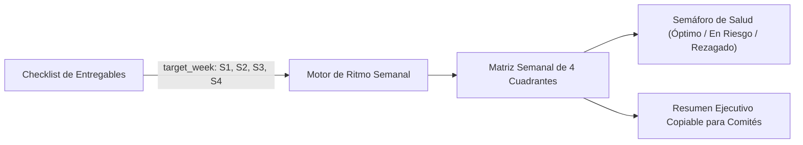
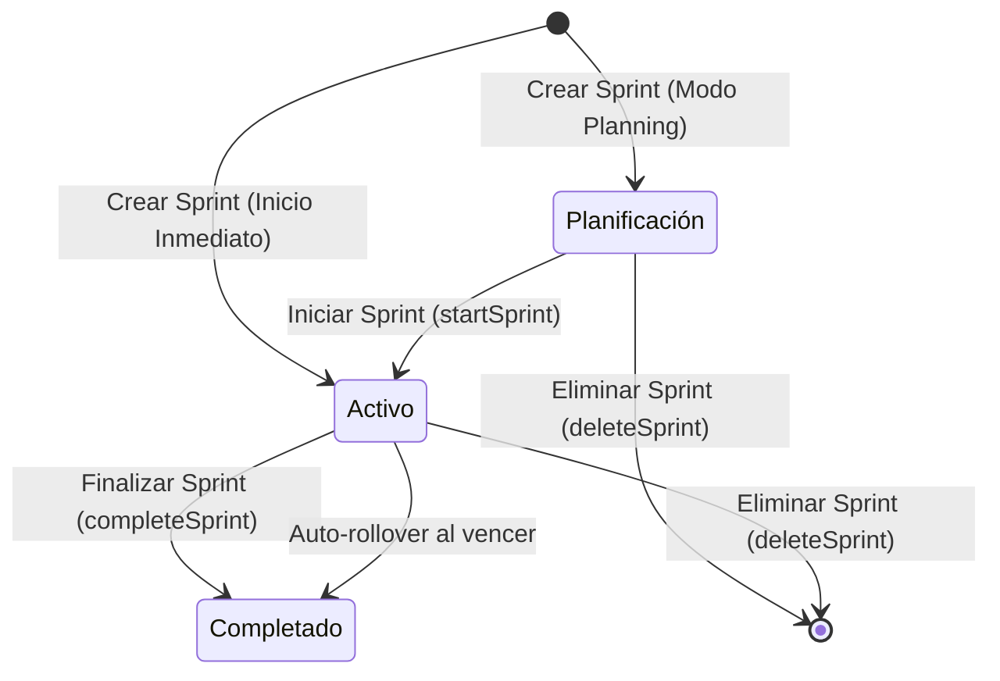

# Arquitectura Integral del Módulo de Gestión de Tareas (Task Management)

Este documento describe la estructura técnica, modelo de datos relacional, mecanismos de control de acceso (RBAC granular por espacios y roles), flujos operativos, arquitectura del sistema de subtareas colaborativas, estándares de interfaz, efectos visuales de enfoque y optimizaciones de rendimiento del módulo de **Gestión de Tareas (`tasks`)** y sus **Portales de Colaboradores**, en el ecosistema de PIXY Agency Manager.

---

## 1. Visión General y Jerarquía de Trabajo

El módulo orquesta el ciclo de vida operativo de los requerimientos y sprints de la agencia a través de una jerarquía de cuatro niveles:



### Componentes Principales del Sistema
1. **Plataforma Central (`/operations/tasks`)**: Panel administrativo para directores, administradores y personal interno con acceso a métricas globales (`TaskMetricsView`), tableros Kanban interactivos (`TaskKanbanBoard`) con detección de bloqueos `🚫`, matriz de ritmo semanal (`TaskWeeklyPacingMatrix`), vistas de lista paginadas (`TaskListView`) y gestión integral de espacios y proyectos.
2. **Portales Seguros por Token (`/portal/tasks/[token]`)**: Entornos web aislados accesibles mediante tokens criptográficos únicos por colaborador (`organization_staff.access_token`), sin requerir autenticación directa a la base de datos:
   - **Modo Colaborador (Ejecución)**: Enfocado en entregables y subtareas asignadas al colaborador (tanto si es el responsable principal del ticket como si participa como colaborador de subtarea en tickets ajenos). Cuenta con microinteracciones de enfoque visual (**Border Beam permanente** y **Shimmer temporal**), controles de cierre seguros y aislamiento estricto de permisos.
   - **Modo Gestor de Proyecto (PM / Lead)**: Puesto de mando táctico (`TaskPmOperationsDashboard`) con telemetría de ritmo, cinta interactiva de especialistas (`TaskCollaboratorRibbon`), delegación de subtareas individuales con asignación de responsable y semana, control de dependencias de bloqueo y facultad de crear proyectos y tickets según sus espacios autorizados.
   - **Modo Aseguramiento de Calidad (QA)**: Detección semántica de roles (`isStaffLeadOrPmRole` con keywords QA) con botones de acción rápida para aprobar requerimientos a producción o reportar hallazgos.

---

## 2. Modelo de Datos Relacional (Supabase / PostgreSQL)

El esquema se implementa en migraciones SQL con soporte multi-tenant estricto (`organization_id`):

### A. Tabla: `task_workspaces`
Define los espacios o unidades operativas macro (ej. *Desarrollo Web*, *App Móvil*, *Marketing*, *Diseño*).
| Campo | Tipo | Propósito |
|---|---|---|
| `id` | UUID (PK) | Identificador único del espacio. |
| `organization_id` | UUID (FK) | Tenant propietario. |
| `name` | Text | Nombre descriptivo del espacio de trabajo. |
| `slug` | Text | Identificador URL amigable. |
| `key_prefix` | Text | Prefijo para códigos de tickets (ej: `WEB`, `APP`, `MKT`). |
| `color` | Text | Color hexadecimal para identificación visual. |
| `description` | Text | Descripción opcional del alcance del espacio. |
| `icon` | Text | Identificador de icono de Lucide. |
| `lead_staff_id` | UUID (FK, Nullable) | Responsable o líder del espacio. |
| `order_index` | Integer | Posicionamiento en menús y selectores. |
| `is_active` | Boolean | Estado de vigencia (default: `true`). |
| `created_at` / `updated_at` | Timestamp | Registro temporal de creación y actualización. |

### B. Tabla: `task_workspace_members`
Gobierna el control de acceso granular por espacio para colaboradores.
| Campo | Tipo | Propósito |
|---|---|---|
| `id` | UUID (PK) | Identificador del registro de membresía. |
| `organization_id` | UUID (FK) | Tenant propietario. |
| `workspace_id` | UUID (FK) | Espacio de trabajo concedido (`task_workspaces`). |
| `staff_id` | UUID (FK) | Miembro del personal autorizado (`organization_staff`). |
| `created_at` | Timestamp | Registro de asignación de acceso. |

### C. Tabla: `task_projects`
Contenedores macro para agrupar tickets y requerimientos de un objetivo específico (sin mezclar la noción de ciclo temporal/sprint con el contenedor).
| Campo | Tipo | Propósito |
|---|---|---|
| `id` | UUID (PK) | Identificador del proyecto. |
| `organization_id` | UUID (FK) | Tenant propietario. |
| `workspace_id` | UUID (FK, Opcional) | Espacio al que pertenece el proyecto. |
| `name` | Text | Nombre del proyecto. |
| `slug` | Text | Slug único del proyecto. |
| `color` | Text | Color hexadecimal del proyecto. |
| `icon` | Text | Ícono representativo. |
| `description` | Text | Descripción de alcance y objetivos. |
| `status` | Text (`ProjectStatus`) | `active`, `paused`, `completed`, `archived`. |
| `lead_staff_id` | UUID (FK, Nullable) | Líder técnico asignado. |
| `start_date` | Timestamp | Fecha de inicio programada. |
| `target_date` | Timestamp | Fecha de cierre estimada. |
| `is_active` | Boolean | Indicador de proyecto activo. |
| `order_index` | Integer | Orden de presentación visual. |

### D. Tabla: `task_items`
Unidad atómica de requerimiento técnico, tarea o ticket.
| Campo | Tipo | Propósito |
|---|---|---|
| `id` | UUID (PK) | Identificador único del ticket. |
| `organization_id` | UUID (FK) | Tenant propietario. |
| `project_id` | UUID (FK) | Proyecto asociado (`task_projects`). |
| `ticket_code` | Text | Código autogenerado secuencial (ej: `WEB-101`, `APP-204`). |
| `title` | Text | Título descriptivo y conciso de la tarea. |
| `description` | Text | Criterios de aceptación y especificaciones técnicas. |
| `status` | Text (`TaskStatus`) | `backlog`, `todo`, `in_progress`, `in_review`, `blocked`, `done`. |
| `priority` | Text (`TaskPriority`) | `low`, `medium`, `high`, `urgent`. |
| `type` | Text (`TaskType`) | `task`, `feature`, `bug`, `improvement`, `delivery`. |
| `assigned_staff_id` | UUID (FK, Nullable) | Especialista líder asignado (`organization_staff`). Dueño del ticket padre. |
| `created_by_staff_id` | UUID (FK, Nullable) | Creador del ticket. |
| `qa_staff_id` | UUID (FK, Nullable) | Tester o revisor de calidad asignado. |
| `progress_percentage` | Integer | Avance registrado (0 - 100%). |
| `estimated_hours` | Numeric | Horas estimadas de ejecución. |
| `actual_hours` | Numeric | Horas reales reportadas. |
| `checklist` | JSONB (`TaskChecklistItem[]`) | Subtareas y entregables granulares con asignación de colaborador individual, semana objetivo y horas. |
| `blocked_by_task_id` | UUID (FK, Nullable) | Ticket predecesor que bloquea esta tarea (`task_items.id`). Dispara auto-desbloqueo reactivo al completarse. |
| `blocked_reason` | Text (Nullable) | Motivo o nota de impedimento registrada cuando la tarea está en estado `blocked`. Neutral y aplicable a cualquier tipo de negocio. Se limpia automáticamente a `null` al salir del estado bloqueado. |
| `tags` | Text[] / JSONB | Etiquetas libres y etapas de flujo del catálogo del tenant. |
| `attachments` | JSONB (`TaskAttachment[]`) | Enlaces externos (Figma, GitHub, Docs) y archivos subidos a storage. |
| `due_date` | Date / Timestamp | Fecha límite de entrega del entregable. |
| `order_index` | Integer | Orden dentro de columnas Kanban. |
| `is_recurring` | Boolean | Indicador de tarea periódica recurrente. |
| `recurrence_interval` | Text | Intervalo (`daily`, `weekly`, `biweekly`, `monthly`, `quarterly`, `biannual`, `yearly`). |
| `recurrence_day` | Integer | Día del ciclo programado (1-7 semanal, 1-31 mensual). |
| `parent_recurring_id` | UUID (FK, Nullable) | Tarea matriz de la que se derivó la recurrencia. |
| `last_recurred_at` | Timestamp | Última fecha en que se renovó. |
| `next_recurrence_at` | Timestamp | Próxima fecha programada para renovación. |
| `weekly_snapshots` | JSONB | Cortes inmutables congelados por semana (`{"s1": number, "s2": number, "s3": number, "s4": number}`). |

### E. Tabla: `task_comments`
Canal de discusión contextual del ticket con soporte para menciones de equipo y trazabilidad de eventos del sistema (Auditoría Integrada):
| Campo | Tipo | Propósito |
|---|---|---|
| `id` | UUID (PK) | Identificador del comentario. |
| `organization_id` | UUID (FK) | Tenant propietario. |
| `task_id` | UUID (FK) | Ticket al que pertenece el comentario. |
| `author_type` | Text | `owner`, `staff`, `system` (notas automáticas de auditoría). |
| `author_id` | UUID (FK) | Colaborador emisor (o null si es generado por el sistema). |
| `author_name` | Text | Nombre visible del autor o "Sistema". |
| `author_avatar` | Text | URL del avatar. |
| `content` | Text | Mensaje formateado o nota de auditoría (`📈`, `📉`, `🔄`, `👤`, `📅`, `⚡`, `🚫`, `🔓`, `☑️`, `⬜`). Incluye notas de bloqueo `🚫 Motivo del bloqueo: ...` y resolución `🔓 Motivo del bloqueo removido`. |
| `mentions` | JSONB / Text[] | Metadatos de colaboradores mencionados para notificaciones. |

### F. Mecanismo de Desbloqueo Reactivo y Restauración Inteligente
1. Cuando una tarea pasa a estado `done` o alcanza el 100% de progreso:
   - Se ejecuta `handleTaskUnblocking(predecessorId, ticketCode, title)` en [`task-actions.ts`](file:///G:/Pixy/agency-manager/src/modules/features/tasks/actions/task-actions.ts) o `handlePortalTaskUnblocking` en [`collaborator-portal-actions.ts`](file:///G:/Pixy/agency-manager/src/modules/features/tasks/actions/collaborator-portal-actions.ts).
   - Se localizan todas las tareas dependientes (`WHERE blocked_by_task_id = predecessorId`).
   - Se registra una nota de auditoría del sistema: `🔓 Bloqueo resuelto automáticamente por finalización de #TK-xxx`.
   - Si la tarea dependiente tenía estado `blocked`:
     - Se restaura a `in_progress` si su progreso previo es `> 0%` (preservando el trabajo ya iniciado por el colaborador).
     - Se restaura a `todo` si su progreso previo es `=== 0%`.
     - Se limpia automáticamente `blocked_reason = null` para reabrir el flujo sin residuos.
   - Las tareas desbloqueadas alertan a sus responsables y eliminan el micro-badge `🚫` en Kanban, listas y portales.
2. **Blindaje de Bloqueos:**
   - Una tarea bloqueada no puede pasar a `done` ni a `in_review` mientras la dependencia esté pendiente.
   - Si se desvincula manualmente la dependencia (`val === "none"`), el estado se restaura inteligentemente a `in_progress` o `todo`.

---

## 3. Arquitectura del Sistema de Subtareas y Entregables Colaborativos

El sistema de subtareas transforma el checklist tradicional en un motor de delegación multidireccional dentro del mismo ticket principal.



### A. Estructura de Datos de una Subtarea (`TaskChecklistItem`)
```typescript
export type TaskChecklistItem = {
  id: string;                         // Identificador único (ej: "item-1726712345678")
  title: string;                      // Descripción del entregable
  completed: boolean;                 // Estado completado / pendiente
  completed_at?: string;              // ISO Timestamp de resolución
  completed_by?: string;              // Primer nombre del colaborador que resolvió
  target_week?: 1 | 2 | 3 | 4 | null; // Semana asignada del mes para la Matriz de Ritmo
  due_date?: string | null;           // Fecha límite específica del entregable
  assigned_staff_id?: string | null;  // Colaborador especialista delegado
  assigned_staff?: {                  // Hidratación visual del especialista
    id: string;
    first_name: string;
    last_name: string;
    photo_url?: string | null;
    role?: string;
  } | null;
  estimated_hours?: number | null;    // Horas estimadas para la subtarea
};
```

### B. Matriz de Permisos y Reglas de Aislamiento (Seguridad Frontend & Backend)

| Acción / Elemento | Colaborador con Subtarea Propia | Responsable del Ticket Padre | Gestor PM / Lead / Admin |
|---|---|---|---|
| **Marcar su propia subtarea** | ✅ Permitido | ✅ Permitido | ✅ Permitido |
| **Marcar subtarea de otro colaborador** | ❌ **BLOQUEADO** (Disabled + Rechazo) | ✅ Permitido | ✅ Permitido |
| **Marcar subtarea sin asignar** | ❌ **BLOQUEADO** (Disabled + Rechazo) | ✅ Permitido | ✅ Permitido |
| **Arrastrar Slider de Progreso General** | ❌ **BLOQUEADO** (Slider disabled + Lock) | ✅ Permitido | ✅ Permitido |
| **Cerrar Ticket a 100% / estado `done`** | ❌ **BLOQUEADO** (Rechazo en Server) | ✅ Permitido (si checklist completo) | ✅ Permitido (si checklist completo) |
| **Reasignar responsable de subtarea** | ❌ Solo lectura | ❌ Solo lectura | ✅ Permitido (Select interactivo) |
| **Cambiar semana objetivo (`target_week`)** | ❌ Solo lectura | ❌ Solo lectura | ✅ Permitido (Select interactivo) |
| **Eliminar subtarea del checklist** | ❌ Solo lectura | ❌ Solo lectura | ✅ Permitido (Botón papelera) |

#### Implementación en Servidor ([`collaborator-portal-actions.ts`](file:///G:/Pixy/agency-manager/src/modules/features/tasks/actions/collaborator-portal-actions.ts)):
1. **En `portalToggleChecklist`**:
   - Resuelve si el solicitante es el dueño directo (`task.assigned_staff_id === staff.id`) o PM (`isStaffLeadOrPmRole`).
   - Si no lo es, valida estrictamente: `targetItem.assigned_staff_id === staff.id`.
   - Si un colaborador intenta alterar la subtarea de otro, la acción falla con error 403: *"No tienes autorización para marcar subtareas asignadas a otros colaboradores."*
   - Si intenta marcar una subtarea sin asignar: *"Solo el responsable directo de la tarea o un PM pueden marcar subtareas generales."*
2. **En `portalUpdateTaskProgress`**:
   - Valida `canCloseParentTask = isLeadOrPm || isMainAssignee`.
   - Si un colaborador ajeno intenta modificar el slider vía API: *"Solo el responsable directo de la tarea o un PM pueden ajustar el avance general del ticket."*
3. **En `portalUpdateTask`**:
   - Para no propietarios: `delete data.progressPercentage` descarta cualquier intento de sobreescribir el avance general del ticket.
   - El payload del checklist se sanitiza en el backend: solo se aceptan mutaciones de `completed` sobre los ítems donde `existing.assigned_staff_id === staff.id`.
   - El progreso se recalcula matemáticamente según los entregables válidos completados.
   - **Regla de Paso a QA**: Si todas las subtareas se completan y el progreso llega a 100%, el ticket avanza a `in_review` (QA) y **nunca directamente a `done`**, garantizando que el responsable o el PM hagan la entrega formal.

---

## 4. Experiencia Visual de Enfoque en Subtareas (Microinteracciones Premium)

Para que los colaboradores identifiquen de forma instantánea qué entregable les corresponde al abrir un ticket sin confundirse con las tareas de sus compañeros:

### A. Border Beam Permanente (`.animate-border-beam`)
- **Propósito**: Delimitar de manera continua la caja de la subtarea que pertenece al colaborador conectado.
- **Implementación Técnica** ([`globals.css`](file:///G:/Pixy/agency-manager/src/app/globals.css)):
  - `@property --beam-angle`: Registra la propiedad CSS tipada `<angle>` para que el motor del navegador interpole suavemente los 360 grados del gradiente cónico.
  - `@keyframes border-beam-spin`: Rotación infinita continua de `0deg` a `360deg`.
  - Contenedor con `mask-composite: exclude` y pseudo-elemento `::before` de 1.5px de grosor.
  - Inyección dinámica del color corporativo de la organización mediante la variable `--beam-color: brandColor`.
  - **Permanencia**: La animación corre con `animation: border-beam-spin 4s linear infinite;`, manteniéndose activa mientras la subtarea permanezca pendiente.
  - Al completarse la subtarea, la clase se retira automáticamente, pasando al estado estándar con check esmeralda y texto tachado.

### B. Shimmer de Texto Temporal con Desvanecimiento Suave (`ShimmerText`)
- **Propósito**: Destacar el título de la subtarea con una ola de brillo reflectante en el momento en que se abre el modal o se cargan las tarjetas, y luego disolverse suavemente hacia el texto normal para evitar fatiga visual.
- **Implementación Técnica** ([`global-dashboard-banner.tsx`](file:///G:/Pixy/agency-manager/src/modules/core/dashboard/components/global-dashboard-banner.tsx)):
  - Propiedad opcional `duration?: number` (fijada en `3000` ms para subtareas).
  - Durante los primeros ~2.3s corre la ola de máscara `text-shimmer-wave`.
  - A los 2.3s (`duration - 700ms`), se activa una transición de opacidad cruzada (`duration-700`): la capa con la máscara de brillo transiciona a `opacity-0` mientras el texto sólido normal transiciona a `opacity-100`.
  - A los 3.0s, el efecto se desmonta por completo, retornando el texto limpio `{children}` sin sobrecarga en el DOM.
  - **Reactivación por Apertura**: En el modal de detalle se monta con `key={`${item.id}-${isOpen}`}`, garantizando que cada vez que el colaborador abre el modal de un ticket, el destello de 3 segundos se ejecuta nuevamente de forma impecable.

### C. Estado de Subtareas de Terceros
- Checkbox inhabilitado (`cursor-not-allowed opacity-40`).
- Icono de candado ([`Lock`](file:///G:/Pixy/agency-manager/src/modules/features/tasks/components/portal/task-portal-detail-modal.tsx)) de 14x14px envuelto en contenedor semántico con tooltip nativo.
- Fondo atenuado (`bg-muted/20 border-border/40 opacity-75`).
- Al hacer clic en una tarjeta bloqueada en el Grid, se emite un toast de advertencia inmediato: *"Solo el colaborador asignado a esta subtarea puede marcarla."*

### D. Burbuja de Subtareas en Tablas de Requerimientos (`TaskSubtasksTooltipBadge`)
- Componente compartido: [`task-subtasks-tooltip-badge.tsx`](file:///G:/Pixy/agency-manager/src/modules/features/tasks/components/shared/task-subtasks-tooltip-badge.tsx).
- Ubicado en la columna del título en las tablas de `/operations/tasks` y `/portal/tasks/[token]`.
- Muestra una píldora con icono `CheckSquare` y contador `completadas/total` (ej: `1/3`):
  - 🟢 Verde esmeralda si están 100% completas (`CheckCircle2`).
  - 🔵 Azul cielo si hay avance parcial (> 0).
  - ⚪ Gris neutro si están todas pendientes.
- Al posar el cursor (`hover`), despliega un `TooltipContent` translúcido estilizado con:
  - Mini barra de progreso porcentual.
  - Lista detallada de subtareas: nombre, estado (tachado y atenuado si está lista), indicador de semana (`S1`..`S4`) y chip con mención del responsable asignado (`@Juan C.`).

---

## 5. Control de Acceso y Aislamiento por Espacios (RBAC Granular)

Para permitir que una agencia gestione múltiples unidades operativas (ej. *Espacio Web* y *Espacio App Móvil*) sin que colaboradores ajenos tengan visibilidad no autorizada:

1. **Acceso Global Implícito (Dueños y Administradores)**:
   - Usuarios con roles de administración o colaboradores sin restricciones en `task_workspace_members` tienen visibilidad total sobre todos los espacios, proyectos y tareas.
2. **Acceso Acotado a Espacios (`task_workspace_members`)**:
   - Si un colaborador tiene registros en `task_workspace_members`, sus consultas se limitan estrictamente a esos `workspace_id`.
   - Proyectos de espacios no autorizados quedan filtrados en el combobox, tableros y listados.
   - En el portal de colaboradores, un PM asignado a un solo espacio únicamente puede crear proyectos y tickets dentro de su espacio asignado.
3. **Mapeo de Consultas con `allowedWorkspaceIds` y `allowedProjectIds`**:
   - En [`collaborator-portal-actions.ts`](file:///G:/Pixy/agency-manager/src/modules/features/tasks/actions/collaborator-portal-actions.ts), se realiza la intersección de membresías al iniciar la sesión del portal:
     ```ts
     const { data: memberWorkspaces } = await supabaseAdmin
       .from("task_workspace_members")
       .select("workspace_id")
       .eq("staff_id", staff.id);
     ```
   - Si existen membresías, se extraen los IDs y solo se cargan proyectos hijos de esos espacios.

---

## 6. Patrones de Interfaz y Navegación

### A. Combobox Unificado en Árbol (Espacios y Proyectos)
En lugar de selectores separados que consumen espacio horizontal, se diseñó un combobox jerárquico integrado en [`task-manager-view.tsx`](file:///G:/Pixy/agency-manager/src/modules/features/tasks/components/task-manager-view.tsx) y [`task-collaborator-portal.tsx`](file:///G:/Pixy/agency-manager/src/modules/features/tasks/components/portal/task-collaborator-portal.tsx):
- **Jerarquía en Árbol**:
  - **Espacios de Trabajo**: Justificados completamente a la izquierda, en negrita, sin dot circular para distinguirlos con claridad.
  - **Proyectos**: Anidados hacia la derecha con indentación visual (`pl-6`), acompañados de su dot de color corporativo.
- **Edición Contextual Inmediata**:
  - Un botón de acción rápida con icono de lápiz (`Pencil`) permite editar el elemento seleccionado actualmente (si es un espacio abre [`WorkspaceFormModal`](file:///G:/Pixy/agency-manager/src/modules/features/tasks/components/modals/workspace-form-modal.tsx); si es un proyecto abre [`ProjectFormModal`](file:///G:/Pixy/agency-manager/src/modules/features/tasks/components/modals/project-form-modal.tsx)).
- **Aislamiento de Despliegue**: El popover de filtros despliega su contenido internamente sin empujar los elementos de la barra de herramientas fuera del frame contenedor.

### B. Botón de Creación Unificado (+ Nuevo)
El botón principal despliega un menú contextual según permisos:
- **+ Nuevo Ticket**: Invoca el modal de creación de requerimientos.
- **+ Nuevo Proyecto**: Invoca el modal de creación de proyectos/sprints, asociándolo al espacio contextual seleccionado.

---

## 7. Estándar de Diseño de Modales (Estilo Linear / Jira)

Para evitar contaminación visual y antipatrones de interfaz:

1. **Eliminación de Falsos Botones**:
   - Se erradicó el badge verde `+ NUEVO TICKET` en la cabecera que confundía a los usuarios al aparentar ser un botón interactivo.
2. **Supresión de Redundancias**:
   - Se eliminó el indicador duplicado de proyecto en la cabecera, ya que el selector interactivo es el primer campo del formulario.
   - Se retiraron los badges de rol innecesarios (`Gestor de Proyecto (Configuración Completa)`, `Modo Gestor PM`, `Modo Colaborador`).
3. **Cabecera Minimalista**:
   - **Izquierda**: Icono sobrio `<CheckSquare className="w-4 h-4 text-primary" />` acompañado del título semántico (`Nuevo Ticket de Sprint` o `TK-101` en edición).
   - **Derecha**: Botón de acción principal (`Crear Ticket` o `Guardar Cambios`), botón de `Eliminar` (si aplica) y botón de cierre `X`.
4. **Placeholder Profesional**:
   - Todos los inputs de título usan el placeholder estandarizado:
     ```tsx
     placeholder="Título de la tarea o requerimiento..."
     ```

---

## 8. Sistema Integral de Etiquetas (Tags & Catálogo Dinámico del Tenant)

### A. Catálogo Dinámico en `organizations.app_metadata.task_tags`
A diferencia de esquemas rígidos con tablas SQL dedicadas, el catálogo de etiquetas del tenant se persiste y versiona en la columna `app_metadata` de la organización mediante [`task-tag-actions.ts`](file:///G:/Pixy/agency-manager/src/modules/features/tasks/actions/task-tag-actions.ts):
- **Tipado (`TenantTaskTag`)**:
  ```typescript
  export interface TenantTaskTag {
    id: string;            // slug/key único sanitizado (ej: "qa-failed", "frontend")
    name: string;          // nombre de la etiqueta
    label: string;         // etiqueta visible para el usuario
    color: string;         // 'blue' | 'emerald' | 'purple' | 'amber' | 'red' | 'indigo' | 'rose' | 'cyan' | 'slate'
    is_favorite: boolean;  // si es favorita para predominar arriba en el selector
    created_at?: string;
    created_by?: string;
  }
  ```
- **Inicialización Automática**: Si el tenant aún no tiene etiquetas configuradas, `getTenantTaskTags` siembra y persiste automáticamente el array `DEFAULT_TENANT_TASK_TAGS`.
- **Gobernanza de Catálogo**:
  - `createTenantTaskTag`: Exclusivo para PMs, Leads y administradores (`canManageCatalog`). Sanitiza el nombre (slug en minúsculas sin símbolos `#` o `@`).
  - `toggleFavoriteTenantTaskTag`: Permite fijar o desfijar etiquetas para que aparezcan en el bloque superior de acceso rápido.
  - `deleteTenantTaskTag`: Valida antes con `getTagUsageCount` para evitar eliminar etiquetas con alto volumen de uso activo en tickets.

### B. Componente Unificado: [`TaskTagSelector`](file:///G:/Pixy/agency-manager/src/modules/features/tasks/components/tags/task-tag-selector.tsx)
Centraliza la gestión visual en creación, edición y portales:
- Despliega primero las etiquetas favoritas en píldoras coloreadas de un solo clic.
- Barra de búsqueda reactiva para localizar etiquetas del catálogo por nombre.
- Input para crear nuevas etiquetas al presionar `Enter` (si el usuario tiene permisos de gestión).
- Píldoras activas removibles con botón `×`.

### C. Visualización Transversal
- **Tablero Kanban ([`task-kanban-board.tsx`](file:///G:/Pixy/agency-manager/src/modules/features/tasks/components/kanban/task-kanban-board.tsx))**: Renderiza las etapas del sistema con su estilo semántico y las etiquetas del catálogo con chips sutiles `#{tag}`.
- **Vista de Lista ([`task-list-view.tsx`](file:///G:/Pixy/agency-manager/src/modules/features/tasks/components/list/task-list-view.tsx))**: Badges compactos junto al título del ticket.
- **Portal de Colaboradores ([`task-collaborator-portal.tsx`](file:///G:/Pixy/agency-manager/src/modules/features/tasks/components/portal/task-collaborator-portal.tsx))**: Chips visibles en tarjetas individuales y en la tabla de tareas.

---

## 9. Reglas de Negocio y Restricciones Operativas

1. **Aislamiento de Subtareas por Colaborador**:
   - Un colaborador que participa en un ticket ajeno únicamente puede marcar o desmarcar la subtarea que tenga asignada su `assigned_staff_id`.
   - No puede alterar subtareas asignadas a sus compañeros ni subtareas generales sin asignar.
   - Cualquier intento es bloqueado en la interfaz y rechazado con código 403 en servidor (`portalToggleChecklist` y `portalUpdateTask`).
2. **Bloqueo del Slider y Cierre para Colaboradores de Subtareas**:
   - El slider de porcentaje general y el cambio de estado a `done` están estrictamente reservados para el **responsable principal del ticket** (`task.assigned_staff_id === staff.id`), el **Gestor de Proyecto / Lead** o el **Revisor QA**.
   - Para colaboradores de subtarea, el slider se presenta deshabilitado con icono de candado `Lock` y el servidor ignora cualquier valor de `progressPercentage` enviado por el cliente.
3. **Regla del 95% y Transición Automática a QA (`in_review`)**:
   - Una tarea **no puede alcanzar el 100% de progreso ni cambiar al estado `done`** si tiene subtareas sin completar en su checklist. El sistema frena el avance en **95%** y ajusta el estado a `in_review`.
   - Cuando todas las subtareas son completadas por los colaboradores (100% de entregables listos), el ticket avanza automáticamente a `in_review` (QA) y **nunca a `done`**, garantizando que el responsable o el PM hagan la entrega formal.
4. **Slider de Progreso Seguro (Debounce de Commits)**:
   - La manipulación continua del control deslizante actualiza el estado local en memoria (`onValueChange`), evitando ráfagas de escrituras a la base de datos.
   - El commit en base de datos únicamente se dispara al soltar el ratón (`onValueCommit`), optimizando la red y previniendo pérdidas de estado.
5. **Circuito de QA (`Aprobar QA` vs `Hallazgo`)**:
   - En estado `in_review`, los usuarios con rol QA o PM disponen de dos acciones directas:
     - **Aprobar QA**: Establece estado `done`, progreso 100% y dispara celebración.
     - **Hallazgo**: Devuelve la tarea a `in_progress` y permite reportar los motivos del rechazo.

---

## 10. Optimización de Rendimiento y Escalabilidad

Se aplicó una reestructuración de ingeniería para garantizar fluidez con miles de tickets concurrentes:

### A. Índices Compuestos en Base de Datos (`20260916000003_optimize_task_indexes.sql`)
- `idx_task_items_org_proj_status`: Índice compuesto en `(organization_id, project_id, status)` para acelerar filtros de tableros Kanban.
- `idx_task_items_org_assigned`: En `(organization_id, assigned_staff_id)` para consultas de tareas asignadas al colaborador en portales.
- `idx_task_items_org_created`: En `(organization_id, created_at DESC)` para listados paginados cronológicos.
- `idx_task_workspace_members_org_staff`: En `(organization_id, staff_id)` para verificación instantánea de permisos en portales.

### B. Ejecución de Consultas Concurrentes y `React.cache()`
- En `collaborator-portal-actions.ts`, las consultas de membresías, proyectos, organización, staff y menciones se resuelven concurrentemente con `Promise.all()`.
- Se envuelven las funciones en `React.cache()` para deduplicar peticiones dentro del mismo ciclo de render de Next.js.

### C. Paginación Eficiente en Vistas de Lista
- [`task-list-view.tsx`](file:///G:/Pixy/agency-manager/src/modules/features/tasks/components/list/task-list-view.tsx) implementa paginación reactiva con selector de tamaño de página (10, 25, 50, 100 elementos) para mantener el árbol DOM ligero.

### D. Memoización en Tableros Kanban
- `TaskKanbanCard` está memoizado con `React.memo` y un comparador de propiedades personalizado (`arePropsEqual`).
- La clasificación de tareas por columnas en [`task-kanban-board.tsx`](file:///G:/Pixy/agency-manager/src/modules/features/tasks/components/kanban/task-kanban-board.tsx) se realiza en **una sola pasada $O(n)$** en lugar de filtros repetidos $O(k \cdot n)$.

### E. Aislamiento de Sliders y Carga Diferida (Lazy Loading)
- `PortalTaskSlider` opera como un componente aislado, evitando re-renders del tablero completo mientras se arrastra el slider.
- Animaciones pesadas de Lottie (celebración al 100% y modal de alertas) se cargan dinámicamente (`lazy load`) sólo cuando el modal correspondiente se activa.

---

## 9. Experiencia de Usuario y Estándares de Interfaz

### A. Sistema Dual de Menciones en Discusión (@ y #)
Implementado en [`task-detail-modal.tsx`](file:///G:/Pixy/agency-manager/src/modules/features/tasks/components/modals/task-detail-modal.tsx) y [`task-portal-detail-modal.tsx`](file:///G:/Pixy/agency-manager/src/modules/features/tasks/components/portal/task-portal-detail-modal.tsx):
1. **Menciones de Colaboradores (`@`)**:
   - Activa un popover flotante inteligente que filtra por nombre a los miembros de la organización.
   - Inserta `@Nombre` y notifica al usuario en su portal correspondiente.
2. **Menciones de Tickets (`#`)**:
   - Al tipear `#`, despliega un menú flotante con búsqueda instantánea por código de ticket (ej. `TK-101`) o palabras clave en el título.
   - En el historial de comentarios, cualquier mención `#TK-XXX` se renderiza como un chip interactivo estilizado (`FormattedCommentContent`).
   - **Navegación inter-ticket**: Al pulsar un chip `#TK-XXX`, el modal cambia directamente al ticket mencionado sin recargar la página.

### B. Confirmación de Cierre y Validación de Entregables
- En el portal de colaboradores, las acciones de completado ("Listo" en tabla o "Completar" en tarjetas) abren un `AlertDialog` con animación slide-in from bottom (`animate-alert-enter`).
- **Validación de checklist**:
  - Si existen entregables sin marcar como completados, se muestra una alerta ámbar detallando la cantidad pendiente y fijando el avance como máximo en **95%**.
  - Si todos los entregables están listos, confirma el cierre formal al **100%** con estado `done` y activa la celebración.

### C. Acciones Minimalistas y Tablas Fluidas
- **Columna Acciones**: En la tabla del portal, los botones de acción son exclusivamente de ícono (`CheckCircle2` y `Settings` de 28x28px) con tooltips nativos (`title`), optimizando el espacio horizontal.
- **Protección de Tablas en Pantallas Angostas**: Contenedores con `overflow-x-auto` y `min-w-[760px]` (en portal) o `min-w-[800px]` (en plataforma) para prevenir la compresión o solapamiento de columnas en dispositivos móviles o pantallas reducidas.
- **Ancho Completo Responsivo (100%)**: Se retiraron los límites de ancho fijos (`max-w-7xl mx-auto`) de los portales, utilizando `w-full px-4 sm:px-6 lg:px-8 xl:px-10` para aprovechar monitores ultra-wide, 2K y 4K.

### D. Scroll Horizontal Desktop en Monitor de Colaboradores
- En [`task-collaborator-ribbon.tsx`](file:///G:/Pixy/agency-manager/src/modules/features/tasks/components/portal/task-collaborator-ribbon.tsx), se captura el evento `wheel` del ratón para traducir el giro vertical (`deltaY`) en desplazamiento horizontal fluido sobre el monitor de especialistas, complementado por una barra de desplazamiento delgada (`scrollbar-thin`).

### E. Tonalización y Contraste del Riel de Slider
- En [`slider.tsx`](file:///G:/Pixy/agency-manager/src/components/ui/slider.tsx), el riel base se estiliza con `bg-zinc-200/90 dark:bg-zinc-800 border border-zinc-300/50 dark:border-white/10` y soporte para `trackClassName`, garantizando contraste visual nítido frente al fondo blanco o grafito de las tablas.

---

## 12. Motor de Tareas Recurrentes / Periódicas (Recurrence Engine)

Para automatizar procesos cíclicos (mantenimientos preventivos, auditorías semanales, cierres contables mensuales, backups diarios, etc.), el sistema incorpora un motor nativo de recurrencia:

### A. Columnas de Recurrencia en `task_items`
- `is_recurring` (`BOOLEAN`, default `false`): Señalizador de tarea periódica activa.
- `recurrence_interval` (`VARCHAR(32)`): Intervalo de ciclo (`daily`, `weekly`, `biweekly`, `monthly`, `quarterly`, `biannual`, `yearly`).
- `recurrence_day` (`INTEGER`, default `1`): Día programado del ciclo (1-7 para semanal; 1-31 para mensual/trimestral/anual).
- `parent_recurring_id` (`UUID`, FK hacia `task_items`): Trazabilidad hacia la tarea matriz o plantilla original.
- `last_recurred_at` (`TIMESTAMPTZ`): Fecha y hora en la que se generó la última instancia.
- `next_recurrence_at` (`TIMESTAMPTZ`): Próxima fecha y hora de renovación calculada con `date-fns`.

### B. Endpoint Cron Idempotente (`/api/cron/tasks-recurrence`)
- Protegido mediante `requireCronSecret` para ejecución desatendida segura vía Vercel Cron o cron daemon.
- Localiza tareas donde `is_recurring = true` y `next_recurrence_at <= NOW()`.
- **Clonación atómica**: Genera una nueva tarea clonando título, descripción, proyecto, asignados, etiquetas y entregables del checklist (los cuales se reinician a `completed = false`, preservando su asignación de `target_week`).
- **Control de instancia única**: La tarea anterior se marca como cerrada en su ciclo (`is_recurring = false`), transfiriendo la antorcha a la nueva instancia con su siguiente fecha programada calculada automáticamente.

---

## 13. Sistema de Avance Fraccionado & Matriz Ejecutiva de Ritmo Semanal (Weekly Pacing Matrix)

Diseñado para sustituir los controles manuales estáticos e ineficientes (como las tablas de Excel tradicionales donde se preguntan avances de forma empírica en reuniones semanales), este sistema conecta el avance porcentual con entregables tangibles verificables:



### A. Entregables Vinculados a Semanas del Mes
- Cada ítem del checklist (`TaskChecklistItem`) incluye el atributo opcional `target_week?: 1 | 2 | 3 | 4 | null`.
- Los líderes y colaboradores pueden asignar entregables a la semana objetivo directamente desde los modales de creación y detalle (`task-form-modal.tsx`, `task-detail-modal.tsx`, `task-portal-detail-modal.tsx`).
- **Lógica Temporal y Auditoría Semanal**:
  - **Tareas con Entregables por Semana (`target_week`)**: Cada semana mide estrictamente los entregables comprometidos para esa semana. Si una semana no tiene entregables programados, se presenta como `— Plan`, evitando catalogarla erróneamente en retraso. El retraso (`delayed`) solo se dispara si una semana pasada tenía entregables comprometidos que no se finalizaron o si el ticket está bloqueado.
  - **Tareas con Entregable Único**: Si un ticket tiene un solo entregable asignado (ej. S2), las semanas previas se mantienen en `— Plan` sin penalización. Durante la semana activa, si el usuario trabaja en ella, el slider global se refleja en dicha semana (ej. 50% en progreso) hasta marcar el check para alcanzar el 100% definitivo.
  - **Tareas Estándar (Sin Entregables Semanales)**: Se eliminó el esquema de cuartiles artificiales (que imputaba avance a semanas futuras inexistentes). La semana activa refleja el progreso global real del ticket (ej: 95% en S3). Las semanas futuras se mantienen en `— Plan` (0% de avance). En semanas pasadas, solo se marca retraso si la fecha límite (`due_date`) expiró o si el ticket está bloqueado; las tareas en curso normal se reconocen como programadas, eliminando falsos positivos en el semáforo gerencial.
  - **Exclusión Estricta de Tickets en Backlog**: Los tickets con estado `backlog` son excluidos por completo de la matriz de ritmo semanal. Al tratarse de requerimientos en cola sin priorización de sprint, no representan compromisos inmediatos y excluirlos evita falsos rezagos y saturación visual en la telemetría gerencial.

### B. Matriz Ejecutiva (`TaskWeeklyPacingMatrix`)
- Componente interactivo de alta dirección ubicado en:
  1. **Plataforma Central (`/operations/tasks`)**: Nueva pestaña permanente **"Ritmo Semanal"** junto a General, Tablero Kanban y Métricas.
  2. **Portal de Gestores PM (`/portal/tasks/[token]`)**: Switch superior de tres estados (**Dashboard**, **Gestión**, **Ritmo Semanal**).
- **Indicadores y Semáforos en Tiempo Real**:
  - 🟢 **En Ritmo (On Track)**: El avance de la semana en curso cumple o supera la cuota programada.
  - 🟡 **En Riesgo (At Risk)**: Existe retraso leve o entregables de la semana previa incompletos.
  - 🔴 **Rezagada (Delayed)**: La semana activa está vencida sin los entregables mínimos completados.
  - ⚪ **No Iniciada (Not Started)**: Semana futura programada aún sin actividad.
- **Barra de Herramientas y Filtros Integrada (`SearchFilterBar`)**:
  - Buscador reactivo por código, título y colaborador.
  - Píldoras de filtro rápido con contadores dinámicos: *Todas*, *Con Retraso*, *Periódicas*, *En Riesgo*, *En Ritmo*.
  - Selector jerárquico de Espacios de Trabajo / Proyectos con formato de árbol.
  - Selector de Colaborador con avatares integrados.
  - Navegador de mes junto al botón de acción ejecutiva con tooltip ("Copiar resumen ejecutivo al portapapeles").
- **Optimizaciones de Visualización y Rendimiento**:
  - **Indicador de Semana Actual**: Resaltado visual en el encabezado (`● Actual`) y sutil tintado de columna, activo únicamente cuando se consulta el mes en curso.
  - **Celdas Semanales Limpias**: Porcentaje numérico de avance (`%`) acompañado de su badge de estado y contador de entregables completados, prescindiendo de barras deslizantes para evitar redundancia visual.
  - **Badges en Español Estricto**: Etiquetas de recurrencia limpias (*Semanal*, *Mensual*, *Quincenal*, etc.) sin emojis ni términos en inglés hardcodeados.
  - **Paginación Inteligente**: Control de 25, 50 y 100 registros por página con reseteo automático ante cambios de filtro, garantizando renderizado ágil en tableros con cientos de tickets.
- **Exportación con 1 Clic**: Botón de copia que formatea un informe ejecutivo estructurado en Markdown listo para comités directivos y canales operativos.

### C. Sistema de Snapshots Automáticos de Corte Semanal
- **Persistencia Histórica (`task_items.weekly_snapshots`)**:
  - Columna JSONB que almacena cortes congelados inmutables: `{"s1": number, "s2": number, "s3": number, "s4": number}`.
  - Resuelve de raíz el problema de regresión de porcentajes en tareas de slider: si un colaborador tuvo 20% en S1 y 35% en S2, y en S3 el PM realiza una regresión a 30%, los cortes de S1 y S2 permanecen grabados fielmente (idéntico al histórico de Excel).
- **Cron de Corte Semanal (`/api/cron/tasks-pacing-snapshot`)**:
  - Ejecutable cada domingo a las 23:59 o programable vía Vercel Cron.
  - Evalúa y congela automáticamente la foto de la semana que cierra para todas las tareas activas de la organización.
- **Acciones de Ajuste Manual**:
  - Server actions `saveTaskWeeklySnapshot` y `portalSaveTaskWeeklySnapshot` para que líderes y PMs puedan corregir o auditar manualmente el corte de una semana histórica si fuera necesario.

---

## 14. Estructura de Directorios del Módulo

```
src/
├── app/
│   ├── (dashboard)/operations/tasks/page.tsx    # Ruta principal en plataforma (/operations/tasks)
│   ├── (public)/portal/tasks/[token]/page.tsx   # Ruta pública de acceso por token seguro
│   └── api/cron/
│       ├── tasks-pacing-snapshot/route.ts       # Cron dominical de congelamiento de cortes semanales
│       └── tasks-recurrence/route.ts            # Cron de renovación de tareas periódicas
└── modules/features/tasks/
    ├── actions/
    │   ├── collaborator-portal-actions.ts       # Acciones del portal autenticadas por access_token
    │   ├── task-actions.ts                      # Server Actions administrativas internas
    │   └── task-tag-actions.ts                  # Catálogo de etiquetas dinámicas en tenant app_metadata
    ├── components/
    │   ├── collaborators/
    │   │   └── task-collaborators-manager.tsx   # Asignación de colaboradores y roles de tarea
    │   ├── kanban/
    │   │   └── task-kanban-board.tsx            # Tablero Kanban O(n) con React.memo y dependencias
    │   ├── list/
    │   │   └── task-list-view.tsx               # Vista de lista paginada con ordenamiento
    │   ├── metrics/
    │   │   └── task-metrics-view.tsx            # Telemetría analítica global de tareas
    │   ├── modals/
    │   │   ├── project-form-modal.tsx           # Creación y edición de proyectos
    │   │   ├── task-detail-modal.tsx            # Modal de detalle y edición completa en plataforma
    │   │   ├── task-form-modal.tsx              # Modal de nuevo ticket con cabecera minimalista
    │   │   └── workspace-form-modal.tsx         # Creación y edición de espacios de trabajo
    │   ├── pacing/
    │   │   ├── task-pacing-pdf-modal.tsx        # Previsualizador e impresor de PDF vertical A4
    │   │   └── task-weekly-pacing-matrix.tsx    # Matriz ejecutiva de ritmo semanal (4 cuadrantes)
    │   ├── portal/
    │   │   ├── task-collaborator-portal.tsx     # Portal principal con vistas Grid, Lista y Kanban
    │   │   ├── task-collaborator-ribbon.tsx     # Monitor interactivo de especialistas (cinta con WhatsApp)
    │   │   ├── task-pm-operations-dashboard.tsx # Dashboard operacional de sprints y cola QA
    │   │   └── task-portal-detail-modal.tsx     # Modal de ticket para portales con beam y shimmer
    │   ├── shared/
    │   │   ├── task-blocker-selector.tsx        # Combobox ultra-versátil de causa de bloqueo y dependencias de tickets
    │   │   └── task-subtasks-tooltip-badge.tsx  # Píldora con tooltip desplegable de subtareas
    │   ├── tags/
    │   │   └── task-tag-selector.tsx            # Selector unificado de tags del tenant
    │   └── task-manager-view.tsx                # Orquestador visual central de la plataforma
    ├── types.ts                                 # Tipos TypeScript, constantes, normalizadores y helpers
    └── utils/
        ├── avatar-presets.ts                    # Mapeo de avatares 3D y visualizadores
        └── recurrence-utils.ts                  # Lógica de cálculo temporal de recurrencias
```

---

## 15. Experiencia de Usuario (UX), Filtros Avanzados y Escalabilidad de Portales

Para mantener un rendimiento óptimo y una experiencia fluida frente a volúmenes masivos de requerimientos, se incorporaron los siguientes estándares arquitectónicos:

### A. Paginación Reactiva en Portales (`TaskCollaboratorPortal`)
- **Control de Densidad**: Selectores de página de 25, 50 y 100 registros integrados en la vista de lista/tabla de colaboradores y gestores.
- **Reseteo Automático**: Cualquier interacción con la barra de búsqueda o píldoras de filtrado reinicia reactivamente el índice de página a 1 (`currentPage = 1`), eliminando pantallas vacías accidentales.
- **Rendimiento O(n)**: La paginación corta el árbol de renderizado de React en el cliente después de aplicar los filtros y búsquedas sobre el conjunto en memoria, garantizando transiciones instantáneas a 60 FPS sin saturar el DOM.

### B. Arquitectura Macroscópica de Filtros (`SearchFilterBar`)
- **Selección Individual Estricta**: Eliminación de estados de filtro combinados confusos. Cada acción activa una vista exclusiva:
  - **Todas**: Vista holística de todos los tickets del proyecto/espacio.
  - **Backlog**: Aislador estricto para tareas en espera de priorización.
  - **Activas**: Agrupa automáticamente los tickets en ciclo de vida del sprint (`todo`, `in_progress`, `in_review`, `blocked`).
  - **Completadas**: Muestra exclusivamente requerimientos cerrados con verificación de 100% de progreso.
- **Subfiltros Anidados**: El filtro **Activas** dispone de un menú contextual anidado con acceso inmediato a los sub-estados operativos (*Por Hacer*, *En Curso*, *En QA*, *Bloqueadas*). Al activar un sub-estado, la interfaz expone una píldora compuesta con botón de descarte rápido `(x)` para regresar a todas las activas sin recargar.
- **Alineación Visual**: Píldoras de filtrado ancladas al extremo derecho (`ml-auto`), colindantes con el divisor y el interruptor de visibilidad, optimizando el espacio horizontal para el input de búsqueda reactivo.

### C. Integridad y Normalización de Datos (`normalizeTask`)
- **Garantía de Progreso al 100% en Tareas Cerradas**:
  - Tanto en la capa de persistencia (`updateTask`) como en la capa de hidratación (`normalizeTask` en `types.ts`), cualquier ticket con `status === 'done'` garantiza automáticamente `progress_percentage = 100`.
  - Esta regla elimina discrepancias visuales derivadas de migraciones históricas donde registros antiguos persistían con porcentaje en cero a pesar de estar completados.

### D. Enlaces de Acceso y Distribución Rápida
- **Cinta de Colaboradores con Compartición vía WhatsApp**:
  - Desde el popover de avatar en `TaskCollaboratorRibbon`, los líderes pueden disparar invitaciones directas por WhatsApp con un mensaje corporativo estandarizado y el enlace único de acceso seguro al portal.
  - El sistema detecta y normaliza automáticamente el indicativo internacional de teléfono (ej. prefijo `+57` para Colombia), asegurando redirecciones telefónicas válidas sin requerir corrección manual por parte del operador.

### E. Centro de Control Táctico y Dashboard de Operaciones PM (`TaskPmOperationsDashboard`)
- **Aislamiento Riguroso de Backlog vs Sprint**:
  - Los tickets con estado `backlog` quedan matemáticamente aislados del cálculo de avance del sprint (`sprintProgress`), del tiempo estimado y del radar de riesgos.
  - La métrica de Salud del Sprint se calcula ponderando el progreso real de las tareas del sprint (`sprintTasks.reduce(acc + progress, 0) / sprintTasks.length`), evitando caídas artificiales causadas por backlog en cero.
  - Se eliminó cualquier cálculo o proyección artificial de velocidad, sustituyéndola por telemetría operacional empírica.
- **Tarjetas KPI de Alto Impacto (4 Pilares)**:
  1. *Salud del Sprint*: Porcentaje de avance ponderado y conteo de tickets completados vs sprint, con indicación contextual del volumen en backlog.
  2. *Cola de QA & Validación*: Monitoreo de tickets en revisión técnica (`in_review`) junto al estado de tickets en curso y por iniciar.
  3. *Horas & Presupuesto / Volumen de Entrega*: Balance de horas reales vs estimadas (con delta de margen/sobrepaso); en proyectos sin estimación horaria, conmuta dinámicamente a balance de volumen de tickets completados vs activos.
  4. *Radar de Riesgos*: Detección inmediata de tickets bloqueados y entregables vencidos (`overdueTasks`), con alerta semántica de atención requerida.
- **Gráficos Operacionales Limpios**:
  - *Carga por Especialista (`ReBarChart`)*: Gráfico comparativo de tickets activos en curso vs completados por miembro del equipo, visualizando de forma inmediata quién tiene sobrecarga o capacidad disponible.
  - *Estado del Sprint (`RePieChart Donut`)*: Desglose porcentual exclusivo del ciclo de vida del sprint (`done`, `in_progress`, `in_review`, `blocked`, `todo`), con conteo centralizado de tickets de sprint.
- **Centro de Triage Operativo & Deck Interactivo**:
  - Sustituye banners pasivos por un centro de mando con 4 pestañas interactivas (*Críticas & Riesgo*, *Cola de QA*, *Finalizadas Recientes*, *Backlog Reserva*).
  - Cada fila expone código de ticket, título, proyecto, avatar del especialista, fecha límite (con alerta si está atrasada) y barra de progreso.
  - Al hacer clic en un ticket, se invoca `onSelectTask` abriendo instantáneamente el modal de detalle del ticket (`TaskPortalDetailModal`), facilitando la resolución de impedimentos sin abandonar el dashboard.

### F. Microinteracciones de Alto Rendimiento en Cinta de Especialistas (`TaskCollaboratorRibbon`) & Hero de Portal
- **Tarjetas Compactas de Monitor de Equipo (`96px`)**:
  - Se redujo la altura del marco de las tarjetas de `118px` a `96px` (`h-[92px] sm:h-[96px]`), eliminando ~22px de espacio muerto superior sin alterar el tamaño de los avatares (`50px`) ni su posición anclada.
  - La tipografía del cargo/rol (`member.role`) permanece estable en escala y peso (`text-[10px] font-medium`) sin ensancharse al activarse la tarjeta.
  - En estado activo (`isSelected`), el avatar se eleva sutilmente `2px` (`-translate-y-0.5 scale-140 sm:scale-145`), separándose limpiamente del rótulo del nombre.
- **Efecto 3D de Avatar Sobresaliente (Breakout) con Transición Fluida**:
  - El avatar 3D se mantiene en el flujo Flexbox estático con anclaje `origin-bottom` y `will-change-transform`, evitando saltos y reacomodos bruscos entre estados.
  - En estado hover, proporciona un suave realce visual (`group-hover:scale-110 group-hover:-translate-y-0.5`).
- **Disparador de Información no Invasivo**:
  - El tooltip/popover con información de tickets, métricas y botón de WhatsApp se desacopló del cuerpo de la tarjeta y se reubicó en un ícono circular sutil de información (`Info`) en la esquina superior derecha (`absolute top-1.5 right-1.5`).
  - La interacción de hover sobre la tarjeta permanece limpia y dedicada a la selección del colaborador sin disparar popups emergentes involuntarios.
- **Watermark Odómetro de Avance en Activas (`RollingOdometer`)**:
  - En la esquina superior derecha del hero del portal de colaboradores (`task-collaborator-portal.tsx`), se integró un contador de odómetro mecánico con rodaje de dígitos independientes (`OdometerDigit`).
  - Desaceleración exponencial auténtica con curva `easeOutExpo` (`[0.16, 1, 0.3, 1]`) y máscaras de gradiente vertical (`mask-image`) en la parte superior e inferior para desvanecer suavemente los números que entran y salen.
  - El símbolo `%` se ubica de forma independiente directamente debajo del carácter numérico de la derecha, y el componente reposa anclado en `top-0 right-[12px]` con opacidad sutil tipo marca de agua (`11%` en claro, `13%` en oscuro).
- **Catálogo de Avatares 3D Actualizado**:
  - Actualización integral de los recursos gráficos en `public/avatar task pack/` (Frame 10 a 29) e incorporación de **`Frame 30.png`**, totalizando 19 avatares oficiales en `TASK_PACK_AVATARS`.

### G. Persistencia Atómica y Aislamiento de Estado Borrador en Modales de Edición (`TaskDetailModal` / `TaskPortalDetailModal`)
- **Desacoplamiento de Mutaciones en Tiempo Real**:
  - En los modales de edición, las operaciones de creación de entregables (`handleAddChecklistItem`), asignación de semana (`handleUpdateChecklistWeek`), eliminación (`handleRemoveChecklistItem`) y marcado de checks (`handleToggleChecklist`) operan exclusivamente sobre el estado local de React (`checklist`).
  - Se eliminó la persistencia anticipada en tiempo real hacia la base de datos que causaba falsos completados cuando un usuario marcaba accidentalmente un entregable mientras redactaba la tarea.
- **Transiciones de Estado Intencionales**:
  - En `toggleChecklistItem` (acciones de servidor), se erradicó la regla de sobreescritura automática `if (progress === 100) status = 'done'`. El cierre o transición de estado de una tarea debe ser una decisión explícita del usuario o líder.
  - Al presionar **Guardar Cambios**, se validan integralmente los entregables pendientes: si existen subtareas sin completar, la tarea no puede forzarse a `done` (se normaliza a `in_review` con tope de 95%), y todos los campos se persisten de manera atómica en una única transacción controlada.

---

## 16. Matriz Ejecutiva de Ritmo Semanal (Weekly Pacing Matrix), Auditoría Continua y Suite de Exportación

Con el fin de reemplazar los sistemas manuales estáticos tipo Excel de seguimiento semanal por una solución digital automatizada, reactiva y fidedigna:

### A. Motor de Ritmo Semanal Fraccionado en 4 Cuadrantes (`getTaskWeeklyPacing`)
- **Desglose por Entregables**: Cada elemento del checklist de la tarea puede asociarse a una semana del mes (`target_week: 1 | 2 | 3 | 4 | null`).
- **Eliminación de Falsos Completados Futuros**:
  - Si una tarea se completa antes de finalizar el mes, las semanas que aún no han transcurrido (`isFutureWeek`) muestran neutro `— Plan` (`progress = 0, status = 'pending'`), erradicando registros completados "fantasma" en el futuro.
  - En semanas pasadas o en curso, el avance se calcula rigurosamente a partir de los entregables agendados para ese cuadrante o mediante cuartiles proporcionales de respaldo.
- **Ciclo y Retiro Mensual Automático**:
  - Tareas completadas en meses previos (ej. agosto) se retiran automáticamente al cambiar el selector al mes siguiente (ej. septiembre).
  - Tareas en curso o rezagadas se arrastran continuamente entre periodos hasta su culminación.

### B. Bitácora de Auditoría de Avance y Regresión (`Log de actividad`)
- **Captura Universal en Tablas, Tarjetas y Modales**:
  - Cualquier modificación del slider de porcentaje realizada por cualquier rol (colaborador, PM o administrador) en cualquier pantalla registra una nota de sistema inmediata en `task_comments` (`portalUpdateTaskProgress` y `updateTaskProgress`).
  - Detecta automáticamente el sentido del cambio: `📈 Avance` si el porcentaje se incrementa o `📉 Regresión` si se reduce.
- **Diseño Ultracompacto y Neutral**:
  - Se eliminaron avatares repetitivos y badges ruidosos de las notas del sistema, unificando la telemetría en una sola línea sutil con fondo neutral (`bg-muted/40`) sin trazo (`border-0`).
  - Título profesional de sección renombrado a **Log de actividad**.
  - Orden cronológico inverso: el evento más reciente se posiciona siempre arriba del todo.
  - Paginación progresiva con botón "Cargar más" (bloques de 10 registros) para optimizar el rendimiento del DOM en tickets con historiales extensos.
- **Tooltip Resumen de 1 Segundo en el Slider**:
  - Al posar el cursor durante 1000ms sobre el slider en el portal de PMs, emerge un tooltip compacto con el primer nombre del autor, avatar micro, delta de avance/regresión coloreado (`anterior: 10%-40%` en verde o rojo) y marca temporal corta.

### C. Jerarquía Visual y Filtros Integrados (`SearchFilterBar`)
- **Estructura en Cascada**:
  1. Barra de Herramientas Extendida (Buscador, Píldoras de filtro, Selector de Espacio/Proyecto, Selector de Colaborador, Navegador de Mes y Menú de Exportación).
  2. Scoreboard Ejecutivo (4 KPIs: *Avance Activo*, *Total Periodo*, *A Tiempo*, *Atención / Riesgo*).
  3. Matriz de Cuadrantes Semanales (Tabla).
- **Consolidación de Filtros en el Combobox**:
  - Píldoras integradas directamente en el `SearchFilterBar`: `Todas`, `Activas` y `Completas`, con conteos reactivos y seleccionable por defecto en `Todas`.

### D. Suite de Exportación Ejecutiva (Dropdown & Modal PDF en Navegador)
- **Selector Desplegable de Exportación (`DropdownMenu`)**:
  - Reemplaza el botón simple por un selector con icono (`Download`) de microinteracciones idénticas al botón *"Nuevo"* de Gestión:
    1. **Copiar Resumen**: Copia al portapapeles un informe Markdown limpio y no saturado (código de ticket, título, responsable y progreso; sin párrafos de descripción).
    2. **Documento PDF**: Dispara la previsualización del documento ejecutivo en el navegador antes de cualquier descarga forzada.
- **Modal de Previsualización y Generador PDF ([`TaskPacingPdfModal`](file:///G:/Pixy/agency-manager/src/modules/features/tasks/components/pacing/task-pacing-pdf-modal.tsx))**:
  - **Formato Vertical A4 (Portrait)**: Diseñado en proporción vertical estándar A4 (210 mm x 297 mm, ancho rígido `800px`) para maximizar el aprovechamiento del espacio vertical y la legibilidad natural de los requerimientos.
  - **Adaptación Lateral Perfecta**:
    - Estructura `table-fixed` con ancho exacto distribuido pixel a pixel (`w-[85px]`, `w-[245px]`, `w-[110px]`, `w-[54px] x 4`, `w-[80px]`), garantizando que la tabla ocupe el 100% del área útil interna (736 px) sin recortes a la derecha ni desbordamientos laterales.
    - Viewport de previsualización centrado con `overflow-auto flex justify-center`.
  - **Diseño Editorial Claro (Light Executive)**: Fondo claro luminoso (`bg-gradient-to-br from-zinc-50 via-white to-zinc-50 border border-zinc-200/90`) con acento superior de marca, optimizado para lectura de comités y ahorro de tinta en impresión física.
  - **Hero Adaptable**:
    - *Filtro por Colaborador*: Avatar (`w-14 h-14`), nombre, cargo, correo y widget de avance ponderado.
    - *Filtro Global*: El avatar se sustituye por el **isotipo oficial del ADN de marca del tenant** (`isotipo_url` o fallback `/pixy-isotipo.png`) con la razón social de la organización.
  - **Métricas Clave Condensadas**: 4 tarjetas minimalistas (*Avance Activo*, *Total Periodo*, *A Tiempo*, *Atención/Riesgo*).
  - **Tabla Pura de Tickets**: Código mono, requerimiento (título), asignado, semáforos S1..S4 y avance porcentual con microbarra de color.
  - **Doble Salida**:
    - *Descargar PDF*: Generación local en orientación vertical A4 a 300 DPI mediante `html-to-image` (`toPng`) + `jsPDF`, con eliminación de sombras temporales (`boxShadow: none`) para un contorno nítido.
    - *Imprimir*: Impresión nativa vectorial mediante `window.print()` con reglas CSS aisladas `@media print` fijadas en `size: A4 portrait`.

### E. Estandarización Universal de Tooltips Claros y Estilizados (Erradicación de Tooltips Oscuros)
- **Diseño Base Unificado y Arquitectura Autoportante (`components/ui/tooltip.tsx`)**:
  - Se elevó el diseño predeterminado de `TooltipContent` a estándar premium: `rounded-xl`, tipografía compacta `text-xs font-medium`, borde sutil `border-border/80`, fondo claro translúcido `bg-popover/95`, soporte dark mode nativo, `shadow-lg` y desenfoque `backdrop-blur-md`.
  - **Self-Healing Provider**: Para prevenir errores de contexto Radix (`Tooltip must be used within TooltipProvider`), el componente `Tooltip` en [`tooltip.tsx`](file:///G:/Pixy/agency-manager/src/components/ui/tooltip.tsx) encapsula automáticamente `TooltipPrimitive.Root` dentro de `TooltipPrimitive.Provider delayDuration={150}`, además de registrar el `<TooltipProvider>` global en el [`RootLayout`](file:///G:/Pixy/agency-manager/src/app/layout.tsx). Esto garantiza tolerancia total a fallos en cualquier componente del árbol.
- **Eliminación Total de Tooltips Nativos Negros del Navegador**:
  - Se suprimieron todos los atributos HTML `title="..."` en botones con microinteracciones, reemplazándolos por `aria-label` para accesibilidad y Tooltips estilizados de Radix UI, evitando la doble visualización o el cuadro negro tosco del navegador.
- **Cobertura Transversal de la Suite**:
  1. **Elementos de Cabecera y Navegación**:
     - *Header General de Plataforma* ([`header.tsx`](file:///G:/Pixy/agency-manager/src/components/layout/header.tsx)): Campana de notificaciones y avatar de perfil de usuario enriquecidos con Tooltips interactivos.
     - *Interruptor de Tema Visual* ([`theme-toggle.tsx`](file:///G:/Pixy/agency-manager/src/components/ui/theme-toggle.tsx)): Erradicado el atributo `title="Cambiar tema"`, migrado a Tooltip dinámico (`Cambiar a modo claro / oscuro`).
     - *Barra Lateral* ([`sidebar.tsx`](file:///G:/Pixy/agency-manager/src/components/layout/sidebar.tsx)): Ítems colapsados migrados de fondo oscuro `bg-brand-dark` a tarjeta clara estilizada; botón de colapso/expansión integrado con Tooltip.
     - *Cabecera de Portales*:
       - Botón de cambio de tema del portal y campana de notificaciones.
       - Avatar y nombre de perfil del colaborador en cabecera.
       - Cabecera del portal de cliente ([`portal-layout.tsx`](file:///G:/Pixy/agency-manager/src/modules/features/portal/components/portal-layout.tsx)).
       - *Exclusión Intencionada*: El multitab switch de secciones de PM (`Dashboard`, `Gestión`, `Ritmo Semanal`) se mantiene desprovisto de tooltips por directriz de UX para evitar polución visual innecesaria, dado que sus etiquetas e iconos son autoexplicativos.
  2. **Selectores de Tipo de Vista de Tablas**:
     - Componente global [`ViewToggle`](file:///G:/Pixy/agency-manager/src/modules/core/ui/components/view-toggle.tsx): Los 4 botones de conmutación (*Vista Lista*, *Tablero Kanban*, *Vista Compacta*, *Vista Detallada*) envueltos en Tooltip Radix.
     - Selector de vistas de órdenes de trabajo ([`work-orders-dashboard.tsx`](file:///G:/Pixy/agency-manager/src/modules/features/work-orders/components/work-orders-dashboard.tsx)): Botones de vista Lista, Cards y Calendario modernizados.
     - Barra flotante de acciones masivas ([`bulk-actions-floating-bar.tsx`](file:///G:/Pixy/agency-manager/src/modules/core/ui/components/bulk-actions-floating-bar.tsx)): Botones de eliminar y cancelar selección con Tooltips explicativos.
     - Barra de búsqueda y filtros ([`search-filter-bar.tsx`](file:///G:/Pixy/agency-manager/src/modules/core/ui/components/search-filter-bar.tsx)): Limpieza de búsqueda y botón de alternancia de barra de filtros.
  3. **Hero y Componentes de Portales**:
     - Bloque de Avance en Activas: Chips métricos (*En curso*, *En QA*, *Horas Estimadas*) y botón hipervínculo de tarea prioritaria (`focusTask`).
     - Botón de edición dinámica de proyecto/espacio de trabajo en barra de herramientas (`Pencil`).
     - Indicador de estado de entrega y fecha límite pactada en el dashboard de PM.
     - Insignia de recurrencia en la Matriz de Ritmo Semanal y etiquetas interactivas de tickets (`#TK-...`) en comentarios.
     - Acciones de fila en tabla de clientes ([`clients-table.tsx`](file:///G:/Pixy/agency-manager/src/modules/features/crm/components/list/clients-table.tsx)): Centro de envíos, facturación, acceso al portal y notas rápidas.
- **Modernización del Tooltip de Auditoría de Sliders y Cinta**:
  - El tooltip del slider de porcentaje y el popover de la cinta de colaboradores ([`task-collaborator-ribbon.tsx`](file:///G:/Pixy/agency-manager/src/modules/features/tasks/components/portal/task-collaborator-ribbon.tsx)) adoptaron las tarjetas claras, luminosas y estilizadas sin fondos negros pesados.

---

## 17. Guía Rápida para Agentes y Desarrolladores Futuros

Al extender o modificar el módulo de tareas, respetar rigurosamente los siguientes contratos:

1. **Gobernanza del Slider de Progreso y Cierre del Ticket**:
   - En frontend: evaluar `canCloseParentTask = isCreating || isLeadOrPm || isQa || isMainAssignee`. Si es falso, el `Slider` debe estar `disabled` (`opacity-50 cursor-not-allowed`) con icono `Lock` y tooltip informativo.
   - En backend: en `portalUpdateTaskProgress` y `portalUpdateTask`, rechazar con error si un colaborador ajeno intenta modificar el progreso general o marcar el estado en `done`.
2. **Aislamiento de Subtareas**:
   - En frontend: evaluar `canToggleItem(item)`. Si `item.assigned_staff_id && item.assigned_staff_id !== currentStaffId` (y no es Lead/PM ni dueño directo), el checkbox debe estar `disabled` con icono `Lock`.
   - En backend: en `portalToggleChecklist`, validar `targetItem.assigned_staff_id === staff.id`. En `portalUpdateTask`, filtrar el array de checklist para ignorar mutaciones en ítems no pertenecientes al colaborador.
3. **Regla de Transición a QA (`in_review`)**:
   - Cuando todas las subtareas se marcan como listas (progreso al 100%), el estado del ticket transiciona a `in_review` (QA) y **NUNCA a `done`** automáticamente. El cierre formal a `done` requiere aprobación explícita de un PM, Revisor QA o Dueño del Ticket.
4. **Efectos Visuales de Enfoque en Subtareas**:
   - **Border Beam**: Permanente mientras la subtarea propia esté pendiente (`animate-border-beam` con variable `--beam-color: brandColor`). Al completarse, se retira.
   - **Shimmer de Texto**: Duración máxima de 3 segundos con desvanecimiento suave (`<ShimmerText key={`${item.id}-${isOpen}`} active duration={3000}>`).
5. **Detección de Roles Centralizada**:
   - Usar siempre `isStaffLeadOrPmRole(role)` de [`types.ts`](file:///G:/Pixy/agency-manager/src/modules/features/tasks/types.ts). Contempla roles de PM, Dirección y Aseguramiento de Calidad (QA).
6. **Normalización de Datos**:
   - Utilizar siempre `normalizeTask(task)` al hidratar tareas en componentes para garantizar que `checklist`, `tags` y `attachments` sean arreglos seguros y que tickets con `status === 'done'` reflejen 100% de progreso.
7. **Catálogo de Tags del Tenant**:
   - No crear tablas SQL para etiquetas. Utilizar [`task-tag-actions.ts`](file:///G:/Pixy/agency-manager/src/modules/features/tasks/actions/task-tag-actions.ts), las cuales se persisten en `organizations.app_metadata.task_tags`.
8. **Arquitectura de Bloqueos y Dependencias ([`TaskBlockerSelector`](file:///G:/Pixy/agency-manager/src/modules/features/tasks/components/shared/task-blocker-selector.tsx))**:
   - El selector de causa de bloqueo solo se renderiza cuando `status === 'blocked'`.
   - Soporta doble propósito: escribir una causa textual libre o seleccionar un ticket predecesor del sistema.
   - Para evitar saturación en el DOM y garantizar 0 lag al abrir el menú, el componente limita el renderizado a un máximo de 25 tickets (`MAX_DISPLAY_TASKS = 25`), aplicando ordenamiento inteligente por proyecto actual, estado incompleto y recencia.
   - En modales Radix (`DialogContent`), para evitar que `react-remove-scroll` congele el scroll de popovers portaleados en `body`, el contenedor del listado implementa escuchadores DOM nativos de `wheel` y `touchmove` con `e.stopPropagation()`.
9. **Interpretación de Bloqueos en Modales y Tablas**:
   - En [`TaskDetailModal`](file:///G:/Pixy/agency-manager/src/modules/features/tasks/components/modals/task-detail-modal.tsx) y [`TaskPortalDetailModal`](file:///G:/Pixy/agency-manager/src/modules/features/tasks/components/portal/task-portal-detail-modal.tsx), el banner izquierdo evalúa reactivamente si existe un ticket predecesor (`currentBlocker`) y muestra su código interactivo y título, avisando en verde si el predecesor ya fue completado.
   - En las tablas de tareas ([`task-list-view.tsx`](file:///G:/Pixy/agency-manager/src/modules/features/tasks/components/list/task-list-view.tsx)), la columna **Ticket** solo muestra el badge del ticket principal. La información del bloqueo queda centralizada en la columna **Estado** mediante un tooltip flotante con `delayDuration={1000}`.

---

## 18. Arquitectura del Sistema de Bloqueo y Dependencias Predecesoras

### A. Dualidad Operativa: Dependencia de Ticket vs Motivo Libre
Un ticket puede ingresar al estado `blocked` por dos razones operativas:
1. **Dependencia Interna de Ticket (`blocked_by_task_id`)**: Requiere que otro ticket del sistema concluya antes de poder avanzar. El sistema bloquea automáticamente transiciones a `in_review` o `done` y auto-desbloquea reactivamente la tarea dependiente cuando el ticket predecesor se completa.
2. **Impedimento Textual Libre (`blocked_reason`)**: Motivo externo (ej: *"Esperando confirmación del cliente"*, *"Falta credencial de API externa"*). Neutral y aplicable a cualquier industria.

### B. Componente Unificado: [`TaskBlockerSelector`](file:///G:/Pixy/agency-manager/src/modules/features/tasks/components/shared/task-blocker-selector.tsx)
- **Input Versátil con Autocompletado**: Al hacer focus o clic, despliega la lista flotante de tickets. Al escribir texto libre, detecta la intención y muestra un icono de check verde (`✓`) para guardar el motivo con `Enter` o clic.
- **Filtrado y Priorización Inteligente en Memoria**:
  - `MAX_DISPLAY_TASKS = 25`: Tope de renderizado en DOM para apertura instantánea (0ms de latencia).
  - Prioriza tickets del **mismo proyecto** (`project_id`).
  - Prioriza tickets **activos o incompletos** (`todo`, `in_progress`, `in_review`, `blocked`) sobre tickets ya completados (`done`).
  - Prioriza coincidencia directa por prefijo de código (`TK-...`).
- **Aislamiento de Scroll en Radix UI**:
  - Resuelve el conflicto entre `RemoveScroll` del diálogo modal y el popover portaleado a `document.body` mediante escuchadores nativos con `e.stopPropagation()`, normalización de `deltaMode` (líneas/píxeles/páginas) y `scrollbar-thin`.
- **Aislamiento de Acciones**:
  - Pulsar la `X` dentro del input en edición únicamente limpia el texto escrito; la tarea conserva su estado `Bloqueado` para prevenir cambios accidentales de flujo.

---

## 19. Arquitectura de Sprints & Ciclos Ágiles (Linear / Jira Enterprise)

### A. Filosofía de Ciclos Continuos & Sprints
El sistema implementa una arquitectura ágil de ciclos continuos inspirada en el estándar de oro de **Linear Cycles** y **Jira Software Enterprise**:
- **Convivencia Armónica (Sprints vs Ritmo Semanal)**: El Ritmo Semanal (`Weekly Pacing`) opera como la micro-cadencia de 7 días por especialista para la distribución de capacidad y prevención de sobrecarga. Los **Sprints** operan como la macro-cadencia de entrega (1 a 4 semanas) vinculada a metas estratégicas de negocio. Ambos modelos coexisten sin fricción.
- **Compatibilidad Hacia Atrás & Backlog**: Cualquier tarea que carezca de `sprint_id` pertenece de forma natural al **Backlog General** de la organización. No se fuerza a que toda tarea pertenezca a un sprint, otorgando flexibilidad total en proyectos Kanban continuos o tareas de soporte reactivo.

### B. Modelo de Datos Relacional (`task_sprints`)
Implementado mediante la migración `20260921000001_create_task_sprints.sql`:

| Campo | Tipo | Propósito |
|---|---|---|
| `id` | UUID (PK) | Identificador único del ciclo (`gen_random_uuid()`). |
| `organization_id` | UUID (FK) | Tenant propietario con borrado en cascada. |
| `workspace_id` | UUID (FK, Nullable) | Espacio de trabajo opcional para scoping departamental. |
| `project_id` | UUID (FK, Nullable) | Proyecto opcional para sprints dedicados. |
| `name` | Text | Nombre del sprint (ej: "Sprint 1", "Sprint 2"). |
| `goal` | Text (Nullable) | Meta u objetivo estratégico del sprint. |
| `start_date` / `end_date` | Date | Período de vigencia del sprint. |
| `duration_days` | Integer | Duración estándar en días (7, 14, 21, 30). |
| `status` | Text | Estado: `'planning'`, `'active'`, `'completed'`, `'cancelled'`. |
| `auto_rollover` | Boolean | Activa el ciclado continuo automático al llegar la fecha límite. |
| `created_by_staff_id` | UUID (FK, Nullable) | Colaborador que planificó o creó el sprint. |
| `completed_at` | Timestamp (Nullable) | Fecha de finalización formal del ciclo. |

Adicionalmente, la tabla `task_items` incorpora:
- `sprint_id`: UUID nullable con clave foránea a `task_sprints(id)` y cláusula `ON DELETE SET NULL`.
- Índice btree `idx_task_items_sprint_id` para garantizar consultas de telemetría en O(1).

### C. Ciclo de Vida del Sprint y Transiciones


1. **`planning` (En Planificación)**:
   - Permite al PM pre-asignar y priorizar tickets del backlog general hacia sprints futuros sin afectar las métricas ni la concentración del equipo en el sprint actual.
2. **`active` (Sprint Activo)**:
   - Exactamente un sprint activo gobierna las métricas en vivo del panel de control de la organización. Si se inicia un sprint mientras otro está activo, el sistema solicita confirmación y completa limpiamente el ciclo previo.
3. **`completed` (Cerrado)**:
   - Ciclo formalmente concluido que retiene su historial de entregas para auditar la velocidad del equipo en retrospectivas.
4. **Eliminación Segura (`deleteSprint`)**:
   - Al eliminar un sprint, el sistema desasigna automáticamente todas las tareas vinculadas (`sprint_id = NULL`), retornándolas sanas y salvas al backlog sin pérdida de información.

### D. Motor Quirúrgico de Rollover & Retención Histórica (`completeSprint`)
Al finalizar un sprint (bien sea manual o automáticamente), el motor ejecuta un algoritmo estricto de dos fases:
1. **Retención de Entregas (`status === 'done'`)**: Las tareas completadas permanecen permanentemente asociadas al sprint que finaliza (`sprint_id = sprint.id`). Esto protege la métrica histórica de velocidad (evita que un sprint completado muestre 0 tareas).
2. **Transferencia de Tareas Incompletas**: Las tareas no terminadas (`todo`, `in_progress`, `in_review`, `blocked`) son gestionadas según la decisión del PM:
   - **Opción A (Recomendada): Transferir al Siguiente Sprint**: Crea automáticamente el siguiente ciclo correlativo ("Sprint N+1") o asigna las tareas a un sprint planificado existente.
   - **Opción B: Retornar al Backlog**: Desvincula las tareas pendientes (`sprint_id = NULL`) para que descansen en la reserva general.
3. **Auditoría Transparente**: Cada tarea transferida registra un evento en `task_activity_feed` con el texto: `🔁 Rollover de Sprint: Movida de "Sprint X" hacia "Sprint Y"`.

### E. Auto-ciclado Continuo (Linear Cycles)
Cuando `auto_rollover = true`, la función `getActiveSprint` evalúa si `new Date() > new Date(sprint.end_date)`. Si el plazo concluyó, ejecuta automáticamente el cierre y traslado de tareas al siguiente sprint sin que el PM tenga que intervenir manualmente, asegurando que la operación de la agencia nunca se detenga un lunes por la mañana.

### F. Estándares de Experiencia de Usuario en el PM Dashboard (`TaskPmOperationsDashboard`)
1. **Barra de Control Unificada**:
   - Selector plano y compacto sin encabezados invasivos: lista directa con etiquetas de estado (`{Nombre} (En curso)`, `{Nombre} (Planificación)`, etc.) y acción rápida `+ Crear nuevo sprint...`.
   - Badges dinámicos de estado: Días restantes con alerta por color (esmeralda, ámbar si $\le 3$ días, rojo si venció), fecha de inicio programada, y badge de auto-ciclado continuo.
2. **Acciones Contextuales Precisas**:
   - En **Vista Global** o sin sprints: Botón de acción destacado **`Crear Sprint`**.
   - En **Cualquier Sprint Seleccionado**: Botón **`Editar`** permanentemente disponible (con opción de eliminar sprint).
   - En **Sprint Activo**: Botón **`Finalizar Sprint`** (esmeralda con modal de rollover).
   - En **Sprint en Planificación**: Botón **`Iniciar Sprint`** (primario con icono `Play`).
3. **Métricas Context-Aware (Adaptabilidad Dinámica)**:
   - Cuando se selecciona un sprint específico: muestra títulos como `"Salud del Sprint"` y `"Estado del Sprint"`.
   - Cuando se selecciona `"Todos los tickets (Global)"`: la terminología conmuta automáticamente a **`"Salud Global"`**, **`"Estado de los Tickets"`**, `"% del total"`, `"Total: Xh/Yh"` y mensajes operativos sin mencionar la palabra "sprint", garantizando coherencia semántica absoluta.

### G. Sincronización Realtime con Supabase
Tanto el portal del colaborador ([`task-collaborator-portal.tsx`](file:///g:/Pixy/agency-manager/src/modules/features/tasks/components/portal/task-collaborator-portal.tsx)) como el dashboard del PM suscriben un canal de Supabase Realtime a la tabla `task_sprints`:
- Eventos `INSERT`: El nuevo sprint aparece instantáneamente en el selector de todos los usuarios conectados.
- Eventos `UPDATE`: Cambios de estado (ej: activación de sprint o edición de fechas) se reflejan de inmediato.
- Eventos `DELETE`: Se limpia el estado local y se redirige la vista a la vista global de forma transparente.

### H. Integración de Sprints en la Plataforma Central (`/operations/tasks`)
1. **Punto de Entrada Global (`+ Nuevo`)**:
   - En [`task-manager-view.tsx`](file:///g:/Pixy/agency-manager/src/modules/features/tasks/components/task-manager-view.tsx), el desplegable universal de creación `+ Nuevo` incluye la opción **`Nuevo Sprint`** (con icono `Rocket` y subtítulo *"Ciclo ágil de trabajo con fechas y meta"*). Permite a los administradores iniciar o planificar sprints desde cualquier parte del módulo sin depender del portal de PM.
2. **Aislamiento Operativo Limpio (General & Kanban)**:
   - Las pestañas de **General (Lista)** y **Tablero Kanban** se mantienen completamente despejadas y libres de la barra de control de sprints. Esto evita sobrecargar las vistas operativas transversales de proyectos/espacios y elimina duplicidad visual.
3. **Módulo Especializado de Sprints en Pestaña Métricas**:
   - La pestaña **Métricas** ([`task-metrics-view.tsx`](file:///g:/Pixy/agency-manager/src/modules/features/tasks/components/metrics/task-metrics-view.tsx)) aloja de manera natural el [`TaskPmOperationsDashboard`](file:///g:/Pixy/agency-manager/src/modules/features/tasks/components/portal/task-pm-operations-dashboard.tsx), el cual recibe la colección de `sprints`, el `activeSprint` y los callbacks reactivos (`onSprintCreated`, `onSprintUpdated`, `onSprintCompleted`, `onSprintDeleted`), centralizando el control del ciclo ágil, el rollover y los indicadores de velocidad en un único panel analítico de alta fidelidad.
4. **Sincronización Multipestaña en Vivo**:
   - `TaskManagerView` suscribe un canal Supabase Realtime a `task_sprints` con filtro `organization_id=eq.${orgId}`, reaccionando de inmediato a cualquier inserción, edición o borrado de ciclo ágil realizado por otros usuarios.

---

## 20. Suite Universal de Importación Masiva (Pixy a Pixy, CSV Tabular & Adaptador de Jira)

### A. Arquitectura Canónica con Adaptadores (*Canonical Schema & Adapter Pattern*)
Para garantizar migraciones impecables sin importar la fuente original, el sistema implementa el **Esquema Canónico Universal de Pixy (`PixyUniversalBundle`)** ([`import-types.ts`](file:///g:/Pixy/agency-manager/src/modules/features/tasks/import-types.ts)):
1. **Pixy Bundle JSON (`.json`)**: Migración nativa de alta fidelidad entre organizaciones Pixy o respaldos completos que incluye colaboradores, espacios de trabajo, proyectos, sprints, tareas, subtareas con horas y dependencias.
2. **CSV Tabular Estándar (`.csv`)**: Formato plano estructurado con mapeo flexible de encabezados en español/inglés, soporte de horas estimadas y decodificación de checklists complejas mediante sintaxis `[x] Subtarea (3h @email)`.
3. **Adaptador Jira Cloud (`parseJiraCsv`)**: Detección automática de encabezados de Jira (`Issue key`, `Issue Type`, `Summary`, `Priority`, `Status`, `Original Estimate`, `Sprint`, `Labels`), con traducción de estados a flujo Pixy y conversión de segundos a horas.

### B. Ingesta Secuencial en Orden Topológico (`executeUniversalImport`)
Para preservar la integridad referencial sin colisiones de UUIDs entre bases de datos, el motor en [`task-import-actions.ts`](file:///g:/Pixy/agency-manager/src/modules/features/tasks/actions/task-import-actions.ts) procesa la carga en 7 etapas estrictas:
1. **Resolución de Colaboradores**: Búsqueda por `email` en `organization_staff`. Si no existen y la opción está habilitada, se crean automáticamente con permisos globales de tareas y se mapean en memoria.
2. **Espacios de Trabajo (`task_workspaces`)**: Creación y resolución por `key_prefix`.
3. **Proyectos (`task_projects`)**: Vinculación por `slug` o nombre dentro del espacio correspondiente.
4. **Sprints (`task_sprints`)**: Creación de ciclos correlativos con fechas automáticas si están ausentes.
5. **Tareas (`task_items`)**: Generación de códigos oficiales correlativos (`TK-XXX`, `TECH-XXX`), asignación de colaboradores/QA y transformación de subtareas con UUIDs únicos.
6. **Segunda Pasada (Fase de Bloqueos)**: Resolución de dependencias circulares y predecesores (`blocked_by_ref_id` $\rightarrow$ `blocked_by_task_id`) una vez que todos los tickets cuentan con ID asignado.
7. **Auditoría Transparente**: Registro en `task_activity_feed` notificando el lote de importación masiva y revalidación de caché.

### C. Experiencia de Usuario & Previsualización Dry-Run ([`TaskImportModal`](file:///g:/Pixy/agency-manager/src/modules/features/tasks/components/modals/task-import-modal.tsx))
- **Dropzone Inteligente**: Detección automática del tipo de archivo y descarga de plantillas oficiales con un clic.
- **Auditoría Previa sin Efectos Secundarios (Dry Run)**: Análisis preventivo que totaliza tareas, subtareas, proyectos y clasifica a los colaboradores entre existentes y nuevos.
- **Acceso Global**: Disponible desde el menú `+ Nuevo` -> `Importar Datos / Tareas` en [`task-manager-view.tsx`](file:///g:/Pixy/agency-manager/src/modules/features/tasks/components/task-manager-view.tsx).

### D. Conjunto de Datos Oficial de Prueba & Migración (Tenant Movilservicios)
- **Artefactos Canónicos Generados**:
  - [`public/movilservicios-import-bundle.json`](file:///g:/Pixy/agency-manager/public/movilservicios-import-bundle.json): Contiene 10 colaboradores tipados con sus roles oficiales (`pm`, `qa_lead`, `developer`, `designer`), 2 espacios de trabajo (`Plataforma Web [WEB]` y `App Movil [APP]`), 1 proyecto (`General [WEB]`) y 227 tickets en estado limpio `backlog` con prioridad `medium`, sin etiquetas ni subtareas residuales, listos para pruebas de carga y simulación de ingesta real.
  - [`public/movilservicios-import-bundle-con-responsable.json`](file:///g:/Pixy/agency-manager/public/movilservicios-import-bundle-con-responsable.json): Variante que mapea la asignación original de cada ticket por correo electrónico de colaborador para auditar la vinculación automática de usuarios.

---

## 21. Sistema de Selección Múltiple, Eliminación en Masa y Gestión de Avatares

### A. Permiso Granular de Eliminación en Masa (`can_bulk_delete_tasks`)
1. **Esquema Relacional e IAM**:
   - Se incorpora la columna `can_bulk_delete_tasks BOOLEAN DEFAULT FALSE` en la tabla `public.organization_staff`.
   - Se integra en el sistema IAM (`src/modules/core/iam/permissions/types.ts` y `defaults.ts`) bajo la sección de operaciones: `can_bulk_delete_tasks` (*"Eliminación en masa de tareas: Permite seleccionar y eliminar tareas en lote desde la tabla general"*).
   - Por defecto, se encuentra activo para roles con responsabilidad de gestión (`pm`, `owner`, `admin`) y deshabilitado para roles operativos individuales (`staff`, `specialist`), permitiendo su activación manual mediante un interruptor en el modal de creación y edición de colaboradores.

2. **Propagación Segura al Portal de Colaboradores**:
   - `getCollaboratorPortalData` evalúa la facultad del colaborador y la expone en `CollaboratorPortalData.canBulkDeleteTasks`.
   - La acción de servidor `portalBulkDeleteTasks(token, taskIds)` valida criptográficamente el token del colaborador, verifica que posea el permiso explícito y realiza la eliminación atómica en bloques de 100 tickets dentro del alcance estricto de su organización.

### B. Barra Flotante de Acciones en Lote (`BulkActionsFloatingBar`)
1. **Plataforma Central (`/operations/tasks`)**:
   - La vista de lista (`TaskListView`) integra checkboxes por fila y un selector maestro en el encabezado con soporte para estado indeterminado.
   - Al seleccionar uno o más tickets, se despliega `BulkActionsFloatingBar` con contador reactivo, confirmación de seguridad y eliminación por lotes a través de `deleteTasks`.

2. **Portal de Colaboradores (`/portal/tasks/[token]`)**:
   - En la vista de lista (`viewMode === "list"`), si el colaborador dispone de `canBulkDeleteTasks`, se habilitan los checkboxes de selección múltiple y la barra de acciones flotante con confirmación explícita antes de ejecutar el borrado masivo.
   - La selección se restablece automáticamente al cambiar de pestaña, filtro de estado, búsqueda o proyecto para evitar eliminaciones accidentales fuera de vista.

### C. Experiencia y Rediseño de Avatares de Colaboradores
1. **Contenedor Limpio y Estado Vacío en el Gestor de Colaboradores**:
   - Al remover la foto mediante el botón de canequita (`Trash2`), el contenedor queda como un círculo transparente con borde punteado (`border-dashed`), eliminando cualquier asignación automática forzada de avatares 3D o iniciales coloreadas.
   - La canequita es contextual y solo se visualiza cuando existe una foto o avatar asignado.
   - Se elimina el botón redundante de carga; la carga de archivos se activa directamente al interactuar sobre el avatar previsualizador con indicador hover.

2. **Cuadrícula Compacta de 2 Filas**:
   - Los 19 avatares oficiales del paquete 3D se distribuyen en una cuadrícula optimizada (`sm:grid-cols-10`), ocupando exactamente 2 filas para equilibrar la altura vertical del bloque con el avatar previsualizador.

3. **Renderizado Adaptativo en el Hero del Portal**:
   - **Archivos Subidos**: Las fotos personalizadas cargadas por el usuario se muestran en formato circular (`rounded-full`, `aspect-square`, `object-cover`), con bordes suaves de alto contraste y sombra tridimensional.
   - **Avatares 3D Oficiales**: Mantienen su renderizado como silueta recortada transparente (`object-contain`), flotando libremente sin recorte circular.

---

## 22. Cierre de Brecha de Telemetría e Imputación Ágil de Horas en Transición

### A. Problemática Detectada y Brecha Operativa
Previamente, el modal de imputación rápida de horas (`TaskLogWorkModal`) únicamente se disparaba ante interacciones superficiales en las tablas o el tablero Kanban (botón check de completado o selector rápido de fila). Sin embargo, el 80% del trabajo real de los colaboradores se realiza dentro del modal detallado de la tarea (`TaskPortalDetailModal` en el portal y `TaskDetailModal` en la plataforma central), donde leen especificaciones, marcan entregables del checklist y adjuntan archivos. Al cambiar el estado a "Para Revisión" (QA) o "Completada" desde el modal, el sistema guardaba directamente sin solicitar el registro de horas invertidas, originando una fuga masiva de datos en la telemetría de tiempos del equipo.

### B. Arquitectura de Intercepción en Modales de Detalle
Se implementó el patrón de diseño *Log Work on Transition*:
1. **Detección de Transición en Guardado**:
   - Al pulsar **"Guardar Cambios"** en [`TaskPortalDetailModal.tsx`](file:///g:/Pixy/agency-manager/src/modules/features/tasks/components/portal/task-portal-detail-modal.tsx) y [`TaskDetailModal.tsx`](file:///g:/Pixy/agency-manager/src/modules/features/tasks/components/modals/task-detail-modal.tsx), se evalúa si el estado final es `in_review` o `done` y difiere del estado previo de la tarea (`task.status !== finalStatus`).
2. **Despliegue Superpuesto de `TaskLogWorkModal` (`z-[80]`)**:
   - Se despliega el diálogo ágil con comparativa de horas estimadas vs. reales previas, sugerencia inteligente de horas restantes y chips de adición rápida (`+30m`, `+1h`, `+2h`, `+4h`), además de campo opcional para notas de entrega.
3. **Flujos de Decisión**:
   - **Guardar y avanzar**: Suma incrementalmente las horas ingresadas a `actual_hours`, registra el comentario de auditoría con la nota opcional en el feed de la tarea, ejecuta la persistencia y cierra ambos modales.
   - **Omitir horas y avanzar**: Guarda los cambios de estado y contenido con 0 horas incrementales para no bloquear flujos donde no aplique registro.
   - **Cancelar**: Cierra únicamente `TaskLogWorkModal` y mantiene abierto el modal de detalle sin perder las modificaciones previas.
4. **Acceso Rápido Manual (`+ Imputar`)**:
   - Se habilitó un botón directo `+ Imputar` junto al campo de "Horas Reales" en ambos modales de detalle, permitiendo imputar horas en cualquier momento sin necesidad de cambiar el estado a completado.
5. **Celebración de Logro Sincronizada**:
   - Al marcar una tarea como `done` desde el modal de detalle del portal, se detona reactivamente la animación de confeti/celebración, garantizando paridad visual con el botón de check de la tabla.

---

## 23. Barra de Control Unificada y Multicreador en Dashboard de Operaciones PM

### A. Racional de Diseño y Simplificación de Espacio
Anteriormente, el panel de operaciones del PM (`TaskPmOperationsDashboard`) albergaba dos barras de herramientas apiladas: una superior de telemetría y filtros de rango temporal, y una barra secundaria inmediatamente debajo para seleccionar y gestionar el Sprint. Esto generaba sobrecarga vertical, duplicación de elementos decorativos (como el badge redundante "Vista Global" y el botón de recarga manual) y una limitación en la creación de elementos (únicamente un botón aislado para crear Sprint).

### B. Arquitectura de la Barra Unificada
Se consolidaron todos los controles en un único contenedor horizontal de alto rendimiento ergonómico (`rounded-2xl border border-zinc-200/80 bg-card`):
1. **Lado Izquierdo (Alcance Operativo)**:
   - Selector principal de Sprint con opción de alcance amplio (`Todos los tickets (Global)`) y listado reactivo de sprints activos, en planificación o completados.
   - Badges dinámicos de estado del sprint (`Sprint Activo`, `En Planificación`, `Cerrado`) e indicador numérico de días restantes / vencimiento si se selecciona un sprint específico.
2. **Lado Derecho Interior (Filtros de Telemetría)**:
   - Segmented control de períodos temporales: `7 Días`, `30 Días`, `Trimestre`, `Año`, `Histórico`.
   - Filtro de Proyectos y Espacios de Trabajo con icono `Layers` visible en el disparador (`SelectTrigger`).
   - Filtro de Especialistas del Equipo con icono `Users` visible en el disparador (`SelectTrigger`).
3. **Lado Derecho Exterior (Acciones Contextuales y Multicreador)**:
   - Botones de ciclo de vida del Sprint (`Editar`, `Finalizar Sprint`, `Iniciar Sprint`) que aparecen de forma contextual únicamente al seleccionar un sprint específico.
   - **Botón Multicreador Unificado (`+ Nuevo`)**:
     - Botón principal verde (`bg-primary`) con menú desplegable (`DropdownMenu`).
     - **Nuevo Ticket**: Invoca el modal de creación de tareas/requerimientos (`onCreateTask`).
     - **Nuevo Sprint**: Invoca el modal de creación de sprints ágiles (`onCreateSprint` / local `TaskSprintModal`).
     - **Nuevo Proyecto**: Invoca el modal de creación de proyectos (`onCreateProject`).
   - Integrado coherentemente tanto en el Portal de Colaboradores como en la vista de Métricas de la Plataforma General.

---

## 24. Gobernanza Terminal de Tickets Completados (`done`) y Restricción de Imputación de Horas

### A. Racional de Negocio y Prevención de Fugas de Rentabilidad
Permitir que colaboradores regulares reabran o imputen horas a requerimientos que ya fueron marcados como completados (`done`) acarrea severas distorsiones operacionales en una agencia:
1. **Scope Creep y Retrabajo Oculto**: Los colaboradores suelen aceptar cambios informales solicitados por clientes o terceros reabriendo tickets viejos y trabajando horas no presupuestadas sin conocimiento del PM.
2. **Corrupción de Telemetría Histórica**: Alterar el estado o sumar horas a tareas de sprints cerrados distorsiona las métricas de velocidad y rentabilidad ya consolidadas.
3. **Relleno Artificial de Jornadas**: Previene que colaboradores asignen horas retroactivas a tickets finalizados para justificar jornadas laborales semanales.

### B. Reglas de Gobernanza Implementadas

| Componente / Operación | Colaborador Regular (`!isLeadOrPm`) | Gestor de Proyecto / Admin (`isLeadOrPm`) |
| :--- | :--- | :--- |
| **Reapertura de Estado** | **Bloqueada**. El selector de estado queda inactivo con candado: *"Ticket finalizado. Solo el PM puede reabrirlo o cambiar su estado."* | **Permitida**. Puede reabrir el ticket a `in_progress`, `in_review` o reasignarlo si existe justificación. |
| **Botón `+ Imputar`** | **Oculto**. No puede registrar horas adicionales en tickets completados. | **Activo**. Puede ajustar horas reales para balance contable o auditoría. |
| **Campo de Horas Reales** | **Solo lectura** (`disabled`). Imposibilita la edición manual directa del valor numérico. | **Editable**. |
| **Control de Avance (Slider)** | **Bloqueado**. Con tooltip informativo de restricción. | **Editable**. |
| **Entregables (Checklist)** | **Bloqueados**. No permite desmarcar ni marcar subtareas en tickets completados. | **Interactivos**. |

### C. Aplicación Multicapa (Frontend y Backend)
- **Capa Servidor (`collaborator-portal-actions.ts`)**:
  - `portalUpdateTaskStatus`: Valida que si `current.status === 'done'`, ningún colaborador no-PM pueda alterar el estado ni registrar `loggedHours`.
  - `portalUpdateTaskProgress`: Rechaza intentos de modificar el porcentaje de avance de un ticket completado.
  - `portalToggleChecklist`: Bloquea mutaciones de entregables en tickets completados.
  - `portalUpdateTask`: Rechaza reaperturas, cambios de progreso e imputaciones de horas sobre tickets completados.
- **Capa Interfaz de Usuario**:
  - `TaskPortalDetailModal.tsx` y `TaskDetailModal.tsx`: Bloquean selectores de estado, ocultan `+ Imputar`, inhabilitan checkboxes de entregables y muestran alertas claras de gobernanza.
  - `TaskCollaboratorPortal.tsx`: Bloquea acciones rápidas de cambio de estado en tablas y Kanban para tickets cerrados.

---

## 25. Rediseño UX del Módulo de Tiempo & Horas en Modales de Tarea

### A. Diagnóstico de Fricción y Errores de Usabilidad Previos
Anteriormente, el bloque de horas en la barra lateral de los modales de detalle (`TaskPortalDetailModal` y `TaskDetailModal`) sufría de inconsistencias funcionales y visuales:
1. **Controles Competitivos y Ambigüedad de Propósito**: Existía un campo de entrada numérico (`<input type="number">`) con flechas nativas (*spinners*) para "Horas Reales" ubicado justo debajo de un enlace de texto `+ Imputar`. El usuario no comprendía si cambiar el número registraba horas o si debía pulsar el botón, provocando incertidumbre sobre cómo se asentaba el trabajo.
2. **Fricción de Espacio y Ruptura de UI**: En un contenedor lateral estrecho (~240px), la etiqueta "Horas Reales" compartía renglón con `+ Imputar`, truncándose como `Horas Rea...` con el botón montado encima en dos líneas.
3. **Pérdida de Trazabilidad**: El input directo permitía sobrescribir el total acumulado sin registrar notas de bitácora, fecha de imputación ni autoría.

### B. Arquitectura del Componente Ultra-Compacto de Tiempo & Horas
Se erradicó por completo el `<input type="number">` directo para horas reales y los contenedores pesados ("cajones" o tarjetas voluminosas) que saturaban la barra lateral del modal:
1. **Etiqueta y Fila Única Ultra-Compacta (Single-Line Telemetry)**:
   - Título de sección homogéneo con el resto del sidebar: `Tiempo` (`text-[11px] font-semibold text-muted-foreground uppercase tracking-wider`).
   - Contenedor esbelto de ~28px de altura con fondo sutil (`bg-muted/20 border border-border/60`).
   - **Estimado**: Campo de texto/input numérico en línea sin bordes (`0h` / `[input]h`) accesible para PMs y de solo lectura para colaboradores.
   - **Registrado**: Métrica tipográfica en tiempo real (`0h`), con indicador de delta compacto (`+Xh`) en ámbar únicamente si se supera la estimación.
2. **Botón Principal de Acción Unificado Inmediato**:
   - Ubicado inmediatamente debajo de la fila de tiempo: botón estilizado a ancho completo `Registrar Horas de Trabajo` con icono `Timer`, detonando `TaskLogWorkModal` para registro incremental con notas de trabajo y trazabilidad de autor.
   - En tickets completados (`done`), se sustituye por una píldora sellada: *"Registro cerrado (Ticket completado)"* para preservar gobernanza.

---

## 26. Arquitectura de Telemetría Visual y Gráficos del Dashboard Operativo PM

### A. Diagnóstico de Contraste y Fallos de Renderizado en Tooltips
En la vista de operaciones del PM (`TaskPmOperationsDashboard`), los gráficos de Recharts (`Estado de los Tickets` y `Carga Operativa & Rendimiento`) presentaban problemas críticos de legibilidad y usabilidad:
1. **Contraste Roto en Modo Claro**: Los tooltips utilizaban un fondo oscuro inline forzado (`rgba(18, 18, 23, 0.95)`), mientras que las etiquetas internas heredaban el color de texto del tema claro (`#333333`), generando texto negro sobre fondo negro ilegible.
2. **Colisión de Contexto de Apilamiento (Z-Index Stacking)**: En el gráfico de dona (`Estado de los Tickets`), la lectura central numérica (*Center Readout*, compuesta por el total de tickets y la etiqueta *"Tickets"*) estaba ubicada después del contenedor SVG en el DOM. Al pasar el cursor por sectores cercanos al centro, el texto central se sobreponía encima del cuadro del tooltip.

### B. Solución Arquitectónica
1. **Tooltips Nativos con Soporte Dual Claro / Oscuro**:
   - Se implementaron componentes dedicados (`CustomDonutTooltip` y `CustomWorkloadTooltip`) estilizados con clases Tailwind semánticas (`bg-white/95 dark:bg-zinc-900/95`, `border-zinc-200/80 dark:border-white/10`, `text-zinc-900 dark:text-zinc-100`).
   - Los tooltips presentan etiquetas legibles, indicadores de color por estado, cantidades exactas y porcentajes dinámicos de participación.
2. **Jerarquía DOM y Desacoplamiento de Capas en Gráficos Donut**:
   - El *Center Readout* se reubicó en el DOM antes de `ResponsiveContainer` con `z-0 pointer-events-none`.
   - `ResponsiveContainer` se elevó a `relative z-10`.
   - El contenedor del tooltip de Recharts se configuró con `wrapperStyle={{ zIndex: 50, pointerEvents: "none" }}`.
   - Esta disposición garantiza que el tooltip siempre flote en la capa superior (`z-50`) con su propia sombra y fondo esmerilado, eliminando cualquier superposición no deseada del texto central.

---

## 27. Homologación de Telemetría de Horas en la Tabla del Portal de Colaboradores

### A. Diagnóstico de Disparidad entre Plataforma y Portales
En la vista global de plataforma (`TaskListView`), la tabla de tareas incluía una columna dedicada de **Horas** (`actual_hours / estimated_hours` con porcentaje de consumo presupuestario), mientras que la tabla del portal de colaboradores (`TaskCollaboratorPortal`) carecía de esta métrica. Esta omisión impedía a los colaboradores conocer su ritmo de gasto de tiempo por requerimiento directamente desde la cuadrícula de trabajo.

### B. Arquitectura de Visualización
1. **Columna "Horas" Homogénea**:
   - Encabezado con icono `Timer` alineado a la derecha junto a la columna de `Progreso`.
   - Métrica tipográfica en fuente monoespaciada (`18h / 20h`).
   - Alerta visual en tono carmesí/rosa (`text-rose-600 dark:text-rose-400 font-bold`) cuando las horas reales sobrepasan la estimación presupuestada.
   - Píldora de porcentaje de avance presupuestario (`%`), facilitando auditoría en tiempo real para el colaborador y su líder de proyecto.
2. **Resiliencia Responsiva**:
   - Ancho mínimo de tabla calibrado a `min-w-[850px]` para asegurar scroll horizontal fluido sin compresión de columnas en pantallas compactas o dispositivos móviles.


