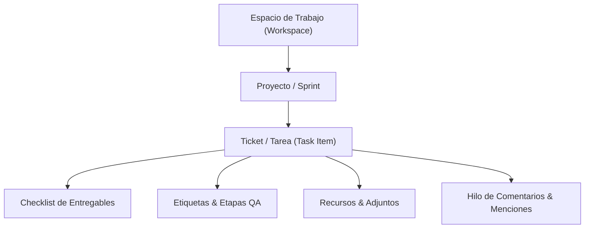
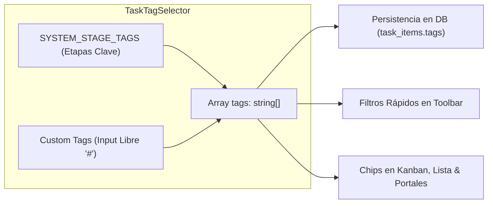
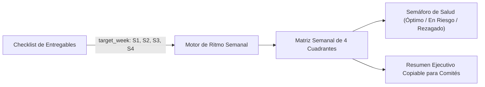

# Arquitectura Integral del Módulo de Gestión de Tareas (Task Management)

Este documento describe la estructura técnica, modelo de datos relacional, mecanismos de control de acceso (RBAC granular por espacios), flujos operativos, estándares de interfaz y optimizaciones de rendimiento del módulo de **Gestión de Tareas (`tasks`)** y sus **Portales de Colaboradores**, en el ecosistema de PIXY Agency Manager.

---

## 1. Visión General y Jerarquía de Trabajo

El módulo orquesta el ciclo de vida operativo de los requerimientos y sprints de la agencia a través de una jerarquía de tres niveles:



### Componentes Principales del Sistema
1. **Plataforma Central (`/operations/tasks`)**: Panel de control administrativo para dueños de agencia, administradores y personal interno con acceso a métricas globales, tableros Kanban interactivos, vistas de lista paginadas y gestión de espacios y proyectos.
2. **Portales Seguros por Token (`/portal/tasks/[token]`)**: Entornos web aislados accesibles mediante tokens criptográficos únicos por colaborador (`organization_staff.access_token`), sin requerir autenticación directa a la base de datos:
   - **Modo Colaborador (Ejecución)**: Enfocado en entregables propios, minimizando ruido visual (columna de responsable oculta, slider de progreso seguro y checklist interactivo).
   - **Modo Gestor de Proyecto (PM / Lead)**: Puesto de mando avanzado con telemetría de sprints, cinta interactiva de especialistas, reasignación de prioridades/estados y facultad de crear proyectos y tickets según sus espacios autorizados.

---

## 2. Modelo de Datos Relacional (Supabase / PostgreSQL)

El esquema se implementa en migraciones SQL con soporte multi-tenant estricto (`organization_id`):

### A. Tabla: `task_workspaces`
Define los espacios o unidades operativas macro (ej. *Desarrollo Web*, *App Móvil*, *Marketing*, *Diseño*).
| Campo | Tipo | Propósito |
|---|---|---|
| `id` | UUID (PK) | Identificador único del espacio. |
| `organization_id` | UUID (FK) | Tenant propietario. |
| `name` | Text | Nombre descriptivo del espacio de trabajo. |
| `color` | Text | Color hexadecimal para identificación visual. |
| `description` | Text | Descripción opcional del alcance del espacio. |
| `icon` | Text | Identificador de icono de Lucide. |
| `order_index` | Integer | Posicionamiento en menús y selectores. |
| `is_active` | Boolean | Estado de vigencia (default: `true`). |
| `created_at` | Timestamp | Fecha y hora de creación. |

### B. Tabla: `task_workspace_members`
Gobierna el control de acceso granular por espacio para colaboradores.
| Campo | Tipo | Propósito |
|---|---|---|
| `id` | UUID (PK) | Identificador del registro de membresía. |
| `organization_id` | UUID (FK) | Tenant propietario. |
| `workspace_id` | UUID (FK) | Espacio de trabajo concedido (`task_workspaces`). |
| `staff_id` | UUID (FK) | Miembro del personal autorizado (`organization_staff`). |
| `created_at` | Timestamp | Registro de asignación de acceso. |

### C. Tabla: `task_projects`
Proyectos o sprints específicos contenidos dentro de un espacio de trabajo.
| Campo | Tipo | Propósito |
|---|---|---|
| `id` | UUID (PK) | Identificador del proyecto. |
| `organization_id` | UUID (FK) | Tenant propietario. |
| `workspace_id` | UUID (FK, Opcional) | Espacio al que pertenece el proyecto. |
| `name` | Text | Nombre del proyecto o sprint. |
| `color` | Text | Color hexadecimal del proyecto. |
| `description` | Text | Descripción de alcance y objetivos. |
| `status` | Text | `planning`, `active`, `completed`, `on_hold`. |
| `start_date` | Timestamp | Fecha de inicio programada. |
| `end_date` | Timestamp | Fecha de cierre estimada. |
| `is_active` | Boolean | Indicador de proyecto activo. |
| `order_index` | Integer | Orden de presentación visual. |

### D. Tabla: `task_items`
Unidad atómica de requerimiento técnico, tarea o ticket.
| Campo | Tipo | Propósito |
|---|---|---|
| `id` | UUID (PK) | Identificador único del ticket. |
| `organization_id` | UUID (FK) | Tenant propietario. |
| `project_id` | UUID (FK) | Proyecto asociado (`task_projects`). |
| `ticket_code` | Text | Código autogenerado secuencial (ej: `TK-101`, `PRJ-102`). |
| `title` | Text | Título descriptivo y conciso de la tarea. |
| `description` | Text | Criterios de aceptación y especificaciones técnicas. |
| `status` | Text (`TaskStatus`) | `backlog`, `todo`, `in_progress`, `in_review`, `blocked`, `done`. |
| `priority` | Text (`TaskPriority`) | `low`, `medium`, `high`, `urgent`. |
| `type` | Text (`TaskType`) | `task`, `feature`, `bug`, `improvement`, `delivery`. |
| `assigned_staff_id` | UUID (FK, Nullable) | Especialista responsable asignado (`organization_staff`). |
| `created_by_staff_id` | UUID (FK, Nullable) | Creador de la tarea. |
| `qa_staff_id` | UUID (FK, Nullable) | Tester o revisor de calidad asignado. |
| `progress_percentage` | Integer | Avance registrado (0 - 100%). |
| `estimated_hours` | Numeric | Horas estimadas de ejecución. |
| `actual_hours` | Numeric | Horas reales reportadas. |
| `checklist` | JSONB | Entregables y subtareas (`TaskChecklistItem[]`). |
| `tags` | Text[] / JSONB | Etiquetas libres y etapas de flujo del sistema. |
| `attachments` | JSONB | Referencias a Figma, GitHub, imágenes y documentos. |
| `due_date` | Date / Timestamp | Fecha límite de entrega del entregable. |
| `order_index` | Integer | Orden dentro de columnas Kanban. |

### E. Tabla: `task_comments`
Canal de discusión contextual del ticket con soporte para menciones de equipo.
| Campo | Tipo | Propósito |
|---|---|---|
| `id` | UUID (PK) | Identificador del comentario. |
| `organization_id` | UUID (FK) | Tenant propietario. |
| `task_id` | UUID (FK) | Ticket al que pertenece el comentario. |
| `author_type` | Text | `owner`, `staff`, `system`. |
| `author_id` | UUID (FK) | Colaborador emisor. |
| `author_name` | Text | Nombre visible del autor. |
| `author_avatar` | Text | URL del avatar. |
| `content` | Text | Mensaje con soporte para `@Nombre`. |
| `mentions` | JSONB | Metadatos de colaboradores mencionados para notificaciones. |

---

## 3. Control de Acceso y Aislamiento por Espacios (RBAC Granular)

Para permitir que una agencia gestione múltiples unidades operativas (ej. *Espacio Web* y *Espacio App Móvil*) sin que colaboradores ajenos tengan visibilidad no autorizada:

1. **Acceso Global Implícito (Dueños y Administradores)**:
   - Usuarios con roles de administración o colaboradores sin restricciones en `task_workspace_members` tienen visibilidad total sobre todos los espacios, proyectos y tareas.
2. **Acceso Acotado a Espacios (`task_workspace_members`)**:
   - Si un colaborador tiene registros en `task_workspace_members`, sus consultas se limitan estrictamente a esos `workspace_id`.
   - Proyectos de espacios no autorizados quedan filtrados en el combobox, tableros y listados.
   - En el portal de colaboradores, un PM asignado a un solo espacio únicamente puede crear proyectos y tickets dentro de su espacio asignado.
3. **Mapeo de Consultas con `allowedWorkspaceIds` y `allowedProjectIds`**:
   - En [`collaborator-portal-actions.ts`](file:///G:/Pixy/agency-manager/src/modules/features/tasks/actions/collaborator-portal-actions.ts), se realiza la intersección de membresías al iniciar la sesión del portal:
     ```ts
     const { data: memberWorkspaces } = await supabaseAdmin
       .from("task_workspace_members")
       .select("workspace_id")
       .eq("staff_id", staff.id);
     ```
   - Si existen membresías, se extraen los IDs y solo se cargan proyectos hijos de esos espacios.

---

## 4. Patrones de Interfaz y Navegación

### A. Combobox Unificado en Árbol (Espacios y Proyectos)
En lugar de selectores separados que consumen espacio horizontal, se diseñó un combobox jerárquico integrado en [`task-manager-view.tsx`](file:///G:/Pixy/agency-manager/src/modules/features/tasks/components/task-manager-view.tsx) y [`task-collaborator-portal.tsx`](file:///G:/Pixy/agency-manager/src/modules/features/tasks/components/portal/task-collaborator-portal.tsx):
- **Jerarquía en Árbol**:
  - **Espacios de Trabajo**: Justificados completamente a la izquierda, en negrita, sin dot circular para distinguirlos con claridad.
  - **Proyectos**: Anidados hacia la derecha con indentación visual (`pl-6`), acompañados de su dot de color corporativo.
- **Edición Contextual Inmediata**:
  - Un botón de acción rápida con icono de lápiz (`Pencil`) permite editar el elemento seleccionado actualmente (si es un espacio abre [`WorkspaceFormModal`](file:///G:/Pixy/agency-manager/src/modules/features/tasks/components/modals/workspace-form-modal.tsx); si es un proyecto abre [`ProjectFormModal`](file:///G:/Pixy/agency-manager/src/modules/features/tasks/components/modals/project-form-modal.tsx)).
- **Aislamiento de Despliegue**: El popover de filtros despliega su contenido internamente sin empujar los elementos de la barra de herramientas fuera del frame contenedor.

### B. Botón de Creación Unificado (+ Nuevo)
El botón principal despliega un menú contextual según permisos:
- **+ Nuevo Ticket**: Invoca el modal de creación de requerimientos.
- **+ Nuevo Proyecto**: Invoca el modal de creación de proyectos/sprints, asociándolo al espacio contextual seleccionado.

---

## 5. Estándar de Diseño de Modales (Estilo Linear / Jira)

Para evitar contaminación visual y antipatrones de interfaz:

1. **Eliminación de Falsos Botones**:
   - Se erradicó el badge verde `+ NUEVO TICKET` en la cabecera que confundía a los usuarios al aparentar ser un botón interactivo.
2. **Supresión de Redundancias**:
   - Se eliminó el indicador duplicado de proyecto en la cabecera, ya que el selector interactivo es el primer campo del formulario.
   - Se retiraron los badges de rol innecesarios (`Gestor de Proyecto (Configuración Completa)`, `Modo Gestor PM`, `Modo Colaborador`).
3. **Cabecera Minimalista**:
   - **Izquierda**: Icono sobrio `<CheckSquare className="w-4 h-4 text-primary" />` acompañado del título semántico (`Nuevo Ticket de Sprint` o `TK-101` en edición).
   - **Derecha**: Botón de acción principal (`Crear Ticket` o `Guardar Cambios`), botón de `Eliminar` (si aplica) y botón de cierre `X`.
4. **Placeholder Profesional**:
   - Todos los inputs de título usan el placeholder estandarizado:
     ```tsx
     placeholder="Título de la tarea o requerimiento..."
     ```

---

## 6. Sistema Integral de Etiquetas (Tags & Etapas de Flujo)

### Componente Unificado: [`TaskTagSelector`](file:///G:/Pixy/agency-manager/src/modules/features/tasks/components/tags/task-tag-selector.tsx)
Centraliza la gestión visual y funcional de etiquetas:



#### A. Etapas Semánticas del Sistema (`SYSTEM_STAGE_TAGS`)
Pre-configuradas para conectar con los filtros analíticos de la agencia:
| Clave | Etiqueta Visible | Color / BadgeClass | Propósito Operativo |
|---|---|---|---|
| `qa-failed` | QA Erróneo | Rojo (`bg-red-500/10 text-red-600 border-red-500/30`) | Ticket rechazado en pruebas de calidad. |
| `uat` | UAT | Púrpura (`bg-purple-500/10 text-purple-600 border-purple-500/30`) | En validación por parte del cliente o usuario final. |
| `vendor-blocked` | Espera Proveedor | Ámbar (`bg-amber-500/10 text-amber-600 border-amber-500/30`) | Bloqueo externo por APIs, credenciales o terceros. |
| `ready-for-release` | Listo Release | Esmeralda (`bg-emerald-500/10 text-emerald-600 border-emerald-500/30`) | Aprobado técnicamente para pase a producción. |

#### B. Etiquetas Personalizadas Libres (Custom Tags)
- Input con prefijo visual `#`.
- Normalización automática al presionar `Enter` o click en `Añadir`:
  - Conversión a minúsculas (`toLowerCase`).
  - Reemplazo de espacios por guiones medios (`slugify`).
  - Eliminación de `#` o `@` iniciales duplicados.
  - Prevención de duplicados en el array de la tarea.

#### C. Visualización Transversal
- **Tablero Kanban ([`task-kanban-board.tsx`](file:///G:/Pixy/agency-manager/src/modules/features/tasks/components/kanban/task-kanban-board.tsx))**: Renderiza las etapas del sistema con su estilo semántico y las etiquetas personalizadas con chips sutiles `#{tag}`.
- **Vista de Lista ([`task-list-view.tsx`](file:///G:/Pixy/agency-manager/src/modules/features/tasks/components/list/task-list-view.tsx))**: Badges compactos junto al título del ticket.
- **Portal de Colaboradores ([`task-collaborator-portal.tsx`](file:///G:/Pixy/agency-manager/src/modules/features/tasks/components/portal/task-collaborator-portal.tsx))**: Visualización en tarjetas Kanban individuales, tarjetas del monitor de equipo y filas de la tabla de tareas.

---

## 7. Reglas de Negocio y Restricciones Operativas

1. **Regla del 95% en Entregables**:
   - Una tarea **no puede alcanzar el 100% de progreso ni cambiar al estado `done`** si tiene entregables sin completar en su checklist (`TaskChecklistItem[]`).
   - El sistema frena automáticamente el avance en **95%**, ajusta el estado a `in_review` y notifica al colaborador.
2. **Slider de Progreso Seguro**:
   - La manipulación continua del control deslizante actualiza el estado local en memoria (`onValueChange`), evitando ráfagas de escrituras a la base de datos.
   - El commit en base de datos únicamente se dispara al soltar el ratón (`onValueCommit`), optimizando la red y previniendo pérdidas de estado.
3. **Aseguramiento de Calidad (QA Flow)**:
   - El campo `qa_staff_id` permite designar a un tester responsable. Si el ticket es rechazado, se asigna el tag `qa-failed`, contabilizándose en las alertas del dashboard de telemetría del PM.
4. **Visibilidad Condicional de Asignaciones**:
   - En portales de colaboradores independientes, las columnas o controles de asignación a terceros se ocultan para mantener el foco en sus propias entregas y proteger la privacidad del equipo.

---

## 8. Optimización de Rendimiento y Escalabilidad

Se aplicó una reestructuración de ingeniería para garantizar fluidez con miles de tickets concurrentes:

### A. Índices Compuestos en Base de Datos (`20260916000003_optimize_task_indexes.sql`)
- `idx_task_items_org_proj_status`: Índice compuesto en `(organization_id, project_id, status)` para acelerar filtros de tableros Kanban.
- `idx_task_items_org_assigned`: En `(organization_id, assigned_staff_id)` para consultas de tareas asignadas al colaborador en portales.
- `idx_task_items_org_created`: En `(organization_id, created_at DESC)` para listados paginados cronológicos.
- `idx_task_workspace_members_org_staff`: En `(organization_id, staff_id)` para verificación instantánea de permisos en portales.

### B. Ejecución de Consultas Concurrentes y `React.cache()`
- En `collaborator-portal-actions.ts`, las consultas de membresías, proyectos, organización, staff y menciones se resuelven concurrentemente con `Promise.all()`.
- Se envuelven las funciones en `React.cache()` para deduplicar peticiones dentro del mismo ciclo de render de Next.js.

### C. Paginación Eficiente en Vistas de Lista
- [`task-list-view.tsx`](file:///G:/Pixy/agency-manager/src/modules/features/tasks/components/list/task-list-view.tsx) implementa paginación reactiva con selector de tamaño de página (10, 25, 50, 100 elementos) para mantener el árbol DOM ligero.

### D. Memoización en Tableros Kanban
- `TaskKanbanCard` está memoizado con `React.memo` y un comparador de propiedades personalizado (`arePropsEqual`).
- La clasificación de tareas por columnas en [`task-kanban-board.tsx`](file:///G:/Pixy/agency-manager/src/modules/features/tasks/components/kanban/task-kanban-board.tsx) se realiza en **una sola pasada $O(n)$** en lugar de filtros repetidos $O(k \cdot n)$.

### E. Aislamiento de Sliders y Carga Diferida (Lazy Loading)
- `PortalTaskSlider` opera como un componente aislado, evitando re-renders del tablero completo mientras se arrastra el slider.
- Animaciones pesadas de Lottie (celebración al 100% y modal de alertas) se cargan dinámicamente (`lazy load`) sólo cuando el modal correspondiente se activa.

---

## 9. Experiencia de Usuario y Estándares de Interfaz

### A. Sistema Dual de Menciones en Discusión (@ y #)
Implementado en [`task-detail-modal.tsx`](file:///G:/Pixy/agency-manager/src/modules/features/tasks/components/modals/task-detail-modal.tsx) y [`task-portal-detail-modal.tsx`](file:///G:/Pixy/agency-manager/src/modules/features/tasks/components/portal/task-portal-detail-modal.tsx):
1. **Menciones de Colaboradores (`@`)**:
   - Activa un popover flotante inteligente que filtra por nombre a los miembros de la organización.
   - Inserta `@Nombre` y notifica al usuario en su portal correspondiente.
2. **Menciones de Tickets (`#`)**:
   - Al tipear `#`, despliega un menú flotante con búsqueda instantánea por código de ticket (ej. `TK-101`) o palabras clave en el título.
   - En el historial de comentarios, cualquier mención `#TK-XXX` se renderiza como un chip interactivo estilizado (`FormattedCommentContent`).
   - **Navegación inter-ticket**: Al pulsar un chip `#TK-XXX`, el modal cambia directamente al ticket mencionado sin recargar la página.

### B. Confirmación de Cierre y Validación de Entregables
- En el portal de colaboradores, las acciones de completado ("Listo" en tabla o "Completar" en tarjetas) abren un `AlertDialog` con animación slide-in from bottom (`animate-alert-enter`).
- **Validación de checklist**:
  - Si existen entregables sin marcar como completados, se muestra una alerta ámbar detallando la cantidad pendiente y fijando el avance como máximo en **95%**.
  - Si todos los entregables están listos, confirma el cierre formal al **100%** con estado `done` y activa la celebración.

### C. Acciones Minimalistas y Tablas Fluidas
- **Columna Acciones**: En la tabla del portal, los botones de acción son exclusivamente de ícono (`CheckCircle2` y `Settings` de 28x28px) con tooltips nativos (`title`), optimizando el espacio horizontal.
- **Protección de Tablas en Pantallas Angostas**: Contenedores con `overflow-x-auto` y `min-w-[760px]` (en portal) o `min-w-[800px]` (en plataforma) para prevenir la compresión o solapamiento de columnas en dispositivos móviles o pantallas reducidas.
- **Ancho Completo Responsivo (100%)**: Se retiraron los límites de ancho fijos (`max-w-7xl mx-auto`) de los portales, utilizando `w-full px-4 sm:px-6 lg:px-8 xl:px-10` para aprovechar monitores ultra-wide, 2K y 4K.

### D. Scroll Horizontal Desktop en Monitor de Colaboradores
- En [`task-collaborator-ribbon.tsx`](file:///G:/Pixy/agency-manager/src/modules/features/tasks/components/portal/task-collaborator-ribbon.tsx), se captura el evento `wheel` del ratón para traducir el giro vertical (`deltaY`) en desplazamiento horizontal fluido sobre el monitor de especialistas, complementado por una barra de desplazamiento delgada (`scrollbar-thin`).

### E. Tonalización y Contraste del Riel de Slider
- En [`slider.tsx`](file:///G:/Pixy/agency-manager/src/components/ui/slider.tsx), el riel base se estiliza con `bg-zinc-200/90 dark:bg-zinc-800 border border-zinc-300/50 dark:border-white/10` y soporte para `trackClassName`, garantizando contraste visual nítido frente al fondo blanco o grafito de las tablas.

---

## 11. Motor de Tareas Recurrentes / Periódicas (Recurrence Engine)

Para automatizar procesos cíclicos (mantenimientos preventivos, auditorías semanales, cierres contables mensuales, backups diarios, etc.), el sistema incorpora un motor nativo de recurrencia:

### A. Columnas de Recurrencia en `task_items`
- `is_recurring` (`BOOLEAN`, default `false`): Señalizador de tarea periódica activa.
- `recurrence_interval` (`VARCHAR(32)`): Intervalo de ciclo (`daily`, `weekly`, `biweekly`, `monthly`, `quarterly`, `biannual`, `yearly`).
- `recurrence_day` (`INTEGER`, default `1`): Día programado del ciclo (1-7 para semanal; 1-31 para mensual/trimestral/anual).
- `parent_recurring_id` (`UUID`, FK hacia `task_items`): Trazabilidad hacia la tarea matriz o plantilla original.
- `last_recurred_at` (`TIMESTAMPTZ`): Fecha y hora en la que se generó la última instancia.
- `next_recurrence_at` (`TIMESTAMPTZ`): Próxima fecha y hora de renovación calculada con `date-fns`.

### B. Endpoint Cron Idempotente (`/api/cron/tasks-recurrence`)
- Protegido mediante `requireCronSecret` para ejecución desatendida segura vía Vercel Cron o cron daemon.
- Localiza tareas donde `is_recurring = true` y `next_recurrence_at <= NOW()`.
- **Clonación atómica**: Genera una nueva tarea clonando título, descripción, proyecto, asignados, etiquetas y entregables del checklist (los cuales se reinician a `completed = false`, preservando su asignación de `target_week`).
- **Control de instancia única**: La tarea anterior se marca como cerrada en su ciclo (`is_recurring = false`), transfiriendo la antorcha a la nueva instancia con su siguiente fecha programada calculada automáticamente.

---

## 12. Sistema de Avance Fraccionado & Matriz Ejecutiva de Ritmo Semanal (Weekly Pacing Matrix)

Diseñado para sustituir los controles manuales estáticos e ineficientes (como las tablas de Excel tradicionales donde se preguntan avances de forma empírica en reuniones semanales), este sistema conecta el avance porcentual con entregables tangibles verificables:



### A. Entregables Vinculados a Semanas del Mes
- Cada ítem del checklist (`TaskChecklistItem`) incluye el atributo opcional `target_week?: 1 | 2 | 3 | 4 | null`.
- Los líderes y colaboradores pueden asignar entregables a la semana objetivo directamente desde los modales de creación y detalle (`task-form-modal.tsx`, `task-detail-modal.tsx`, `task-portal-detail-modal.tsx`).
- **Lógica Temporal y Auditoría Semanal**:
  - **Tareas con Entregables por Semana (`target_week`)**: Cada semana mide estrictamente los entregables comprometidos para esa semana. Si una semana no tiene entregables programados, se presenta como `— Plan`, evitando catalogarla erróneamente en retraso. El retraso (`delayed`) solo se dispara si una semana pasada tenía entregables comprometidos que no se finalizaron o si el ticket está bloqueado.
  - **Tareas con Entregable Único**: Si un ticket tiene un solo entregable asignado (ej. S2), las semanas previas se mantienen en `— Plan` sin penalización. Durante la semana activa, si el usuario trabaja en ella, el slider global se refleja en dicha semana (ej. 50% en progreso) hasta marcar el check para alcanzar el 100% definitivo.
  - **Tareas Estándar (Sin Entregables Semanales)**: Se eliminó el esquema de cuartiles artificiales (que imputaba avance a semanas futuras inexistentes). La semana activa refleja el progreso global real del ticket (ej: 95% en S3). Las semanas futuras se mantienen en `— Plan` (0% de avance). En semanas pasadas, solo se marca retraso si la fecha límite (`due_date`) expiró o si el ticket está bloqueado; las tareas en curso normal se reconocen como programadas, eliminando falsos positivos en el semáforo gerencial.
  - **Exclusión Estricta de Tickets en Backlog**: Los tickets con estado `backlog` son excluidos por completo de la matriz de ritmo semanal. Al tratarse de requerimientos en cola sin priorización de sprint, no representan compromisos inmediatos y excluirlos evita falsos rezagos y saturación visual en la telemetría gerencial.

### B. Matriz Ejecutiva (`TaskWeeklyPacingMatrix`)
- Componente interactivo de alta dirección ubicado en:
  1. **Plataforma Central (`/operations/tasks`)**: Nueva pestaña permanente **"Ritmo Semanal"** junto a General, Tablero Kanban y Métricas.
  2. **Portal de Gestores PM (`/portal/tasks/[token]`)**: Switch superior de tres estados (**Dashboard**, **Gestión**, **Ritmo Semanal**).
- **Indicadores y Semáforos en Tiempo Real**:
  - 🟢 **En Ritmo (On Track)**: El avance de la semana en curso cumple o supera la cuota programada.
  - 🟡 **En Riesgo (At Risk)**: Existe retraso leve o entregables de la semana previa incompletos.
  - 🔴 **Rezagada (Delayed)**: La semana activa está vencida sin los entregables mínimos completados.
  - ⚪ **No Iniciada (Not Started)**: Semana futura programada aún sin actividad.
- **Barra de Herramientas y Filtros Integrada (`SearchFilterBar`)**:
  - Buscador reactivo por código, título y colaborador.
  - Píldoras de filtro rápido con contadores dinámicos: *Todas*, *Con Retraso*, *Periódicas*, *En Riesgo*, *En Ritmo*.
  - Selector jerárquico de Espacios de Trabajo / Proyectos con formato de árbol.
  - Selector de Colaborador con avatares integrados.
  - Navegador de mes junto al botón de acción ejecutiva con tooltip ("Copiar resumen ejecutivo al portapapeles").
- **Optimizaciones de Visualización y Rendimiento**:
  - **Indicador de Semana Actual**: Resaltado visual en el encabezado (`● Actual`) y sutil tintado de columna, activo únicamente cuando se consulta el mes en curso.
  - **Celdas Semanales Limpias**: Porcentaje numérico de avance (`%`) acompañado de su badge de estado y contador de entregables completados, prescindiendo de barras deslizantes para evitar redundancia visual.
  - **Badges en Español Estricto**: Etiquetas de recurrencia limpias (*Semanal*, *Mensual*, *Quincenal*, etc.) sin emojis ni términos en inglés hardcodeados.
  - **Paginación Inteligente**: Control de 25, 50 y 100 registros por página con reseteo automático ante cambios de filtro, garantizando renderizado ágil en tableros con cientos de tickets.
- **Exportación con 1 Clic**: Botón de copia que formatea un informe ejecutivo estructurado en Markdown listo para comités directivos y canales operativos.

### C. Sistema de Snapshots Automáticos de Corte Semanal
- **Persistencia Histórica (`task_items.weekly_snapshots`)**:
  - Columna JSONB que almacena cortes congelados inmutables: `{"s1": number, "s2": number, "s3": number, "s4": number}`.
  - Resuelve de raíz el problema de regresión de porcentajes en tareas de slider: si un colaborador tuvo 20% en S1 y 35% en S2, y en S3 el PM realiza una regresión a 30%, los cortes de S1 y S2 permanecen grabados fielmente (idéntico al histórico de Excel).
- **Cron de Corte Semanal (`/api/cron/tasks-pacing-snapshot`)**:
  - Ejecutable cada domingo a las 23:59 o programable vía Vercel Cron.
  - Evalúa y congela automáticamente la foto de la semana que cierra para todas las tareas activas de la organización.
- **Acciones de Ajuste Manual**:
  - Server actions `saveTaskWeeklySnapshot` y `portalSaveTaskWeeklySnapshot` para que líderes y PMs puedan corregir o auditar manualmente el corte de una semana histórica si fuera necesario.

---

## 13. Estructura de Directorios del Módulo

```
src/
├── app/
│   └── api/
│       └── cron/
│           ├── tasks-pacing-snapshot/
│           │   └── route.ts                 # Endpoint cron de congelamiento de cortes semanales
│           └── tasks-recurrence/
│               └── route.ts                 # Endpoint cron de renovación recurrente
└── modules/features/tasks/
    ├── actions/
    │   ├── collaborator-portal-actions.ts   # Acciones autenticadas por token de portal
    │   ├── task-actions.ts                  # Server Actions administrativas internas
    │   └── task-management-actions.ts       # Consultas de métricas y workspaces
    ├── components/
    │   ├── collaborators/
    │   │   └── task-collaborators-manager.tsx   # Panel de miembros y asignación de accesos
    │   ├── kanban/
    │   │   └── task-kanban-board.tsx            # Tablero Kanban con agrupación O(n) y React.memo
    │   ├── list/
    │   │   └── task-list-view.tsx               # Vista de lista paginada de tickets
    │   ├── modals/
    │   │   ├── project-form-modal.tsx           # Creación y edición de proyectos/sprints
    │   │   ├── task-detail-modal.tsx            # Detalle y edición completa de tickets en plataforma
    │   │   ├── task-form-modal.tsx              # Modal de nuevo ticket con cabecera limpia
    │   │   └── workspace-form-modal.tsx         # Creación y edición de espacios de trabajo
    │   ├── pacing/
    │   │   └── task-weekly-pacing-matrix.tsx    # Matriz ejecutiva de ritmo semanal (4 semanas)
    │   ├── portal/
    │   │   ├── task-collaborator-portal.tsx     # Portal raíz con combobox en árbol y vistas
    │   │   ├── task-collaborator-ribbon.tsx     # Monitor interactivo de especialistas (cinta)
    │   │   ├── task-pm-operations-dashboard.tsx # Telemetría de sprint y gráficos de velocidad
    │   │   └── task-portal-detail-modal.tsx     # Modal de tickets para portal (crear y editar)
    │   ├── tags/
    │   │   └── task-tag-selector.tsx            # Componente unificado de etapas QA y tags libres
    │   └── task-manager-view.tsx                # Vista central de la plataforma (/operations/tasks)
    ├── types.ts                             # Tipos TypeScript (Recurrence, TaskChecklistItem, SYSTEM_STAGE_TAGS)
    └── utils/
        ├── avatar-presets.ts                # Avatares 3D y helpers visuales
        └── recurrence-utils.ts              # Utilidades de cálculo de próximas recurrencias
```

---

## 14. Experiencia de Usuario (UX), Filtros Avanzados y Escalabilidad de Portales

Para mantener un rendimiento óptimo y una experiencia fluida frente a volúmenes masivos de requerimientos, se incorporaron los siguientes estándares arquitectónicos:

### A. Paginación Reactiva en Portales (`TaskCollaboratorPortal`)
- **Control de Densidad**: Selectores de página de 25, 50 y 100 registros integrados en la vista de lista/tabla de colaboradores y gestores.
- **Reseteo Automático**: Cualquier interacción con la barra de búsqueda o píldoras de filtrado reinicia reactivamente el índice de página a 1 (`currentPage = 1`), eliminando pantallas vacías accidentales.
- **Rendimiento O(n)**: La paginación corta el árbol de renderizado de React en el cliente después de aplicar los filtros y búsquedas sobre el conjunto en memoria, garantizando transiciones instantáneas a 60 FPS sin saturar el DOM.

### B. Arquitectura Macroscópica de Filtros (`SearchFilterBar`)
- **Selección Individual Estricta**: Eliminación de estados de filtro combinados confusos. Cada acción activa una vista exclusiva:
  - **Todas**: Vista holística de todos los tickets del proyecto/espacio.
  - **Backlog**: Aislador estricto para tareas en espera de priorización.
  - **Activas**: Agrupa automáticamente los tickets en ciclo de vida del sprint (`todo`, `in_progress`, `in_review`, `blocked`).
  - **Completadas**: Muestra exclusivamente requerimientos cerrados con verificación de 100% de progreso.
- **Subfiltros Anidados**: El filtro **Activas** dispone de un menú contextual anidado con acceso inmediato a los sub-estados operativos (*Por Hacer*, *En Curso*, *En QA*, *Bloqueadas*). Al activar un sub-estado, la interfaz expone una píldora compuesta con botón de descarte rápido `(x)` para regresar a todas las activas sin recargar.
- **Alineación Visual**: Píldoras de filtrado ancladas al extremo derecho (`ml-auto`), colindantes con el divisor y el interruptor de visibilidad, optimizando el espacio horizontal para el input de búsqueda reactivo.

### C. Integridad y Normalización de Datos (`normalizeTask`)
- **Garantía de Progreso al 100% en Tareas Cerradas**:
  - Tanto en la capa de persistencia (`updateTask`) como en la capa de hidratación (`normalizeTask` en `types.ts`), cualquier ticket con `status === 'done'` garantiza automáticamente `progress_percentage = 100`.
  - Esta regla elimina discrepancias visuales derivadas de migraciones históricas donde registros antiguos persistían con porcentaje en cero a pesar de estar completados.

### D. Enlaces de Acceso y Distribución Rápida
- **Cinta de Colaboradores con Compartición vía WhatsApp**:
  - Desde el popover de avatar en `TaskCollaboratorRibbon`, los líderes pueden disparar invitaciones directas por WhatsApp con un mensaje corporativo estandarizado y el enlace único de acceso seguro al portal.
  - El sistema detecta y normaliza automáticamente el indicativo internacional de teléfono (ej. prefijo `+57` para Colombia), asegurando redirecciones telefónicas válidas sin requerir corrección manual por parte del operador.

### E. Centro de Control Táctico y Dashboard de Operaciones PM (`TaskPmOperationsDashboard`)
- **Aislamiento Riguroso de Backlog vs Sprint**:
  - Los tickets con estado `backlog` quedan matemáticamente aislados del cálculo de avance del sprint (`sprintProgress`), del tiempo estimado y del radar de riesgos.
  - La métrica de Salud del Sprint se calcula ponderando el progreso real de las tareas del sprint (`sprintTasks.reduce(acc + progress, 0) / sprintTasks.length`), evitando caídas artificiales causadas por backlog en cero.
  - Se eliminó cualquier cálculo o proyección artificial de velocidad, sustituyéndola por telemetría operacional empírica.
- **Tarjetas KPI de Alto Impacto (4 Pilares)**:
  1. *Salud del Sprint*: Porcentaje de avance ponderado y conteo de tickets completados vs sprint, con indicación contextual del volumen en backlog.
  2. *Cola de QA & Validación*: Monitoreo de tickets en revisión técnica (`in_review`) junto al estado de tickets en curso y por iniciar.
  3. *Horas & Presupuesto / Volumen de Entrega*: Balance de horas reales vs estimadas (con delta de margen/sobrepaso); en proyectos sin estimación horaria, conmuta dinámicamente a balance de volumen de tickets completados vs activos.
  4. *Radar de Riesgos*: Detección inmediata de tickets bloqueados y entregables vencidos (`overdueTasks`), con alerta semántica de atención requerida.
- **Gráficos Operacionales Limpios**:
  - *Carga por Especialista (`ReBarChart`)*: Gráfico comparativo de tickets activos en curso vs completados por miembro del equipo, visualizando de forma inmediata quién tiene sobrecarga o capacidad disponible.
  - *Estado del Sprint (`RePieChart Donut`)*: Desglose porcentual exclusivo del ciclo de vida del sprint (`done`, `in_progress`, `in_review`, `blocked`, `todo`), con conteo centralizado de tickets de sprint.
- **Centro de Triage Operativo & Deck Interactivo**:
  - Sustituye banners pasivos por un centro de mando con 4 pestañas interactivas (*Críticas & Riesgo*, *Cola de QA*, *Finalizadas Recientes*, *Backlog Reserva*).
  - Cada fila expone código de ticket, título, proyecto, avatar del especialista, fecha límite (con alerta si está atrasada) y barra de progreso.
  - Al hacer clic en un ticket, se invoca `onSelectTask` abriendo instantáneamente el modal de detalle del ticket (`TaskPortalDetailModal`), facilitando la resolución de impedimentos sin abandonar el dashboard.

### F. Microinteracciones de Alto Rendimiento en Cinta de Especialistas (`TaskCollaboratorRibbon`)
- **Efecto 3D de Avatar Sobresaliente (Breakout) con Transición Fluida**:
  - El avatar 3D se mantiene en el flujo Flexbox estático con anclaje `origin-bottom` y `will-change-transform`, evitando saltos y reacomodos bruscos entre estados.
  - En estado activo (`isSelected`), escala suavemente a `scale-140 sm:scale-145` y se reposiciona sutilmente hacia abajo (`translate-y-1 sm:translate-y-1.5`), logrando que la cabeza del avatar sobresalga del marco redondeado superior sin ser recortada (`overflow-visible`) mientras el torso descansa firmemente sobre el rótulo del nombre.
  - En estado hover, proporciona un suave realce visual (`group-hover:scale-110 group-hover:-translate-y-0.5`).
- **Disparador de Información no Invasivo**:
  - El tooltip/popover con información de tickets, métricas y botón de WhatsApp se desacopló del cuerpo de la tarjeta y se reubicó en un ícono circular sutil de información (`Info`) en la esquina superior derecha (`absolute top-1.5 right-1.5`).
  - La interacción de hover sobre la tarjeta permanece limpia y dedicada a la selección del colaborador sin disparar popups emergentes involuntarios.
- **Tipografía y Rol Focalizado**:
  - Se removió el insight redundante de porcentaje de la base de la tarjeta, exhibiendo con claridad el nombre del especialista y su rol corporativo (`member.role`).

### G. Persistencia Atómica y Aislamiento de Estado Borrador en Modales de Edición (`TaskDetailModal` / `TaskPortalDetailModal`)
- **Desacoplamiento de Mutaciones en Tiempo Real**:
  - En los modales de edición, las operaciones de creación de entregables (`handleAddChecklistItem`), asignación de semana (`handleUpdateChecklistWeek`), eliminación (`handleRemoveChecklistItem`) y marcado de checks (`handleToggleChecklist`) operan exclusivamente sobre el estado local de React (`checklist`).
  - Se eliminó la persistencia anticipada en tiempo real hacia la base de datos que causaba falsos completados cuando un usuario marcaba accidentalmente un entregable mientras redactaba la tarea.
- **Transiciones de Estado Intencionales**:
  - En `toggleChecklistItem` (acciones de servidor), se erradicó la regla de sobreescritura automática `if (progress === 100) status = 'done'`. El cierre o transición de estado de una tarea debe ser una decisión explícita del usuario o líder.
  - Al presionar **Guardar Cambios**, se validan integralmente los entregables pendientes: si existen subtareas sin completar, la tarea no puede forzarse a `done` (se normaliza a `in_review` con tope de 95%), y todos los campos se persisten de manera atómica en una única transacción controlada.

---

## 15. Matriz Ejecutiva de Ritmo Semanal (Weekly Pacing Matrix), Auditoría Continua y Suite de Exportación

Con el fin de reemplazar los sistemas manuales estáticos tipo Excel de seguimiento semanal por una solución digital automatizada, reactiva y fidedigna:

### A. Motor de Ritmo Semanal Fraccionado en 4 Cuadrantes (`getTaskWeeklyPacing`)
- **Desglose por Entregables**: Cada elemento del checklist de la tarea puede asociarse a una semana del mes (`target_week: 1 | 2 | 3 | 4 | null`).
- **Eliminación de Falsos Completados Futuros**:
  - Si una tarea se completa antes de finalizar el mes, las semanas que aún no han transcurrido (`isFutureWeek`) muestran neutro `— Plan` (`progress = 0, status = 'pending'`), erradicando registros completados "fantasma" en el futuro.
  - En semanas pasadas o en curso, el avance se calcula rigurosamente a partir de los entregables agendados para ese cuadrante o mediante cuartiles proporcionales de respaldo.
- **Ciclo y Retiro Mensual Automático**:
  - Tareas completadas en meses previos (ej. agosto) se retiran automáticamente al cambiar el selector al mes siguiente (ej. septiembre).
  - Tareas en curso o rezagadas se arrastran continuamente entre periodos hasta su culminación.

### B. Bitácora de Auditoría de Avance y Regresión (`Log de actividad`)
- **Captura Universal en Tablas, Tarjetas y Modales**:
  - Cualquier modificación del slider de porcentaje realizada por cualquier rol (colaborador, PM o administrador) en cualquier pantalla registra una nota de sistema inmediata en `task_comments` (`portalUpdateTaskProgress` y `updateTaskProgress`).
  - Detecta automáticamente el sentido del cambio: `📈 Avance` si el porcentaje se incrementa o `📉 Regresión` si se reduce.
- **Diseño Ultracompacto y Neutral**:
  - Se eliminaron avatares repetitivos y badges ruidosos de las notas del sistema, unificando la telemetría en una sola línea sutil con fondo neutral (`bg-muted/40`) sin trazo (`border-0`).
  - Título profesional de sección renombrado a **Log de actividad**.
  - Orden cronológico inverso: el evento más reciente se posiciona siempre arriba del todo.
  - Paginación progresiva con botón "Cargar más" (bloques de 10 registros) para optimizar el rendimiento del DOM en tickets con historiales extensos.
- **Tooltip Resumen de 1 Segundo en el Slider**:
  - Al posar el cursor durante 1000ms sobre el slider en el portal de PMs, emerge un tooltip compacto con el primer nombre del autor, avatar micro, delta de avance/regresión coloreado (`anterior: 10%-40%` en verde o rojo) y marca temporal corta.

### C. Jerarquía Visual y Filtros Integrados (`SearchFilterBar`)
- **Estructura en Cascada**:
  1. Barra de Herramientas Extendida (Buscador, Píldoras de filtro, Selector de Espacio/Proyecto, Selector de Colaborador, Navegador de Mes y Menú de Exportación).
  2. Scoreboard Ejecutivo (4 KPIs: *Avance Activo*, *Total Periodo*, *A Tiempo*, *Atención / Riesgo*).
  3. Matriz de Cuadrantes Semanales (Tabla).
- **Consolidación de Filtros en el Combobox**:
  - Píldoras integradas directamente en el `SearchFilterBar`: `Todas`, `Activas` y `Completas`, con conteos reactivos y seleccionable por defecto en `Todas`.

### D. Suite de Exportación Ejecutiva (Dropdown & Modal PDF en Navegador)
- **Selector Desplegable de Exportación (`DropdownMenu`)**:
  - Reemplaza el botón simple por un selector con icono (`Download`) de microinteracciones idénticas al botón *"Nuevo"* de Gestión:
    1. **Copiar Resumen**: Copia al portapapeles un informe Markdown limpio y no saturado (código de ticket, título, responsable y progreso; sin párrafos de descripción).
    2. **Documento PDF**: Dispara la previsualización del documento ejecutivo en el navegador antes de cualquier descarga forzada.
- **Modal de Previsualización y Generador PDF ([`TaskPacingPdfModal`](file:///G:/Pixy/agency-manager/src/modules/features/tasks/components/pacing/task-pacing-pdf-modal.tsx))**:
  - **Formato Vertical A4 (Portrait)**: Diseñado en proporción vertical estándar A4 (210 mm x 297 mm, ancho rígido `800px`) para maximizar el aprovechamiento del espacio vertical y la legibilidad natural de los requerimientos.
  - **Adaptación Lateral Perfecta**:
    - Estructura `table-fixed` con ancho exacto distribuido pixel a pixel (`w-[85px]`, `w-[245px]`, `w-[110px]`, `w-[54px] x 4`, `w-[80px]`), garantizando que la tabla ocupe el 100% del área útil interna (736 px) sin recortes a la derecha ni desbordamientos laterales.
    - Viewport de previsualización centrado con `overflow-auto flex justify-center`.
  - **Diseño Editorial Claro (Light Executive)**: Fondo claro luminoso (`bg-gradient-to-br from-zinc-50 via-white to-zinc-50 border border-zinc-200/90`) con acento superior de marca, optimizado para lectura de comités y ahorro de tinta en impresión física.
  - **Hero Adaptable**:
    - *Filtro por Colaborador*: Avatar (`w-14 h-14`), nombre, cargo, correo y widget de avance ponderado.
    - *Filtro Global*: El avatar se sustituye por el **isotipo oficial del ADN de marca del tenant** (`isotipo_url` o fallback `/pixy-isotipo.png`) con la razón social de la organización.
  - **Métricas Clave Condensadas**: 4 tarjetas minimalistas (*Avance Activo*, *Total Periodo*, *A Tiempo*, *Atención/Riesgo*).
  - **Tabla Pura de Tickets**: Código mono, requerimiento (título), asignado, semáforos S1..S4 y avance porcentual con microbarra de color.
  - **Doble Salida**:
    - *Descargar PDF*: Generación local en orientación vertical A4 a 300 DPI mediante `html-to-image` (`toPng`) + `jsPDF`, con eliminación de sombras temporales (`boxShadow: none`) para un contorno nítido.
    - *Imprimir*: Impresión nativa vectorial mediante `window.print()` con reglas CSS aisladas `@media print` fijadas en `size: A4 portrait`.

### E. Estandarización Universal de Tooltips Claros y Estilizados (Erradicación de Tooltips Oscuros)
- **Diseño Base Unificado y Arquitectura Autoportante (`components/ui/tooltip.tsx`)**:
  - Se elevó el diseño predeterminado de `TooltipContent` a estándar premium: `rounded-xl`, tipografía compacta `text-xs font-medium`, borde sutil `border-border/80`, fondo claro translúcido `bg-popover/95`, soporte dark mode nativo, `shadow-lg` y desenfoque `backdrop-blur-md`.
  - **Self-Healing Provider**: Para prevenir errores de contexto Radix (`Tooltip must be used within TooltipProvider`), el componente `Tooltip` en [`tooltip.tsx`](file:///G:/Pixy/agency-manager/src/components/ui/tooltip.tsx) encapsula automáticamente `TooltipPrimitive.Root` dentro de `TooltipPrimitive.Provider delayDuration={150}`, además de registrar el `<TooltipProvider>` global en el [`RootLayout`](file:///G:/Pixy/agency-manager/src/app/layout.tsx). Esto garantiza tolerancia total a fallos en cualquier componente del árbol.
- **Eliminación Total de Tooltips Nativos Negros del Navegador**:
  - Se suprimieron todos los atributos HTML `title="..."` en botones con microinteracciones, reemplazándolos por `aria-label` para accesibilidad y Tooltips estilizados de Radix UI, evitando la doble visualización o el cuadro negro tosco del navegador.
- **Cobertura Transversal de la Suite**:
  1. **Elementos de Cabecera y Navegación**:
     - *Header General de Plataforma* ([`header.tsx`](file:///G:/Pixy/agency-manager/src/components/layout/header.tsx)): Campana de notificaciones y avatar de perfil de usuario enriquecidos con Tooltips interactivos.
     - *Interruptor de Tema Visual* ([`theme-toggle.tsx`](file:///G:/Pixy/agency-manager/src/components/ui/theme-toggle.tsx)): Erradicado el atributo `title="Cambiar tema"`, migrado a Tooltip dinámico (`Cambiar a modo claro / oscuro`).
     - *Barra Lateral* ([`sidebar.tsx`](file:///G:/Pixy/agency-manager/src/components/layout/sidebar.tsx)): Ítems colapsados migrados de fondo oscuro `bg-brand-dark` a tarjeta clara estilizada; botón de colapso/expansión integrado con Tooltip.
     - *Cabecera de Portales*:
       - Botón de cambio de tema del portal y campana de notificaciones.
       - Avatar y nombre de perfil del colaborador en cabecera.
       - Cabecera del portal de cliente ([`portal-layout.tsx`](file:///G:/Pixy/agency-manager/src/modules/features/portal/components/portal-layout.tsx)).
       - *Exclusión Intencionada*: El multitab switch de secciones de PM (`Dashboard`, `Gestión`, `Ritmo Semanal`) se mantiene desprovisto de tooltips por directriz de UX para evitar polución visual innecesaria, dado que sus etiquetas e iconos son autoexplicativos.
  2. **Selectores de Tipo de Vista de Tablas**:
     - Componente global [`ViewToggle`](file:///G:/Pixy/agency-manager/src/modules/core/ui/components/view-toggle.tsx): Los 4 botones de conmutación (*Vista Lista*, *Tablero Kanban*, *Vista Compacta*, *Vista Detallada*) envueltos en Tooltip Radix.
     - Selector de vistas de órdenes de trabajo ([`work-orders-dashboard.tsx`](file:///G:/Pixy/agency-manager/src/modules/features/work-orders/components/work-orders-dashboard.tsx)): Botones de vista Lista, Cards y Calendario modernizados.
     - Barra flotante de acciones masivas ([`bulk-actions-floating-bar.tsx`](file:///G:/Pixy/agency-manager/src/modules/core/ui/components/bulk-actions-floating-bar.tsx)): Botones de eliminar y cancelar selección con Tooltips explicativos.
     - Barra de búsqueda y filtros ([`search-filter-bar.tsx`](file:///G:/Pixy/agency-manager/src/modules/core/ui/components/search-filter-bar.tsx)): Limpieza de búsqueda y botón de alternancia de barra de filtros.
  3. **Hero y Componentes de Portales**:
     - Bloque de Avance en Activas: Chips métricos (*En curso*, *En QA*, *Horas Estimadas*) y botón hipervínculo de tarea prioritaria (`focusTask`).
     - Botón de edición dinámica de proyecto/espacio de trabajo en barra de herramientas (`Pencil`).
     - Indicador de estado de entrega y fecha límite pactada en el dashboard de PM.
     - Insignia de recurrencia en la Matriz de Ritmo Semanal y etiquetas interactivas de tickets (`#TK-...`) en comentarios.
     - Acciones de fila en tabla de clientes ([`clients-table.tsx`](file:///G:/Pixy/agency-manager/src/modules/features/crm/components/list/clients-table.tsx)): Centro de envíos, facturación, acceso al portal y notas rápidas.
- **Modernización del Tooltip de Auditoría de Sliders y Cinta**:
  - El tooltip del slider de porcentaje y el popover de la cinta de colaboradores ([`task-collaborator-ribbon.tsx`](file:///G:/Pixy/agency-manager/src/modules/features/tasks/components/portal/task-collaborator-ribbon.tsx)) adoptaron las tarjetas claras, luminosas y estilizadas sin fondos negros pesados.


