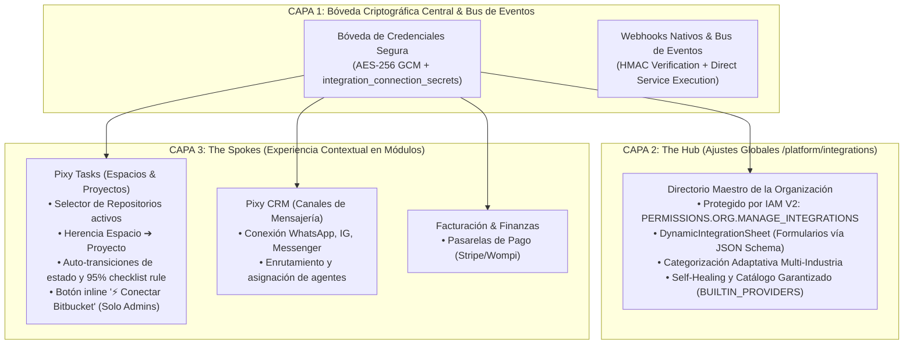

# Arquitectura de Integraciones y Control de Versiones (Hub-and-Spoke Model)

Este documento detalla la arquitectura técnica, protocolos de seguridad, modelo de datos y gobernanza para el ecosistema de integraciones de PIXY Agency Manager, con especial énfasis en la integración nativa de Control de Versiones (VCS / Bitbucket / Git) y el modelo distribuido **Hub-and-Spoke**.

---

## 1. Visión General: El Modelo Hub-and-Spoke

PIXY implementa una arquitectura desacoplada en dos niveles para la gestión de servicios externos, equilibrando la seguridad corporativa con la agilidad operativa:



### Principio Rector
* **The Hub (Centro / `/platform/integrations`):** Gobierna el ciclo de vida de la cuenta externa. Solo los roles autorizados (`owner`, `admin` o poseedores de `PERMISSIONS.ORG.MANAGE_INTEGRATIONS`) pueden conectar, auditar, refrescar tokens o revocar aplicaciones corporativas.
* **The Spoke (Radio / Módulos de Negocio):** Gestiona la operatividad del servicio. En Pixy Tasks, los miembros del equipo vinculan repositorios a proyectos, visualizan ramas y commits en las tarjetas y abren Pull Requests directamente, sin acceder a las credenciales subyacentes.

---

## 2. Integración de Control de Versiones (Pixy Tasks VCS)

### 2.1. Arquitectura de Datos (`task_vcs_links`)
La persistencia de artefactos de Git vinculados a los tickets de tareas se realiza mediante la tabla relacional `public.task_vcs_links`:

| Campo | Tipo | Propósito |
|---|---|---|
| `id` | UUID (PK) | Identificador único del enlace VCS. |
| `organization_id` | UUID (FK) | Tenant propietario con RLS estricto. |
| `task_id` | UUID (FK) | Ticket asociado en `tasks`. |
| `provider` | Text | Proveedor Git (`bitbucket`, `github`, `gitlab`). |
| `link_type` | Text | Tipo de artefacto: `'branch'`, `'commit'`, `'pull_request'`. |
| `external_id` | Text | Identificador remoto (hash de commit, UUID de PR, nombre de rama). |
| `url` | Text | Enlace directo a la interfaz del proveedor. |
| `title` | Text | Nombre de rama, mensaje de commit o título de PR. |
| `author_name` | Text | Nombre del autor Git. |
| `author_avatar_url` | Text | Avatar del autor Git. |
| `status` | Text | Estado del artefacto (`open`, `merged`, `declined`, `synced`). |
| `metadata` | JSONB | Carga útil extendida (source branch, dest branch, review count). |
| `created_at` / `updated_at` | Timestamp | Registro temporal con disparador `moddatetime`. |

### 2.2. Flujo de Webhooks y Procesamiento Nativo
1. **Endpoint Parametrizado:** `/api/webhooks/vcs/bitbucket/[connectionId]`
2. **Validación Criptográfica:** Verificación de firma HMAC-SHA256 en tiempo constante (`timingSafeEqual`) contra el secret generado para la conexión.
3. **Procesamiento Directo y Resiliente:** Siguiendo el estándar nativo de webhooks en Pixy (similar a los webhooks de Meta/Messaging), el endpoint ejecuta directamente `taskVcsService.processBitbucketEvent(...)`. La idempotencia se garantiza a nivel de base de datos (`UPSERT` con clave natural en `task_vcs_links`), ejecutando de inmediato las transiciones de estado, registro de horas en auditoría y desbloqueo en cascada sin depender de daemons externos o runners en la nube.
4. **Worker Opcional / Background Tasks:** Para flujos que requieran reintentos desacoplados en background, se mantiene la función `processVcsBitbucketEvent` en `src/inngest/vcs-bitbucket.ts`.

### 2.3. Lógica de Negocio y Reglas Operativas (`TaskVcsService`)
* **Detección de Tickets:** Expresión regular que detecta códigos con prefijos de espacios (ej: `WEB-104`, `APP-201`, `CRM-50`).
* **Auto-transición a "En Curso":** Cuando se detecta el primer commit o creación de rama asociada a una tarea en estado `todo` o `backlog`, se mueve automáticamente a `in_progress`.
* **Regla del 95% de Entregables (Checklist Safety Rule):** Al fusionar (*merge*) un Pull Request, el sistema evalúa el progreso de subtareas. Si la tarea cuenta con subtareas y el avance es menor al 95%, el sistema **NO** transiciona la tarea a `done`, sino que registra una advertencia en la auditoría del ticket informando que aún hay entregables incompletos.
* **Desbloqueo en Cascada:** Al completar la tarea mediante merge de PR, el servicio invoca automáticamente `unblockSuccessorTasks()` para desbloquear requerimientos dependientes (`blocked_by_task_id`).
* **Registro de Horas por Commit (`Worklog`):** Detección de patrones como `[1.5h]` o `[2h]` en el mensaje de commit para imputar automáticamente horas reales al colaborador correspondiente.

---

## 3. Matriz de Capacidades y Gobernanza por Rol

Para evitar la fuga de información confidencial hacia perfiles no técnicos (UX/UI, especialistas, operaciones, ventas, soporte o clientes externos en portal), la columna `organization_staff.settings` almacena la matriz de capacidades de cada colaborador:

```typescript
export interface CollaboratorCapabilities {
    vcs_code?: boolean       // Repositorios, ramas, commits, PRs
    design_preview?: boolean // Vistas previas de Figma y diseño
    monitoring?: boolean     // Telemetría y monitoreo
    finance_costs?: boolean  // Métricas financieras y costos
}
```

### Resolución Inteligente de Permisos (`resolveCollaboratorCapabilities`)
* `developer`: `vcs_code: true, monitoring: true, design_preview: false, finance_costs: false`
* `designer`: `vcs_code: false, monitoring: false, design_preview: true, finance_costs: false`
* `qa_lead`: `vcs_code: true, monitoring: true, design_preview: true, finance_costs: false`
* `pm`: `vcs_code: true, monitoring: true, design_preview: true, finance_costs: true`
* `support`, `specialist`, `operations`, `consultant`: `vcs_code: false, design_preview: false, monitoring: false, finance_costs: false`

### Aislamiento en el Frontend (`TaskVcsContainer`)
* Si el colaborador tiene `capabilities.vcs_code === false`, el componente retorna `null` inmediatamente, garantizando **cero impacto en el DOM** y **cero fugas de repositorios**.
* En los portales externos (`/portal/tasks/[token]`), el *Client Vault* oculta por completo cualquier metadato de código para visitantes externos.

---

## 4. Herencia de Repositorios (Multi-Repo: Espacio ➔ Proyecto)

1. **Nivel Espacio (`workspace-form-modal.tsx`):**
   * Permite configurar una lista de repositorios predeterminados (ej: `empresa/frontend-core`, `empresa/backend-api`).
   * Todos los proyectos creados dentro de este espacio heredan estos repositorios automáticamente.
2. **Nivel Proyecto (`project-form-modal.tsx`):**
   * Muestra visualmente la herencia activa del espacio.
   * Permite activar un switch de personalización para sobrescribir la herencia y especificar repositorios dedicados del proyecto.

---

## 5. El Motor Dinámico de Formularios (`DynamicIntegrationSheet`)

Para permitir la incorporación inmediata de cualquier integración sin requerir desarrollos de UI a medida, el componente `DynamicIntegrationSheet` lee el esquema JSON `config_schema` almacenado en la base de datos:

1. **Campos Dinámicos:** Mapea tipos `string` con formato `password` (con toggle para revelar/ocultar clave), campos de texto, descripciones y validaciones requeridas.
2. **Auto-Recuperación (*Self-Healing*):** La constante `BUILTIN_PROVIDERS` en `types.ts` garantiza que Bitbucket siempre esté disponible en el catálogo, incluso si la base de datos de producción no ha ejecutado la migración inicial.
3. **Gestión Completa:** Permite probar credenciales, guardar la conexión, copiar el webhook endpoint único y desinstalar la integración con revocación de tokens mediante el adaptador correspondiente.

---

## 6. Seguridad y Hardening IAM V2

1. **Server Guard:** La página `/platform/integrations/page.tsx` está protegida en tiempo de servidor verificando:
   ```typescript
   const [canManageIntegrations, isAdmin] = await Promise.all([
       hasPermission(PERMISSIONS.ORG.MANAGE_INTEGRATIONS),
       hasRole('admin')
   ]);
   if (!canManageIntegrations && !isAdmin) redirect('/dashboard?error=unauthorized');
   ```
2. **Protección Criptográfica de Secretos:** Los tokens de webhook y credenciales de acceso se cifran mediante `AES-256-GCM` y nunca se exponen al cliente en `metadata` ni en respuestas sanitizadas (`[key]_present: true`).
3. **Mocks Señalizados:** Proveedores en desarrollo (Stripe, Twilio, Google Calendar) se exhiben con el distintivo de **"Próximamente"** y con botones deshabilitados para evitar opciones fantasma.
