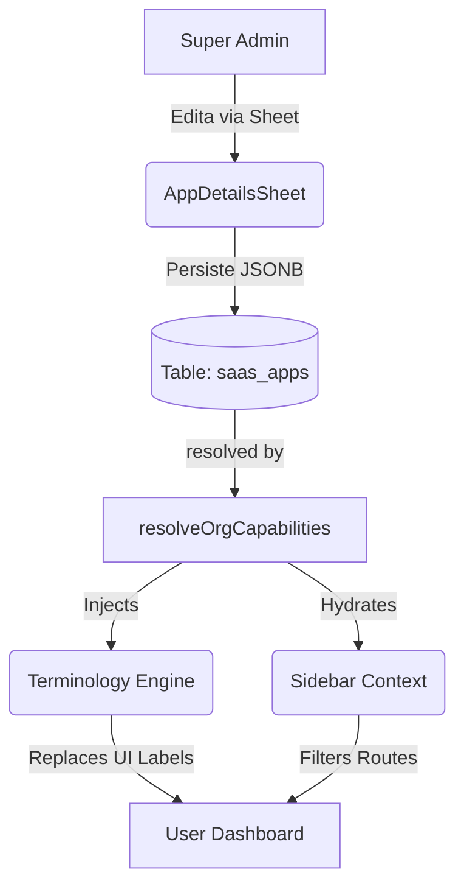

# Arquitectura: Saas Space Engine V2

Este documento detalla el sistema unificado de configuración dinámica para los "Spaces" (Apps) dentro de la plataforma Pixy. Este motor permite que una sola instancia de la aplicación se comporte de forma radicalmente distinta según el contexto de negocio (Vertical).

## 1. El Concepto de "Space Config"
Cada Space (ej: *Medical Space*, *Agency Space*) no es solo un conjunto de módulos, sino una **experiencia de usuario dirigida**. Para lograr esto, hemos centralizado la configuración en el campo `ui_config` (tipo JSONB) dentro de la tabla `saas_apps`.

### Esquema de `ui_config`:
```typescript
interface DynamicSpaceConfig {
    terminology: {
        client: string;    // Ej: "Paciente", "Comensal"
        clients: string;   // Ej: "Pacientes", "Comensales"
        project: string;   // Ej: "Tratamiento", "Reserva"
        sale: string;      // Ej: "Venta", "Servicio"
    };
    capabilities: UICapability[]; // Lista de IDs de funciones activas
    policies: {
        require_location: boolean;
        allow_custom_branding: boolean;
        // ... otras políticas de negocio
    };
}
```

---

## 2. Motor de Terminología Dinámica
El sistema permite renombrar las entidades principales del software sin cambiar una sola línea de código en los componentes.

### Funcionamiento:
1. **Presets**: Cada categoría de Space (Agency, Resto, Medical) tiene un "Preset" de palabras definido en `capabilities-registry.ts`.
2. **Overrides**: El SuperAdmin puede modificar palabras específicas desde el tab **Diccionario** en el panel administrativo.
3. **Resolución**: El sistema carga la configuración en el servidor y la inyecta mediante hooks o server actions (`resolveOrgCapabilities`).

---

## 3. Sistema de Capacidades (UI Capabilities)
A diferencia de los módulos técnicos de base de datos, las **Capacidades** controlan la visibilidad de elementos en la interfaz (Sidebar, Botones, Tablas).

### Mapeo Inteligente (Auto-Sync):
Para simplificar la administración, hemos implementado un sistema de sincronización automática. Si un módulo técnico es activado, el motor activa automáticamente la capacidad de UI necesaria.

| Módulo Técnico (DB) | Capacidad de UI (Sidebar/Acceso) |
|---------------------|----------------------------------|
| `module_quotes`     | `crm.quotes`                    |
| `module_invoicing`  | `billing.management`           |
| `module_automation` | `automation.engine`             |
| `module_whitelabel` | `whitelabel.branding`           |

---

## 4. El Flujo de la Verdad (Data Flow)



### The Source of Truth (S.O.T)
Para evitar conflictos de configuración, se establece la siguiente jerarquía:
1. **Database Overrides (`ui_config`)**: Es la verdad absoluta. Si existe, pisa cualquier otra configuración.
2. **Category Presets**: Definidos en `capabilities-registry.ts`. Se usan si el Space no tiene un `ui_config` personalizado.
3. **Hardcoded Defaults**: Solo como fallback de seguridad en caso de error de base de datos.

---

## 5. Legacy vs. Modern (Guía de Estilo)

| Patrón Legacy (PROHIBIDO) | Patrón Moderno (OBLIGATORIO) | Razón |
|---------------------------|------------------------------|-------|
| `if (vertical === 'agency')` | `if (hasCap('crm.advanced'))` | El vertical es solo una etiqueta; la funcionalidad depende de capacidades. |
| `label="Clientes"` | `label={dict.terminology.clients}` | El nombre de la entidad debe ser dinámico para adaptarse a otras industrias. |
| `filterByVertical('resto')` | `activeModules.includes('resto_tables')` | Las características pertenecen a módulos, no a nombres de apps. |
| `/admin/apps/[slug]` | `AppDetailsSheet (Dialog/Sheet)` | Centralización de UI para evitar fragmentación de estado. |

---

## 6. Gestión Centralizada (Admin Flow)
Hemos eliminado la fragmentación de páginas de administración, moviendo todo al **`AppDetailsSheet`** (Slide-over central).
...

### Tabs del Editor:
1. **Resumen**: Métricas de uso y revenue del Space.
2. **Funciones & Módulos**: Gestión de infraestructura técnica y capacidades de UI unificadas.
3. **Diccionario**: Editor de terminología por Space.
4. **Portal**: Configuración de los Tabs que verán los clientes en sus respectivos portales.
5. **Config**: Ajustes técnicos (Slug, Precio, Categoría).

---

## 5. Ruteo Dinámico y Seguridad
El archivo `src/lib/module-config.ts` actúa como el "Traffic Controller". La función `filterRoutesByModules` evalúa:
1. ¿El Space tiene contratado el módulo técnico?
2. ¿El usuario tiene el rol adecuado?
3. ¿La capacidad específica (`requiredCapabilities`) está activa en el `ui_config`?

Si alguna de estas condiciones falla, la ruta se oculta automáticamente, manteniendo una interfaz limpia y segura ("Non-leaky UI").

---

## 7. Data Retention & Garbage Collection (Safety Net V2)

Para evitar la "pesadez" del sistema por acumulación de basura técnica, hemos implementado una política de **Borrado Físico Estricto**:

- **Ciclo de Vida**: Los datos en papelera se mantienen por **30 días**.
- **Purga Automática**: Un job diario (`system-trash-purge-job` via Inngest) escanea las tablas y elimina físicamente los registros cuya fecha de borrado sea superior al límite.
- **Rendimiento**: Este motor asegura que las tablas primarias (Leads, Facturas, etc.) se mantengan ligeras y los índices funcionen a máxima velocidad al no tener registros "muertos" acumulándose por meses.
- **Acción Irreversible**: Al cumplirse los 30 días, el dato se elimina de la base de datos de forma permanente.

---

## 8. Errores Comunes y Anti-Patrones
- **No duplicar checks**: Si una capacidad ya controla una ruta en `module-config.ts`, no añadidas un `if` manual en el componente a menos que sea para visualización granular.
- **Mantener los Presets Limpios**: No metas terminología específica de un cliente en un preset global. Para eso está el tab **Diccionario**.
- **ParentModule**: Siempre que crees un nuevo módulo de UI, asegúrate de vincularlo a un `parentModule` de la base de datos para que la suscripción funcione.
