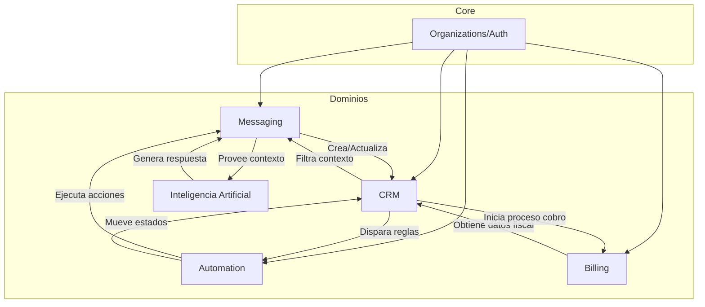

# Grafo de Dependencia de Dominios

Este documento describe cómo interactúan los diferentes dominios funcionales y señala los riesgos de acoplamiento detectados durante el análisis.

---

## 1. Relaciones de Dependencia (Flujo de Datos)

El sistema opera mediante una red de colaboraciones entre dominios:

---

## 2. Descripción de Dependencias Clave

### Messaging → CRM
La captura de un mensaje nuevo puede generar automáticamente un registro en la tabla `leads` si el contacto no existe. El **Inbox** depende del CRM para mostrar el nombre y la etapa del cliente actual.

### CRM → Automation
Cualquier cambio en la etapa de un Pipeline (`pipeline_stage_id`) puede ser un evento que dispare un flujo de trabajo. El CRM "notifica" a la automatización para ejecutar tareas en segundo plano.

### Billing → CRM
Los módulos de Facturación y Cotización consumen la tabla `leads` para extraer el `NIT`, dirección y datos de contacto del destinatario. Sin el CRM, el sistema de facturación no tiene a quién cobrar.

---

## 3. Riesgos de Acoplamiento Detectados

| Dependencia | Nivel de Riesgo | Observación |
|---|---|---|
| **Quotes → Billing Types** | **Medio** | El módulo de cotizaciones importa directamente de `billing/types`. Un cambio en la estructura de facturación puede romper las cotizaciones. |
| **CRM → Messaging Actions** | **Bajo** | El CRM permite enviar mensajes desde la vista de detalle. Es una interacción esperada, pero la lógica de envío debería estar totalmente delegada al `MessagingService`. |
| **Circularidad CRM-Messaging** | **Medio** | Ambos dominios se necesitan mutuamente para operar la vista del Inbox. Esto requiere interfaces estables para evitar bucles de importación. |

---

## 4. Recomendaciones para el Aislamiento

1. **Protocolos de Comunicación**: Utilizar **Eventos (Inngest)** para la comunicación entre dominios en lugar de llamadas directas a servicios de otro dominio siempre que sea posible.
2. **Transfer Objects (DTOs)**: Evitar compartir tipos de la base de datos entre dominios. Cada dominio debería definir sus propios tipos de entrada/salida para sus interfaces públicas.
3. **Módulos Puente**: Para integraciones complejas (ej. CRM + Messaging en el Inbox), considerar un módulo "Bridge" que orqueste la interacción en lugar de acoplar ambos módulos base.
